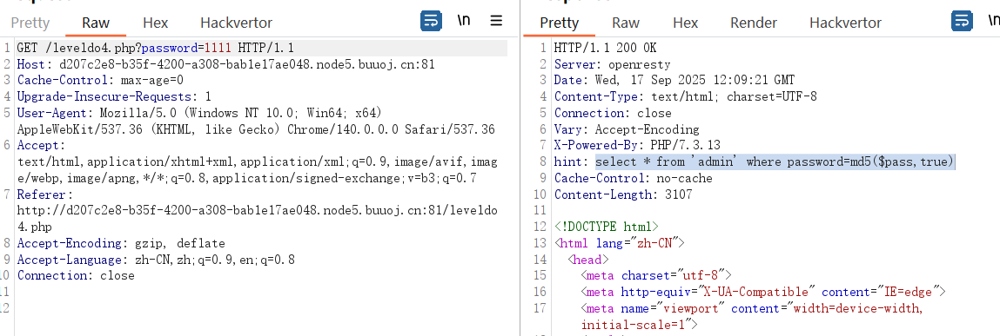
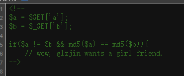
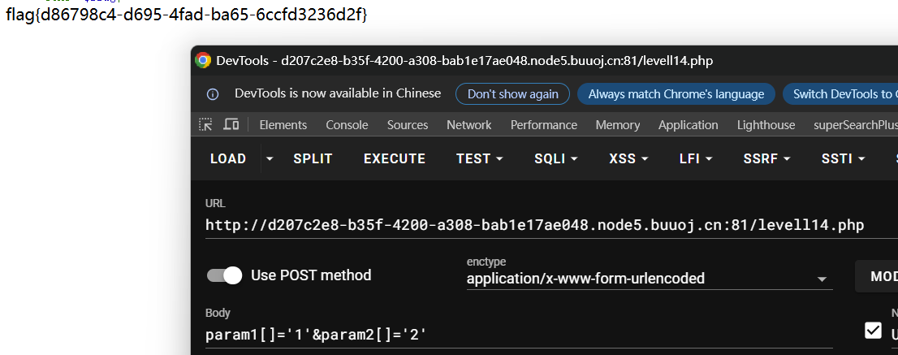

- **`md5(string, true)`**: 这是关键！第二个参数被设置为 `true`。这意味着 `md5()` 函数将返回**原始16字节的二进制格式**的哈希值，而不是我们通常看到的**32字节十六进制数字的字符串**。

- **通常用法（`false` 或省略）**: `md5('abc')` 返回 `'900150983cd24fb0d6963f7d28e17f72'`（一个字符串）。
- **此处用法（`true`）**: `md5('abc', true)` 返回一串二进制数据，如果将其解释为字符串，看起来会是乱码，类似于 `'\x90\x01P\x98<\xD2O\xB0\xD6\x96?}(\xE1\x7Fr'`。

SQL注入：

我们的目标是找到一个输入 `$pass`，使得 `md5($pass, true)` 的结果**看起来像** `'<some_string>' OR '1'='1` 这样的形式。

#### 经典的Payload：`ffifdyop`

- **计算**: `md5('ffifdyop', true)`
- **二进制结果**: `'\x27\x6f\x72\x27\x32\x37\x3a`...`（后面部分不重要）`
- **当MySQL将这个二进制序列解释为字符串时**，开头部分恰好是：`'or'<trash>` (这里的 `<trash>` 是一些不可打印的字符，但在SQL中可能被忽略或视为true)。

跳转到：levels91.php



这些md5之后都会是0exxxxx 会被当做科学计数法进行弱比较 相等

```
QNKCDZO
240610708
s878926199a
s155964671a
s214587387a
s214587387a
```

```
/levels91.php?a=QNKCDZO&b=240610708
```

跳到了/levell14.php

```php
<?php
error_reporting(0);
include "flag.php";

highlight_file(__FILE__);

if($_POST['param1']!==$_POST['param2']&&md5($_POST['param1'])===md5($_POST['param2'])){
    echo $flag;
}
```

数组的md5是null


