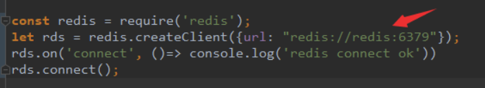
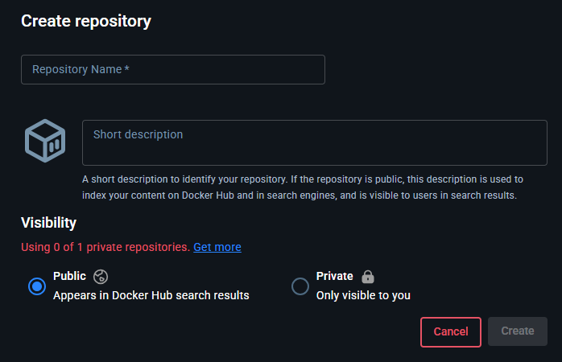

https://docker.easydoc.net/

## 一、简介

### Docker 是什么

Docker 是一个应用打包、分发、部署的工具。
你也可以把它理解为一个轻量的虚拟机，它只虚拟你软件需要的运行环境，多余的一点都不要，
而普通虚拟机则是一个完整而庞大的系统，包含各种不管你要不要的软件。

### 打包、分发、部署

**打包**：就是把你软件运行所需的依赖、第三方库、软件打包到一起，变成一个安装包
**分发**：你可以把你打包好的“安装包”上传到一个镜像仓库，其他人可以非常方便的获取和安装
**部署**：拿着“安装包”就可以一个命令运行起来你的应用，自动模拟出一摸一样的运行环境，不管是在 Windows/Mac/Linux。

### 重要概念：镜像、容器

**镜像**：可以理解为软件安装包，可以方便的进行传播和安装。
**容器**：软件安装后的状态，每个软件运行环境都是独立的、隔离的，称之为容器。

___

## 二、制作自己的镜像

制作过程

1、在项目根目录下编写Dockerfile，以java(Maven)项目为例：

```
# 使用构建阶段，先用Maven编译，再用更小的镜像运行
FROM maven:3.8.4-openjdk-17 AS build
# 设置工作目录，工作目录是Docker中的一个概念，Docker会自动创建，并非项目根目录名称
WORKDIR /app
# 将项目文件复制到镜像中
COPY . .
# 打包，-DskipTests表示跳过所有测试，快速打包
RUN mvn clean package -DskipTests

FROM openjdk:17-jdk-slim
WORKDIR /app
# 从构建阶段复制生成的jar文件
COPY --from=build /app/target/*.jar app.jar

# 暴露端口
EXPOSE 8080

# 启动命令
CMD ["java", "-jar", "app.jar"]
```

2、Build 为镜像（安装包）

```
docker build -t test:v1 .
```

-t 表示设置镜像名字和版本号 点表示当前目录，docker会将你当前目录下的所有文件和子目录都发送给 Docker 守护进程（Docker daemon），作为构建镜像的**源文件**。

3、运行

```
docker run -p 8080:8080 --name test-hello test:v1
```

`-p` 映射容器内端口到宿主机 前者为宿主机端口
`--name` 容器名字
`-d` 后台运行

### 相关命令

`docker ps` 查看当前运行中的容器
`docker images` 查看镜像列表
`docker rm container-id` 删除指定 id 的容器
`docker stop/start container-id` 停止/启动指定 id 的容器
`docker rmi image-id` 删除指定 id 的镜像
`docker volume ls` 查看 volume 列表
`docker network ls` 查看网络列表

___

## 三、目录挂载

使用 Docker 运行后，我们改了项目代码不会立刻生效，需要重新`build`和`run`，很是麻烦。

例如`bind mount`挂载方式：直接把宿主机目录映射到容器内，适合挂代码目录和配置文件。可挂到多个容器上

它用绝对路径：`-v D:/code:/app`

示例：`docker run -p 8080:8080 --name test-hello -v D:/code:/app -d test:v1`

这样容器内的代码会替换成本机的代码，本机代码修改了docker中的代码会更新

___

## 四、多容器通信

项目往往都不是独立运行的，需要数据库、缓存这些东西配合运作。

把前面的 Web 项目增加一个 Redis 依赖，多跑一个 Redis 容器，演示如何多容器之间的通信。

### 创建虚拟网络

要想多容器之间互通，从 Web 容器访问 Redis 容器，我们只需要把他们放到同个网络中就可以了。

1、创建一个名为`test-net`的网络：

```
docker network create test-net
```

2、运行redis在test-net网络，别名网络redis

```
docker run -d --name redis --network test-net --network-alias redis redis:latest
```

3、修改代码中访问`redis`的地址为网络别名



4、重新运行web项目，使用同一个网络

```
docker run -p 8080:8080 --name test -v D:/test:/app --network test-net -d test:v1
```

___

## 五、Decker-Compose

如果项目依赖更多的第三方软件，我们需要管理的容器就更加多，每个都要单独配置运行，指定网络。这节，我们使用 docker-compose 把项目的多个服务集合到一起，一键运行。

要把项目依赖的多个服务集合到一起，我们需要编写一个`docker-compose.yml`文件，描述依赖哪些服务

```
version: "3.7"

services:
  app:
    build: ./
    ports:
      - 80:8080
    volumes:
      - ./:/app
    environment:
      - TZ=Asia/Shanghai
  redis:
    image: redis:5.0.13
    volumes:
      - redis:/data
    environment:
      - TZ=Asia/Shanghai

volumes:
  redis:

```

容器默认时间不是北京时间，增加 TZ=Asia/Shanghai 可以改为北京时间

### 跑起来

在`docker-compose.yml` 文件所在目录，执行：`docker-compose up`就可以跑起来了。

命令参考：https://docs.docker.com/compose/reference/up/

在后台运行只需要加一个 -d 参数`docker-compose up -d`

查看运行状态：`docker-compose ps`

停止运行：`docker-compose stop`

重启：`docker-compose restart`

重启单个服务：`docker-compose restart service-name`

进入容器命令行：`docker-compose exec service-name sh`

查看容器运行log：`docker-compose logs [service-name]`

## 六、发布和部署

https://hub.docker.com/repositories/yaowenda

1、创建一个镜像库



2、命令行登录账号：`docker login -u yaowenda`

3、新建一个tag，名字必须跟你注册账号一样：`docker tag test:v1 yaowenda/test:v1`

4、推上去：`docker push yaowenda/test:v1`

5、部署试下：`docker run -dp 8080:8080 yaowenda/test:v1`

