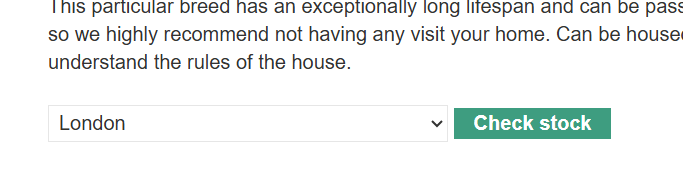

## 1、目录遍历

图片的加载路径：


抓包修改：

```
GET /image?filename=../../../etc/passwd HTTP/2
```

## 2、垂直越权

访问robots.txt

```
User-agent: *
Disallow: /administrator-panel
```

`User-agent: \*`指的是搜索引擎的爬虫，表示下面的规则适用于所有爬虫机器人

`Disallow` 表示“禁止访问”此页面

这是一个管理员页面

## 3、js中隐藏跳转链接


访问：/admin-fj2t3r

## 4、由请求参数控制的用户角色

该实验室在 `/admin` 处有一个管理面板，它使用可伪造的 cookie 来识别管理员。


## 5、绕过双因素身份认证

如果用户首先被提示输入密码，然后在另一个页面上被提示输入验证码，那么用户在输入验证码之前就已经处于“已登录”状态。在这种情况下，值得测试一下，看看在完成第一步身份验证后，是否可以直接跳转到“仅限登录”页面。有时，你会发现网站在加载页面之前实际上并没有检查你是否完成了第二步身份验证。

## 6、SSRF 服务器端请求伪造

服务器端请求伪造是一种网络安全漏洞，它允许攻击者导致服务器端应用程序向非预期位置发出请求。

在典型的 SSRF 攻击中，攻击者可能会使服务器连接到组织基础设施内仅供内部访问的服务。在其他情况下，他们甚至可能强制服务器连接到任意外部系统。这可能会泄露敏感数据，例如授权凭证。

假设有一个购物应用，为了提供库存信息，该应用必须查询各种后端 REST API。它通过前端 HTTP 请求将 URL 传递到相关的后端 API 端点。当用户查看某款商品的库存状态时，他们的浏览器会发出以下请求：

```
POST /product/stock HTTP/1.0
Content-Type: application/x-www-form-urlencoded
Content-Length: 118

stockApi=http://stock.weliketoshop.net:8080/product/stock/check%3FproductId%3D6%26storeId%3D1
```

攻击者可以修改请求以指定服务器本地的 URL：

```
POST /product/stock HTTP/1.0
Content-Type: application/x-www-form-urlencoded
Content-Length: 118

stockApi=http://localhost/admin
```

攻击者可以访问 `/admin` URL，但管理功能通常只有经过身份验证的用户才能访问。这意味着攻击者不会看到任何有用的信息。但是，如果对 `/admin` URL 的请求来自本地计算机，则正常的访问控制将被绕过。由于该请求似乎来自受信任的位置，因此应用程序会授予对管理功能的完全访问权限。

### 例子：



一个查询库存的接口，修改它的请求体：


返回的是后台管理页面，但是想删除用户的话提示需要管理员权限

我们可以知道删除用户时跳转的url，所以可以修改请求体为：

```
stockApi=http://localhost/admin/delete?username=carlos
```

发送请求，过关

除了localhost，还可以是内网地址


扫地址扫出192.168.0.88

