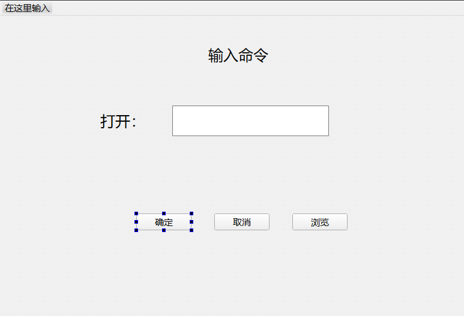
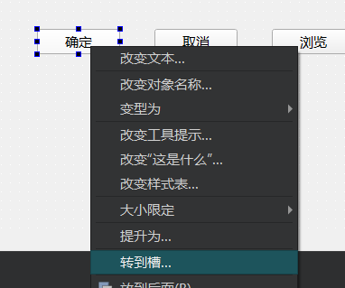
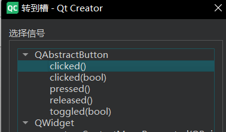
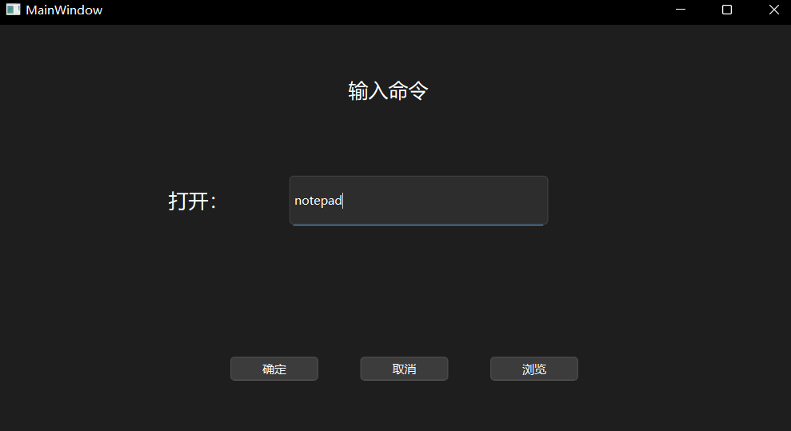

## 信号与槽

这是目前的简单页面：



什么是信号？

​	点击按钮发出一个事件或叫做信号

什么是槽？

​	接收信号的 槽函数




选择clicked()



会在mainwindow.cpp中新增一个：（实现）

```cpp
void MainWindow::on_confirmButton_clicked()
{
    
}

```

同时在mainwindow.h里面新增一个：（声明）

```cpp
private slots:
    void on_confirmButton_clicked();
```


具体实现实例：

```cpp
void MainWindow::on_confirmButton_clicked()
{
    //获取lineEdit中的数据 ui是一个指针，指向界面文件
    QString program = ui->cmdLineEdit->text();


    //创建一个process对象
    QProcess *myProcess = new QProcess(this);
    myProcess -> start(program);
}

```



可以打开记事本


**connect函数**

**发送者（信号）** 不需要知道谁在接收或有多少个接收者。

**接收者（槽）** 不需要知道信号从何而来。

它们之间的连接由 `connect` 函数在运行时建立。

```cpp
connect(sender, singal, receiver, slot)
    sender 发送者
    singal 信号：发送者发出的特定事件
    receiver 接收者：处理信号的对象，如果是this，它代表当前的MainWindow对象
    slot 槽：接收者中用于响应信号的成员函数
```

除了上面右击转到槽的方法，还有**另外一种方法：**

输入命令之后点击回车，也是和确定按钮一样的效果

在构造函数里面：

```cpp
MainWindow::MainWindow(QWidget *parent)
    : QMainWindow(parent)
    , ui(new Ui::MainWindow)
{
    ui->setupUi(this);
    
    //connect函数连接信号与槽 谁发出信号 发出什么信号 谁处理信号 怎么处理
    connect(ui->cmdLineEdit, SIGNAL(returnPressed()), this, SLOT(on_confirmButton_clicked()));
}
```

**取消按钮实现：**

在头文件里给出声明：

```cpp
private slots:
    void on_confirmButton_clicked();
    void on_cancelButton_clicked();
```

实现：

```cpp
void MainWindow::on_cancelButton_clicked()
{
    this->close();
}
```

connect：

```cpp
MainWindow::MainWindow(QWidget *parent)
    : QMainWindow(parent)
    , ui(new Ui::MainWindow)
{
    ui->setupUi(this);

    //connect函数连接信号与槽 谁发出信号 发出什么信号 谁处理信号 怎么处理
    connect(ui->cmdLineEdit, SIGNAL(returnPressed()), this, SLOT(on_confirmButton_clicked()));

    //最后一个参数：提供函数地址而不是调用它
    connect(ui->cancelButton, &QPushButton::clicked, this, &MainWindow::on_cancelButton_clicked);

}

```


另一种方法：槽函数处理的信息不多，没必要写一个函数

```cpp
connect(ui->browseButton, &QPushButton::clicked, [this](){
        QMessageBox::information(this, "信息", "点击浏览");
    }
            );

```

