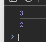
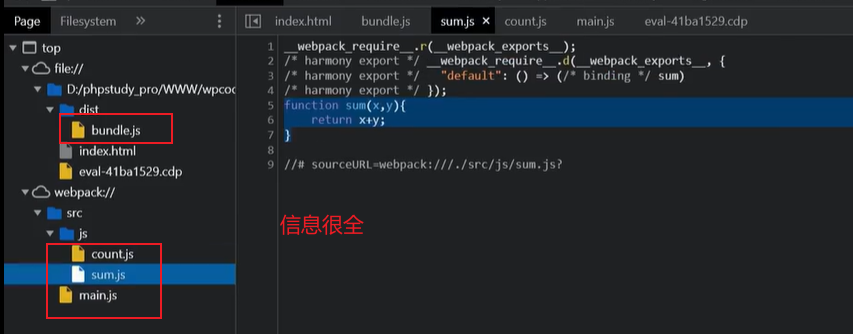

## webpack打包器

https://mp.weixin.qq.com/s/J3bpy-SsCnQ1lBov1L98WA

### 为什么用？

在src目录下创建1.js、 2.js、 index.html

1.js

```js
function test() {
  console.log('test');
}
```

2.js

```js
test();
```

index.html

```html
<!DOCTYPE html>
<html lang="en">
<head>
    <meta charset="UTF-8">
    <meta name="viewport" content="width=device-width, initial-scale=1.0">
    <title>Document</title>
</head>
<body>
    <script src="./src/2.js"></script>
</body>
</html>
```

结果：


test没有定义


那么我改成这样呢？

```html
<!DOCTYPE html>
<html lang="en">
<head>
    <meta charset="UTF-8">
    <meta name="viewport" content="width=device-width, initial-scale=1.0">
    <title>Document</title>
</head>
<body>
    <script src="./src/2.js"></script>
    <script src="./src/1.js"></script>
</body>
</html>
```

还是一样，test没有定义


原因是顺序不对：

```html
<!DOCTYPE html>
<html lang="en">
<head>
    <meta charset="UTF-8">
    <meta name="viewport" content="width=device-width, initial-scale=1.0">
    <title>Document</title>
</head>
<body>
	<script src="./src/1.js"></script>
    <script src="./src/2.js"></script>
    
</body>
</html>
```


因为需要是先声明后调用


如果有大量的js文件，我们一个个引用很麻烦，webpack就是把多个js文件打包成一个


### 如何用

src目录下创建1.js、 2.js、 main.js、 index.html

1.js

```js
export default function add(x, y) {
  return x+y;
}
```

2.js

```js
export default function sub(x, y) {
  return x-y;
}
```

main.js

```js

import add from './1';//这不是js语法 是webpack打包器用的 给webpack看的
import sub from './2';

console.log(add(1, 2)); // 3
console.log(sub(5, 3)); // 2
```

index.html

```html
<!DOCTYPE html>
<html lang="en">
<head>
    <meta charset="UTF-8">
    <meta name="viewport" content="width=device-width, initial-scale=1.0">
    <title>Document</title>
</head>
<body>
    <script src="./src/main.js"></script>
</body>
</html>
```


不能import 浏览器不识别 打包之后才能识别


**如何打包**

​	安装webpack库：`npm i webpack webpack-cli -g`


根目录下创建一个`webpack.config.js`文件，内容如下：

```js
const path = require('path'); // node内置核心模块，用来设置路径。

module.exports = {
    

    entry: './src/main.js', // 入口文件配置（精简写法）
    /* 完整写法：
    entry:{
        main:'./src/js/app.js'
    }
    */

    output: { // 输出配置
        filename: 'app.js', // 输出文件名
        path: path.resolve(__dirname, 'build') // 输出文件路径(绝对路径)，__dirname表示该文件当前文件夹
    },

    mode: 'development',   // 开发环境(二选一)
    // mode: 'production',   // 生产环境(二选一)
};
```

运行`npx webpack` 会自动识别`webpack.config.js`文件

如果打包成功 在html中引用build/app.js

```js
<script src="../build/app.js"></script>
```

 控制台是可以成功输出的



### 安全方面

我们用的是开发者模式 development



生产模式下：


即**模式选择导致代码泄露**

原生态js 在前端能看见代码

node.js和原生态的js是不一样的，它是服务端语言，在前端页面你是看不到源码的。vue也是如此

但是，不管是node.js还是vue，如果用了webpack打包器，且模式选择的是开发模式 都会泄漏源码


## JQuery库


想强调的就是用不同的版本可能导致不同的漏洞，新版本更好一些。不同的第三方库可能会导致漏洞

你使用jquery的一个低版本实现了某代码，它有漏洞。你使用jquery的高版本**实现了相同的代码**，它就可能没漏洞，原因是jquery的某个功能代码修复了，例如过滤规则升级了