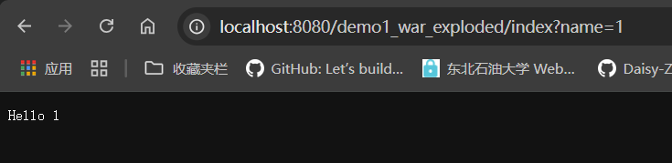

IDEA中创建JavaEE项目

## 处理GET POST等请求

### 方法一：原生

IndexServlet.class:

```java
package com.example.demo1;

import javax.servlet.http.HttpServletRequest;
import javax.servlet.http.HttpServletResponse;
import java.io.IOException;

public class IndexServlet extends HttpServlet{
    @Override
    public void doGet(HttpServletRequest request, HttpServletResponse response) throws IOException {
        System.out.println("IndexServlet");
    }
}

```

在webapp/WEB-INF/web.xml中配置：

```xml
<?xml version="1.0" encoding="UTF-8"?>
<web-app xmlns="http://xmlns.jcp.org/xml/ns/javaee"
         xmlns:xsi="http://www.w3.org/2001/XMLSchema-instance"
         xsi:schemaLocation="http://xmlns.jcp.org/xml/ns/javaee http://xmlns.jcp.org/xml/ns/javaee/web-app_4_0.xsd"
         version="4.0">
    <servlet>
        <servlet-name>index</servlet-name>
        <servlet-class>com.example.demo1.IndexServlet</servlet-class>
    </servlet>

    <servlet-mapping>
        <servlet-name>index</servlet-name>
        <url-pattern>/index</url-pattern>
    </servlet-mapping>
</web-app>
```

上面那个是 名字和类的对应 下面这个是 名字和url的对应

当你访问/index的时候就会触发上面那个类

我们请求这个：


会触发doGet方法，控制台输出IndexServlet

那么如何回显呢？

```java
public class IndexServlet extends HttpServlet{
    @Override
    public void doGet(HttpServletRequest request, HttpServletResponse response) throws IOException {
        String name = request.getParameter("name");
        response.getWriter().println("Hello " + name);
//        System.out.println("IndexServlet");
    }
}
```




除了doGet，还有doPost等


### 方法二：注解

新建一个类NewServlet.class

```java
@WebServlet("/new")
public class NewServlet extends HttpServlet {
    @Override
    protected void doGet(HttpServletRequest req, HttpServletResponse resp) throws ServletException, IOException {
        System.out.println("----------NewServlet");
    }
}
```

通过WebServlet注解


## Servlet生命周期

init在服务器第一次加载时触发（只调用一次）

destory在服务器关闭时触发（只调用一次）

service每次请求都会调用，在 `HttpServlet` 中会根据请求类型调用 `doGet()`、`doPost()` 等方法

演示代码：

```java
public class IndexServlet extends HttpServlet {

    // 生命周期方法：初始化阶段，只执行一次
    @Override
    public void init() throws ServletException {
        System.out.println("【生命周期】init()：Servlet 初始化");
    }

    // 生命周期方法：处理请求阶段（会自动调用 doGet、doPost）
    @Override
    protected void service(HttpServletRequest req, HttpServletResponse resp) throws ServletException, IOException {
        System.out.println("【生命周期】service(HttpServletRequest, HttpServletResponse)：处理请求前");
        super.service(req, resp); // 继续分发到 doGet / doPost
        System.out.println("【生命周期】service(HttpServletRequest, HttpServletResponse)：处理请求后");
    }

    // 处理 GET 请求
    @Override
    protected void doGet(HttpServletRequest request, HttpServletResponse response) throws IOException {
        System.out.println("【生命周期】doGet()：处理 GET 请求");
        String name = request.getParameter("name");
        response.getWriter().println("Hello GET " + name);
    }

    // 处理 POST 请求
    @Override
    protected void doPost(HttpServletRequest req, HttpServletResponse resp) throws ServletException, IOException {
        System.out.println("【生命周期】doPost()：处理 POST 请求");
        String name = req.getParameter("name");
        resp.getWriter().println("Hello POST " + name);
    }

    // 生命周期方法：销毁阶段，只执行一次
    @Override
    public void destroy() {
        System.out.println("【生命周期】destroy()：Servlet 被销毁");
    }
}
```

## 数据库

JDBC 

Mybatis

Hibernate