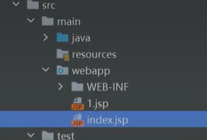
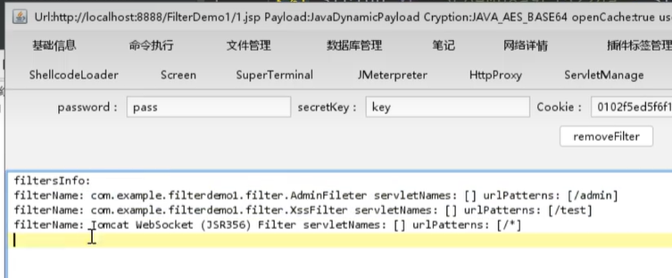
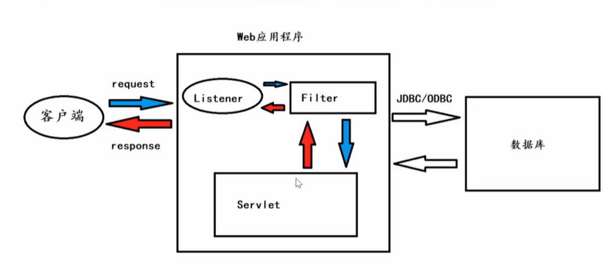

## 预编译

[预编译SQL为什么能够防止SQL注入](https://www.cnblogs.com/Createsequence/p/16963891.html)


# 过滤器Filter

## payload检测

在servlet目录的ServletTest.class中：

访问/test，触发下面的东西：

```java
@WebServlet("/test")
public class ServletTest extends HttpServlet {
    @Override
    protected void doGet(HttpServletRequest req, HttpServletResponse resp) throws ServletException, IOException {
        String code = req.getParameter("code");
        resp.getWriter().println("Hello " + code);
    }
}
```

在filter目录下的XssFilter.class中：

```java
@WebFilter("/test")
public class XssFilter implements Filter {

    @Override
    public void init(FilterConfig filterConfig) throws ServletException {
        System.out.println("Xss开启过滤");
    }

    @Override
    public void doFilter(ServletRequest servletRequest, ServletResponse servletResponse, FilterChain filterChain) throws IOException, ServletException {
        System.out.println("Xss正在过滤");
        // 过滤代码在放行代码前
        // XSS过滤，接收参数值，如果有攻击payload就拦截
        HttpServletRequest request = (HttpServletRequest) servletRequest;
        String code = request.getParameter("code");
        if (code != null && code.contains("<")) {
            System.out.println("XSS攻击");
            return;
        }
        //放行
        filterChain.doFilter(servletRequest,servletResponse);
    }

    @Override
    public void destroy() {
        System.out.println("Xss销毁过滤");
    }
}
```

运行项目之后，控制台输出：Xss开启过滤

也就是还没有触发servlet就已经触发了filter，当然也经过了listener


上面的代码，如果`/test?code=<script>alert(1)</script>`，会被拦截，没有攻击payload才会放到ServletTest.class


## 权限检验

```java
@Override
public void doFilter(ServletRequest servletRequest, ServletResponse servletResponse, FilterChain filterChain) throws IOException, ServletException {
    HttpServletRequest request = (HttpServletRequest) servletRequest;
    Cookie[] cookies = request.getCookies();
    for (Cookie cookie : cookies) {
        String cName = cookie.getName();
        String cValue = cookie.getValue();
        System.out.println("Cookie:" + cName + ":" + cValue);
        if(cName.contains("user") && cValue.contains("admin")) {
            filterChain.doFilter(servletRequest,servletResponse);
            System.out.println("欢迎进入admin页面");
        } else {
            System.out.println("请先登录");
        }
    }
}
```


## 内存马

内存马：写在内存中的，无文件？

哥斯拉生成一个jsp马，放到程序web目录



访问1.jsp后用哥斯拉连接：有一个FilterShell选项，这里可以看到我们刚才创建的filter



点击addFilterShell，会添加一个Filter

一般的木马是插入到了servlet里面，但是内存马插入到了filter里面，所以常规的方法清不掉



# 监听器Listener

过滤器是访问触发 监听器是动作触发，比如创建或者销毁Session