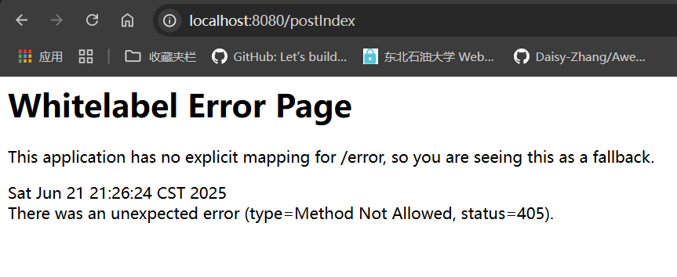

IndexController中：

```java
@RestController
public class IndexController {
    @RequestMapping(value = "/getIndex", method = RequestMethod.GET)
    //GetMapping("/getIndex")
    public String getIndex() {
        return "get test";
    }
	
    //@PostMapping()
    @RequestMapping(value = "/postIndex", method = RequestMethod.POST)
    public String postIndex() {
        return "post test";
    }
}
```

访问：http://localhost:8080/getIndex

页面显示：


post方法不能直接访问：



可以用postman


带参数：

```java
@GetMapping("/getParam")
    public String getParam(@RequestParam String name) {
        return "post test"+ name;
    }
```


Thymeleaf模板注入：

@RestController注解相当于@ResponseBody + @Controller合在一起的作用

```java
@RestController
public class IndexController {
    @RequestMapping("/")
    public String index(Model model) {
        model.addAttribute("data", "hello ywd");
        
        return "index";
    }
}
```

在template目录下有一个index.html


@RestController有@ResponseBody 的作用，index当做字符串显示

@Controller index当做资源文件去渲染

因此如果用RestController，页面会显示一个index字符串而不是Thymeleaf渲染后的页面


若依 Thymeleaf模板注入

https://blog.csdn.net/lza20001103/article/details/142638979