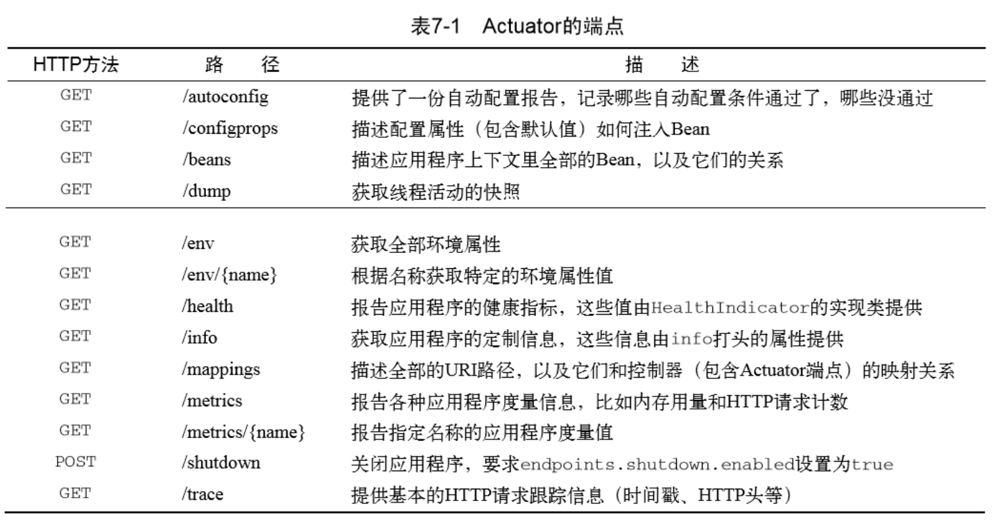
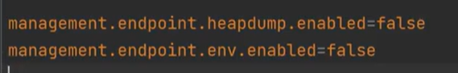

actuator是spring boot提供的对应用系统的自省和监控的集成功能，可以对应用系统进行配置查看、相关功能统计等。

安全问题：

信息泄露

heapdump泄露：

heapdump可以理解为运行的一个虚拟内存

利用工具：jvisualvm（系统带的）、JDumpSpider（自动提取）

防范：

Swagger

Swagger是当下比较流行的实时接口文档生成工具。接口文档是当前前后端分离项目中必不可少的工具，在前后端开发之前，后端要先出接口文档，前端根据接口文档来进行项目的开发，双方开发结束后在进行联调测试。

安全问题：

接口泄露

postman自动化测试

postman可以导入这个Swagger的地址
