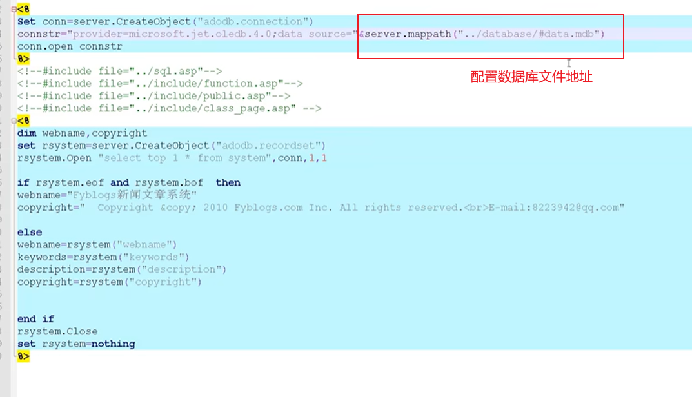

## Access数据库

由于大部分ASP程序与ACCESS数据库搭建，但ACCESS无需连接，都在脚本文件中定义配置好数据库路径即用，不需要额外配置安装数据库，所以大部分提前固定好的数据库路径如默认未修改，当攻击者知道数据库的完整路径，可远程下载后解密数据实现攻击。

如果配置没有更改，能直接访问下载access数据库文件

举例：如果想改，在这里：

## HTTP.SYS

https://cloud.tencent.com/developer/article/2107200

使用curl进行测试之后就可以直接漏洞利用

## IIS短文件

## IIS文件解析漏洞

 IIS 6 解析漏洞 （官方没出补丁）

1、该版本默认会将*.asp;.jpg 此种格式的文件名，当成Asp解析 如：logo.asp;.jpg

2、该版本默认会将*.asp/目录下的所有文件当成Asp解析。如：xx.asp/logo.jpg 

IIS 7.x 解析漏洞 （官方出了补丁）

在一个文件路径(/xx.jpg)后面加上/xx.php会将/xx.jpg/xx.php 解析为php文件 

应用场景：配合文件上传获取Webshell

## IIS写权限漏洞

