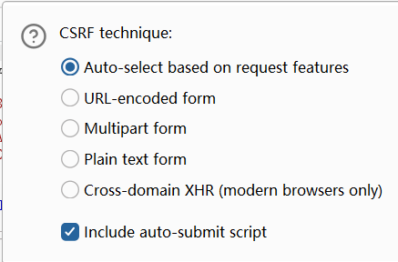

CSRF验证的绕过：

### 验证得严谨：

全部对比无法绕过，只能配合xss或者上传来搞

上传add.html到服务器，然后访问这个add.html，referer就是自身网站，就是合法的（当然要求网站已登录）

xss因为执行是在这个网站的页面执行的，所以referer是自身网站

### 验证得不严谨：

**(一种思路，实战无法实现，因为目录名不能有//  但如果说网站只匹配ip 那就可以试试了)**

如果是匹配绕过，比如

攻击机的ip是`43.21.231.123`

靶机的ip是`123.233.56.1`

如果说攻击者构造了一个html页面，进入就会跳转到`123.233.56.1`的某个地址，那么请求包的referer是`http://43.21.231.123`

网站采取的验证方式是匹配验证而不是完全验证，即referer中有`http://123.233.56.1`即可

也就是说如果请求包的referer是`http://43.21.231.123http://123.233.56.1`也可以成功绕过检查

那么可以把html页面放到43.21.231.123的`http://123.233.56.1`目录下（目录名是`http://123.233.56.1`）

那么请求的referer就是`http://43.21.231.123http://123.233.56.1`

**置空：**

有些网站 请求包没有referer字段是可以的 直接返回true 这是网站正常需要 但这造成CSRF漏洞

写的时候告诉 不带referrer

### csrf token

绕过（代码写不严谨的情况）：

复用、删除、置空