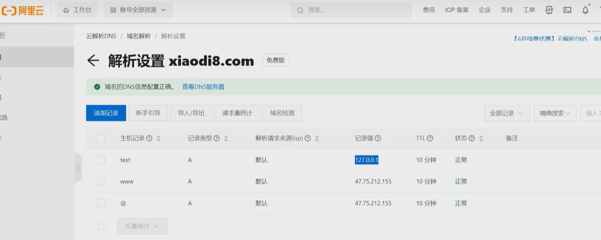
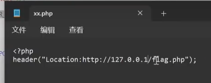
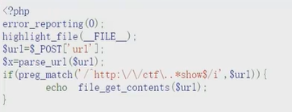

## SSRF 漏洞挖掘

黑盒探针：

业务功能点

1. 社交分享功能：获取超链接的标题等内容进行显示
2. 转码服务：通过 URL 地址把原地址的网页内容调优使其适合手机屏幕浏览
3. 在线翻译：给网址翻译对应网页的内容
4. 图片加载 / 下载：例如富文本编辑器中的点击下载图片到本地；通过 URL 地址加载或下载图片
5. 图片 / 文章收藏功能：主要其会取 URL 地址中 title 以及文本的内容作为显示以求一个好的用具体验
6. 云服务厂商：它会远程执行一些命令来判断网站是否存活等，所以如果可以捕获相应的信息，就可以进行 ssrf 测试
7. 网站采集，网站抓取的地方：一些网站会针对你输入的 url 进行一些信息采集工作
8. 数据库内置功能：数据库的比如 mongodb 的 copyDatabase 函数
9. 邮件系统：比如接收邮件服务器地址
10. 编码处理，属性信息处理，文件处理：比如 ffmpeg，ImageMagick，docx，pdf，xml 处理器等
11. 未公开的 api 实现以及其他扩展调用 URL 的功能：可以利用 google 语法加上这些关键字去寻找 SSRF 漏洞


## URL 关键参数
share
wap
url
link
src
source
target
u
display
sourceURL
imageURL
domain


## SSRF伪协议利用：

- **`http://`：Web 常见访问协议，比如`http://127.0.0.1`，可用于访问 Web 服务。**

- **`file:///`：能从文件系统中获取文件内容，例如`file:///etc/passwd`，可读取服务器上的本地文件。**

- `dict://`：字典服务器协议，用于访问字典资源，像`dict://ip:6739/info:`。

- `sftp://`：SSH 文件传输协议或安全文件传输协议。

- `ldap://`：轻量级目录访问协议。

- `tftp://`：简单文件传输协议。

- `gopher://`：分布式文档传递服务，可使用`gopherus`生成`payload`，常被用于构造复杂的攻击载荷。

  gopherus工具：https://github.com/tarunkant/Gopherus

  由于mysql redis等应用不使用http通讯，可以使用gopherus应用来进行通讯


## SSRF防御绕过方式：

- **限制为`http://www.xxx.com`域名**：采用 HTTP 基本身份认证的方式绕过，格式为`http://www.xxx.com@www.xxyy.com`，通过这种带`@`的 URL 格式，可在看似访问`www.xxx.com`的情况下，实际访问`www.xxyy.com`。
- **限制请求 IP 不为内网地址**：当不允许 IP 为内网地址时，有四种绕过方法：
  - 短网址绕过（短网址在线生成）
  - 采取域名解析
  - 采取进制转换
  - 采取 3XX 重定向。


IP 地址进制绕过

十六进制

`url=http://0x7F.0.0.1/flag.php`

八进制

`url=http://0177.0.0.1/flag.php`

10 进制整数格式

`url=http://2130706433/flag.php`

16 进制整数格式，还是上面那个网站转换记得前缀 0x

`url=http://0x7F000001/flag.php`


还有一种特殊的省略模式

127.0.0.1 写成 127.1

如果遇到长度限制 0也是代表127.0.0.1的 例如`http://0/test.php` =`http://127.0.0.1/test.php`

用 CIDR 绕过 localhost
`url=http://127.127.127.127/flag.php`


ctfshow ssrf 第三关 

**不允许出现localhost、1和0**

短地址生成也是带1的，因此通不过，可以这样：

自己的服务器添加一条域名解析设置 访问`test.xiaodi8.com`会指向 127.0.0.1



**会解析域名然后判断，如果解析之后是127.0.0.1 也会过滤：**

这种情况用重定向

使对方服务器访问43.12.23.211/xx.php 其中的代码会使其重定向到127.0.0.1



代码如下：

要求url中有 `http://ctf.` 和`show`



可以这样：`http://ctf@127.0.0.1/flag.php#show`


## SSRF无回显

RCE无回显 思路：

1、dnslog带外

2、通过nc反向连接

​	无回显，即攻击者的命令（`ls` `cat /etc/passwd`）无法通过原请求响应返回，通过nc建立反向连接后，攻击者可直接在控制端输入命令并实时接收输出，相当于获得一个 “远程 shell”，彻底摆脱对原请求响应的依赖。

如果没有nc，通过python建立连接也可以，如果都没有，可以通过在服务器创建文件然后查看能否访问到：

可以利用操作系统提供的文件操作命令（如在 Linux 系统中的`touch`、`echo`等，在 Windows 系统中的`echo`、`type`等 ），在目标服务器上创建文件或者向文件写入特定内容。然后，访问该文件所在的 Web 路径（前提是该路径允许 Web 访问），查看文件是否被成功创建或内容是否正确写入，从而间接得知命令是否成功执行。

例如：

```
touch /var/www/html/test.txt
```

攻击者访问`http://目标服务器IP/test.txt` 。如果能够正常访问到该文件，就说明`touch`命令在目标服务器上成功执行了，也就间接证明了 RCE 漏洞是可以利用的。