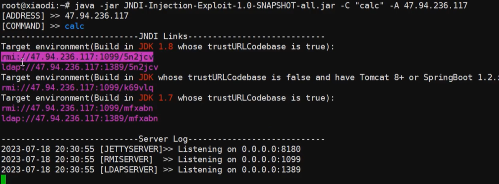
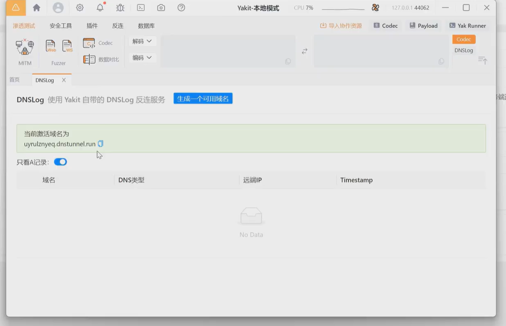
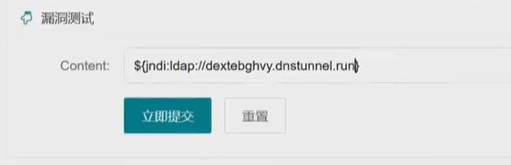
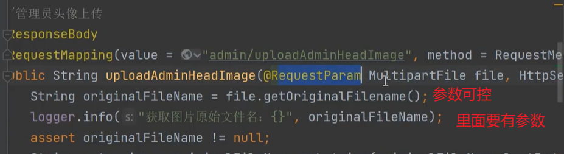

## Java中几个触发RCE的函数

```java
GroovyExec
LoadJsExec
ProcessBuilderExec
ProcessImplExec
RuntimeExec
```

## JNDI



这个工具是生成了一个类，然后对方远程访问加载

## 不安全组件 log4j、Shiro、fastjson、jackson、Xstream

### log4j：

是做日志记录的，因为不知道它在什么功能点会做记录，所以黑盒中的做法就是在各种地方输入payload乱测

如果弹计算器的话也是在对方服务器上面弹，所以用dnslog，看他带不带外

例如，yakit中开启dnslog



需要用ldap协议而不是rmi



白盒审计log4j：

1、看引用组件及版本，搜索`logger.info` `logger.error`



上传一个头像，头像名为paylaod

2、看组件库或者pom.xml

