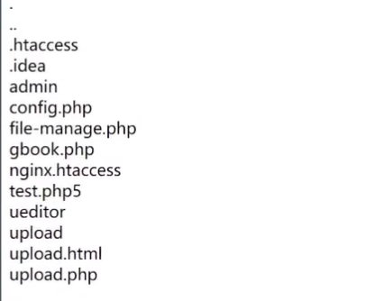
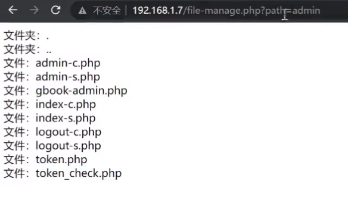
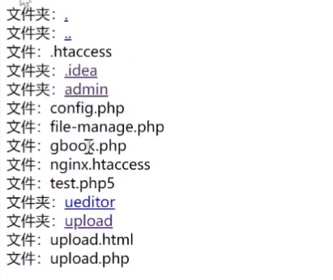

## 文件管理


$_FILES: PHP中一个预定义的超全局变量，用于在上传文件时从客户端接收文件，并将其保存到服务器上。它是一个包含上传文件信息的数组，包括文件名、类型、大小、临时文件名等信息。

$_FILES["表单值"] ["name"] 获取上传文件原始名称

$_FILES["表单值"] ["type"] 获取上传文件MIME类型

$_FILES["表单值"] ["size"] 获取上传文件字节单位大小 

$_FILES["表单值"] ["tmp_name"] 获取上传的临时副本文件名

$_FILES["表单值"] ["error"] 获取上传时发生的错误代码

move_uploaded_file() 将上传的文件移动到指定位置的函数


### 上传


upload.html:

```html
<body>
    <h1>文件上传</h1>
    <form action="upload.php" method="POST" enctype="multipart/form-data">
        <label for="file">选择文件:</label>
        <br>
        <input type="file" id="file" name="file">
        <br>
        <button type="submit">上传文件</button>
    </form>
</body>

```

upload.php:

```php
<?php
$name = $_FILES['file']['name'];
$type = $_FILES['file']['type'];
$size = $_FILES['file']['size'];
$tmp_name = $_FILES['file']['tmp_name'];
$error = $_FILES['file']['tmp_name'];

if(move_uploaded_file($tmp_name,'upload/'.$name)) {
    echo '文件上传成功！';
}

//黑名单写法：
$black_ext = array('php','asp','jsp','aspx');//php5可以
$fenge = explode('.',$name);
$exts = end($fenge);
if(in_array($exts,$black_ext)) {
    echo 
} else {
    move_uploaded_file($tmp_name,'upload/'.$name);
    echo '<script>alert('上传成功')</script>';
}


//白名单写法：
$allow_ext = array('png','jpg','jpeg')
$fenge = explode('.',$name);
$exts = end($fenge);
if(!in_array($exts,$black_ext)) {
    echo '非法文件'; 
} else {
    move_uploaded_file($tmp_name,'upload/'.$name);
    echo '<script>alert('上传成功')</script>';
}

//MIME文件类型过滤
$allow_type=array('image/png','image/jpg','image/jpeg','image/gif');
if(!in_array($type,$allow_type)) {
    echo '非法文件'; 
} else {
    move_uploaded_file($tmp_name,'upload/'.$name);
    echo '<script>alert('上传成功')</script>';
}

?>
    
   
```

### 文件管理

```php
<?php
$dir = './';

$d = opendir($dir);
while(($file=readdir($d))!== false) {//有文件就一直读然后输出
    echo $file."<br>"
}


```




完善：

```php
<?php
$dir = './';

$d = opendir($dir);
while(($file=readdir($d))!== false) {//有文件就一直读然后输出
    echo $file."<br>";
    if(is_dir($file)){
        echo '文件夹：'.$file;
    }else{
        echo '文件：'.$file;
    }
}

?>
```

是文件夹就继续读文件夹里面的：

```php
<?php
$dir = $GET['path'] ?? './'; //如果传参就显示参数的那个目录，不传参就显示当前目录
//例如，?path=../ 则显示上级目录的文件 ?path=admin 则显示admin目录的文件
        
function show_file($dir){//定义成函数
	$d = opendir($dir);
	while(($file=readdir($d))!== false) {//有文件就一直读然后输出
    	echo $file."<br>";
    	if(is_dir($file)){
        	echo '文件夹：'.$file."<br>";
    	}else{
        	echo '文件：'.$file."<br>";
    	}
	}
}

show_file('./');
```



如何形成一个文件夹可点击，点击后进入文件夹

```php
<?php
$dir = $GET['path'] ?? './'; //如果传参就显示参数的那个目录，不传参就显示当前目录
//例如，?path=../ 则显示上级目录的文件 ?path=admin 则显示admin目录的文件
        
function show_file($dir){//定义成函数
	$d = opendir($dir);
	while(($file=readdir($d))!== false) {//有文件就一直读然后输出
    	echo $file."<br>";
    	if(is_dir($file)){
        	echo '文件夹：'."<a href=''?path=$file'>$file</a><br>";
    	}else{
        	echo '文件：'.$file."<br>";
    	}
	}
}
```




php.ini中有 open_basedir 参数，如果使它生效的话，他就只能访问到 D:\phpstudy_pro\WWW，访问不到其他目录

`open_basedir = D:\phpstudy_pro\WWW`
