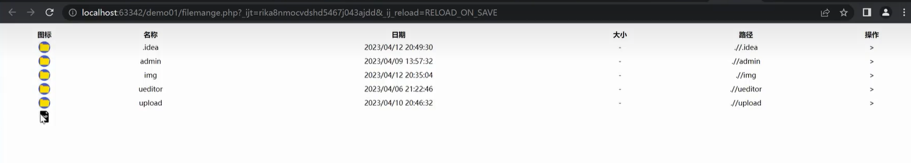
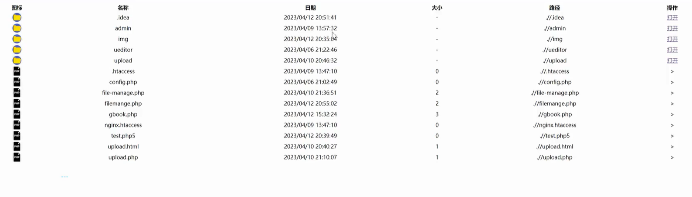
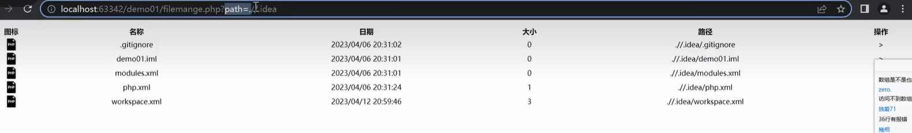
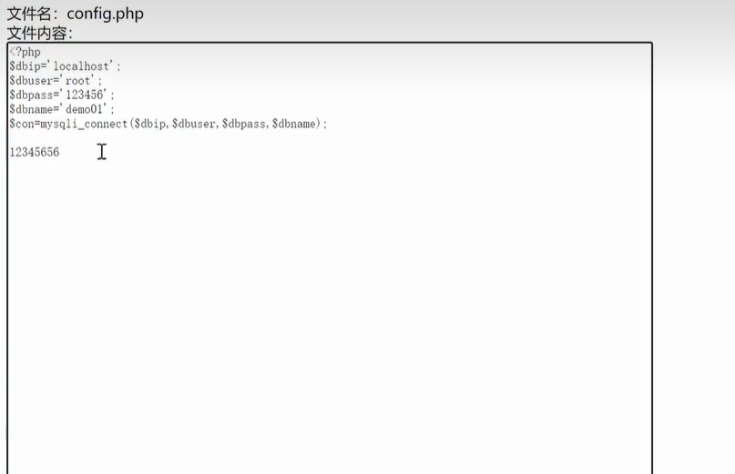

include() 在错误发生后脚本继续执行

require() 在错误发生后脚本停止执行

include_once() 如果已经包含，则不再执行

require_once() 如果已经包含，则不再执行


把其他文件包含过来，方便开发


包含谁就执行谁

如果是`include 'upload.html'`;，那么页面就能显示出upload.html页面的内容

如果死`include($_GET['page']);` ，那么通过 `?page=upload.html` 就能显示出upload.html页面的内容


假如他的项目目录中有一个1.txt，内容是`<?php phpinfo()?>`

那么直接访问1.txt，访问到的是一个txt文件

如果是`?page=`1.txt，那么访问到的就是phpinfo，也就是txt文件被当做php执行


这是因为让用户自己决定包含谁

`filemanage.php`

```php+HTML
<?php
	//安全设置 固定在这个目录 php.ini里面也可以类似的设置
	ini_set('open_basedir', __DIR__);

	$path = $_GET['path'] ?? './';
	$action = isset($_GET['a'])?$_GET['a']:''; //a有值就是a，没有值就是空 接收方法
	$path = isset($_GET['path'])?$_GET['path']:'.'; //接收文件路径 
	if(is_file($path)) {
        //获取文件名
        $file = basename($path);
        //获取路径
        $path = dirname($path);
    }

	// 安全设置 判断 输入的不是文件夹 防止目录遍历
	else if(!is_dir($path)){
        die('无效的文件路径参数');
    }

    function getFileList($path) {
    $handle = opendir($path);
    while(($filename = readdir($handle))!== false){
        if($file_name !== '.' && $file_name !== '..') {
            //获取文件及文件夹路径
            $file_path = "$path/$file_name";
            //获取文件及文件夹类型
            $file_type = filetype($file_path); //dir和file两种
            //将文件和目录封装成数组
            $list[$file_type][] = array(
            	'file_name' => $file_name,
                'file_path' => $file_path,
                'file_size' => round(filesize($file_path)/1024),
                'file_time' => date('Y/m/d H:i:s', filetime($file_path)),
            )
        }
    }
    	closedir($handle);
    	return $list;
}


$list = getFileList($path);//因为下面要调用$list

//接收方法，判断是什么操作
swith($action){
    case 'del':
    	//unlink($file);// 删除写法1
    	system("del $file"); //删除写法2——造成命令执行漏洞 path= ./1.php | ping 127.0.0.1 没回显就使用dnslog看
    	break;
    case 'down':
    	header("Content-Type: application/octet-strram");
    	header("Content-Disposition: attachment; filename=\"".$file."\"");
    	header("Content-Length:".filesize($file));
    	readfile($file);
    	break;
    case 'edit':
    	//有一个输入框显示原本的文件内容
    	$content = file_get_contents("$path/$file");
    	echo '<form name="form1" method="post" action="">';
    	echo "文件名：".$file."<br>";
    	echo "文件内容：<br>";
    	echo '<textarea name="code" style="resize:none;" rows="100" cols="100">'.$content.'</textarea><br>';
    	echo '<input type="submit" name="submit" id="submit" value="提交">';
    	echo '</form>';
    	break;
    	
    	
}

//检测编辑后提交的事件 写入
if($isset($_POST['code'])){
    $f = fopen("$path/$file",'w');
    fwrite($f,$_POST['code']);
    fclose($f);
}
	

?>

<tr>
	<th>图标</th>
    <th>名称</th>
    <th>日期</th>
    <th>大小</th>
    <th>路径</th>
    <th>操作</th>
    
</tr>
<!-- 文件夹-->
<?php foreach(list['dir'] as $v): ?>

<tr>
	<td></td>
    <td><?php echo $v['file_name']?></td>
    <td><?php echo $v['file_time']?></td>
    <td>-</td>
    <td><?php echo $v['file_path']?></td>
    <td><a href="?path= <?php echo $v['file_path'];?>">打开</td>
</tr>

<?php endforeach;?>


<!-- 文件-->
<?php foreach(list['file'] as $v): ?>

<tr>
	<td></td>
    <td><?php echo $v['file_name']?></td>
    <td><?php echo $v['file_time']?></td>
    <td><?php echo $v['file_size']?></td>
    <td><?php echo $v['file_path']?></td>
    <td>
        <a href="?a=del&path=<?php echo $v['file_path']?">编辑</a>
        <!-- 传递a为del，file为文件 -->
        <a href="?a=del&path=<?php echo $v['file_path']?>">删除</a>
        <a href="?a=down&path=<?php echo $v['file_path']?>">下载</a>
    </td>
</tr>

<?php endforeach;?>
```

效果：




效果：



打开文件夹：



`edit.html`

```html
<!DOCTYPE html>
<html lang="en">
<head>
    <meta charset="UTF-8">
    <title>内容更改</title>
</head>
<body>
    <form name="form1" method="post" action="1.php">
        文件名: <input type="text" name="filename"><br>
        文件内容:
        <br><label for="content"></label><textarea id="content" rows="100" cols="100" name="content"></textarea><br>
        <input type="submit" name="submit" id="submit" value="提交">
    </form>
</body>
</html>


```

编辑时：


