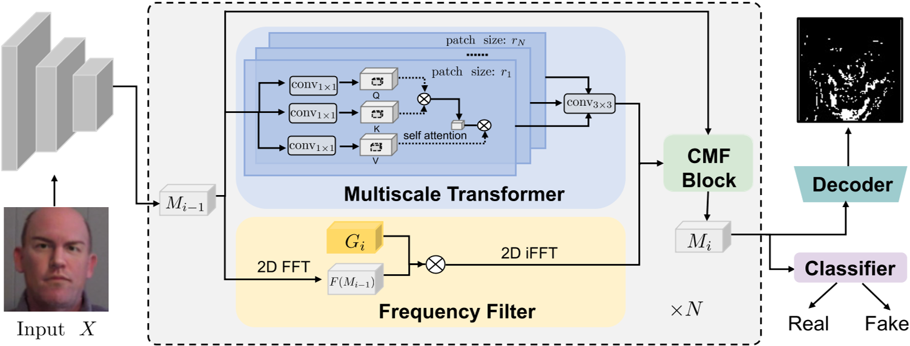

## Multi-modal Muti-scale Transformer for Deepfake detection

考虑到扰动例如压缩会影响在RGB域的判断，用频率域的判断加以辅助

## 双流：

the RGB stream captures the inconsistency among different regions within an image at multiple scales in RGB domain
RGB流捕获RGB域中多个尺度图像中不同区域的不一致性

频率流采用可学习的频率滤波器滤除频域伪造特征

我们还设计了一个交叉模态融合块，以交互方式更有效地组合来自两个流的信息。

最后，将集成的特征输入到全连接层以生成预测结果。除了二元分类之外，我们还以多任务方式预测人脸图像的操纵区域。其基本原理是二元分类往往会导致模型容易过度拟合。因此，**我们使用人脸掩码作为额外的监督信号来减轻过度拟合**。

## 概念解释：
**1、Patch（图像块）**
可以把一张图像想象成一个大棋盘，我们可以把它拆成很多 小方块（即 patch），然后让模型逐个分析这些小块中的信息。
例如，把一张 256×256 的图像切成 16×16 的小块，每个小块就被称为 patch。

**2、Head（注意力头）**
Transformer 里有个重要的机制叫 自注意力机制（Self-Attention），它能帮助模型关注图像中的重要部分。
由于不同区域可能有不同的伪造特征，我们用多个“注意力头（head）”来同时观察图像的不同部分，每个 head 负责关注不同的信息。

**3、Epoch（训练轮次）**
Epoch 就是“完整看一遍所有数据”，如果我们有 100 张图像，每个 Epoch 就表示“模型把这 100 张图像都训练了一次”。

## 方法描述

### 1、初始工作

输入是可疑的假人脸 H x W x C (c = 3)。H是图像的高度，W是图像的宽度，C是图像的通道数。c = 3 对应RGB三个通道

首先使用多个卷积层提取特征 F ∈ R^(H/4) x (W/4) x C  **（为什么是四分之一）**

**使用卷积是确保更快的收敛和更稳定的训练**

提取的图像的特征被输入到连续的 Multi-scale Transformer 和 Frequency Filter

输出是 H x W x 1 输出的是灰度图

### 2、Multi-scale Transformer
输入是前一个**交叉模态融合块**(cross modality fusion block)的输出 M_{i-1} (which is initialized as F)。将其**分成不同大小的空间块**（spatial patches）and 计算不同头部的补丁自我注意 **（calculate patch-wise self-attention in different heads）**

**分成不同大小的空间块**:
从上一层模型（M_{i-1}）的输出中 提取小块（patch），每个小块的大小是 r_h × r_h × C。
例如，如果 r_h=16，那么每个小块就是 16×16 的小图像。

**变换成向量 Embedding**
每个小块（patch）会被“展平”（reshape），从 r_h × r_h × C 变成一个 1D 向量（即一个数字序列）。
然后，用一个全连接层（fully-connected layer）把这些向量转换成 查询（Query）、键（Key）和数值（Value）。

**计算注意力**
Query（Q）：表示当前 patch 需要关注的信息
Key（K）：表示所有 patch 提供的信息
Value（V）：表示所有 patch 的实际特征信息

**还原为原始大小**
计算完注意力后，得到 A^h_i，然后把它重新变成和输入图像相同的空间大小。
不同的注意力头（head）得到的特征 被拼接在一起（concatenate），然后通过一个 2D 残差块（Residual Block） 进一步处理。
最终的输出 T_i 形状为 (H/4) × (W/4) × C，表示经过多尺度 Transformer 处理后的特征。

### Frequency Filter

