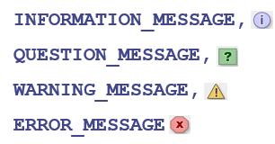

# 标识符和关键字
### 原则
1、标识符可以由字母（英文字母或者中文）、数字、下划线、$ 组成，不能以数字开头。
2、标识符不能是 Java 关键字和保留字
3、标识符是严格**区分大小写的**
4、标识符没有长度限制
5、**可以使用汉字**

# 基本数据类型
final可以**修饰类、方法和变量**，final的作用是 保证这些被修饰的元素一旦被赋值，就不能再被改变。
如：被 final 修饰的类不能被继承，被 final 修饰的方法不能被子类重写，被 final 修饰的变量一旦被赋值，就不能再被改变

如果一个引用变量用 final 修饰，意味着这个变量的引用不能再指向别的对象。但对象本身的内容是否可变，取决于对象的类型（如 String 是不可变的，StringBuffer 是可变的）。

=========================================

如果一个数包括小数点或指数部分，或者在数字后带有字母F或f（float）、**D或d（double）**，则该数为浮点数。

如果不明确指明浮点数的类型，浮点数缺省为double。（默认是double）
不可以： float f=3.14; （默认是double类型，隐式转换不可以）高精度不可以隐式转换成低精度

## 数据类型转换
### 分为：自动转换、 强制类型转换
#### （1）自动转换
基本数据按精度从“低”到“高”顺序如下：（高精度不可以隐式转换成低精度）
    char  byte  short  int  long  float  double
例：

    int  x=50;
    float y;
    y=x; 

#### （2）强制类型转换

当级别高的变量的值赋给级别低的变量时，必须进行强制类型转换。
        (类型名)要转换的值；
注：
      将浮点数转换为整型数时，对小数部分进行截断处理，而**不考虑四舍五入**。（大桶水无法装进小桶）

### 输入框
showInputDialog(Component parentComponent, String message, String title, int messageType) 

String strRadius = JOptionPane.showInputDialog(null, "please input radius",  "input", JOptionPane.QUESTION_MESSAGE);

**第四个参数是图标，图标都可以哪些类型：**

    例题：
    import java.util.Scanner;
    import javax.swing.JOptionPane;

    public class biaoshifu {
        public static void main(String[] args) {
            //在命令行中
            // Scanner reader = new Scanner(System.in);
            // System.out.println("输入pi：");
            // double pi = reader.nextDouble();
            // Scanner reader = new Scanner(System.in);
            // System.out.println("输入半径：");
            // double banjing = reader.nextDouble();
            // System.out.print(pi*banjing*banjing);

            //在对话框中
            String strRadius = JOptionPane.showInputDialog(null, "please input radius", 
    "input", JOptionPane.QUESTION_MESSAGE);
            double Radius = Double.parseDouble(strRadius);
            String strpi = JOptionPane.showInputDialog(null, "please input pi", 
    "input", JOptionPane.QUESTION_MESSAGE);
            double pi = Double.parseDouble(strpi);
            System.out.println(pi*Radius*Radius);

        }

    }

### java数组

声明时不必指定数组大小

Java语言允许通过数组的初始化语句创建数组

示例:
  int[ ] n1 = { 10, 20, 30, 40, 50 };
  int[ ] n2=new int[ ]{1,2,3,4,5};

**错误：**
int b[];
b={1,2,3};

正确：
int b[];
b=new int[]{1,2,3};

**二维数组的每一行可以具有不同的列数**
