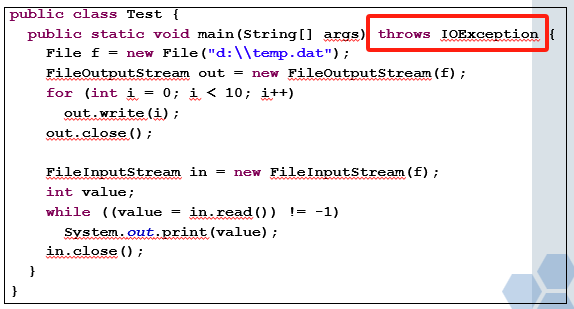
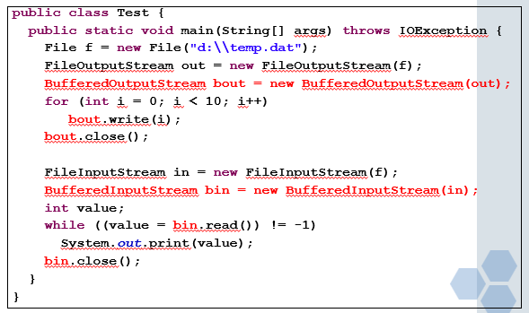
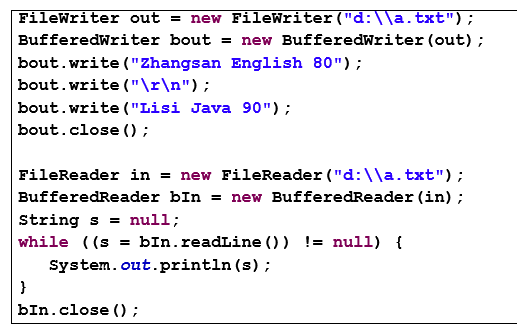

## 流的分类：

按照读取数据的方向：输入流和输出流

按照读取数据的单位：字节流和字符流（为什么分为这样两类呢？字节流是按照逐个字节读写，但是对于汉字或者东南亚的文字来说，一个文字是两个字节，利用字节流容易出现乱码问题。因此使用字符流）

按照功能：结点流和处理流（也成为过滤流）

为了表示各种各样的流，java为我们提供了四个抽象类，分别是**InputStream和OutputStream， Reader和Writer**。

**其中InputStream和Reader从方向上来讲都是输入流，负责读文件的，同时InputStream是字节流，而Reader是字符流。**

**input和ouput是从程序的角度说的，input是读文件中的数据到程序，output是把程序中的数据写到文件中。**

这几个抽象派生了很多类，其中一部分是结点流，一部分是过滤流。

# 字节流

## 输出流：
#### 输出流是向文件写数据，站到程序的角度，是将程序中的数据写入到文件中。

### FileOutputStream

一个简单的例子：

    FileOutputStream out = new FileOutputStream("d:\\aa.dat");
    Out.write(10)
    out.write(11);
    out.close();

### BufferedOutputStream

FileOutputStream是一个字节一个字节的往硬盘上的文件里写，第一效率比较低；第二频繁对硬盘操作，**BufferedOutputSteam**可以解决这个问题。

在FileOutputStream外再包装一个缓冲输出流，先将要写入文件的内容先写到缓冲区中（内存上的一小块临时空间），写满后，由缓冲区直接复制到硬盘上，这样可以减少对硬盘的操作，并且提高效率。

    FileOutputStream out = new FileOutputStream("d:\\aa.dat");
    BufferedOutputStream bOut = new BufferedOutputStream(out);
    bOut.write(10);
    … …
    bOut.close();

#### BufferedOutputStream是对FileOutputStream进行再次包装,不是对文件。如果过滤流存在的情况下，关闭过滤流即可释放所有的流相关资源

## 输入流：
#### 输入流是读文件数据，站到程序的角度，是读文件中的数据到程序中

### FileInputStream

read()方法返回的是0-255之间的int型字节值，如果读到文件末尾，返回-1

### BufferedInputStream

    FileInputStream in = new FileInputStream("d:\\aa.dat");
    BufferedInputStream bIn = new BufferedInputStream(in);
    int value = 0;
    while ((value = bIn.read()) != -1) {
        System.out.print(value);
    }
    bIn.close();

注意是-1而不是null

用缓冲流：

# 字符流

## Reader

Reader分为FileReader和BufferedReader
是从文件读到程序

BufferedReader有个readLine()方法，可以读取一行，相比于BufferedInputStream的read()只可以读一个字节

## Writer
writer分为FileWriter和BufferedWriter

BufferedWriter有个write(String s)方法

## 综合案例：

#### 考试注意

要用BufferedReader读文件，那前面要定义好FileReader，即读谁

BufferedReader里面的read()方法返回的是一个整形变量，即你的s应该是个整形变量。前面是String类型的话，肯定要用readLine()

整形是看等不等于-1，String类型是看等不等于null

考试考的是**throws IOException**，这种方式的异常处理，这两个关键字的地方会挖空