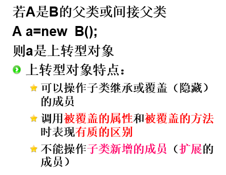

## 类的继承语法规则

（1）继承不改变成员的访问权限
【父类中的公有成员、保护成员和默认成员，在子类中仍然是公有成员、保护成员和默认成员】**（注意没有private成员，因为继承不到）**
（2）父类中私有数据域和方法在类的外面不能访问，因此也就不能被继承
（3） Java仅支持**单继承**，而不支持多重继承，即每个子类只允许有一个父类，而不允许有多个父类。但是可以从一个父类中生成若干个子类。Java中的多继承将通过接口方式来实现。

#### 方法的重写与重载之间是什么区别？
重写：
如果子类对继承父类的方法不满意，可以重写从父类继承的方法；当子类对象调用该方法时，优先调用子类的方法。

**重写的方法的返回值、方法名、参数类型及个数是和父类相同的**

重载：
重载不仅可以应用在父类和子类之间，也可以在一个类内。方法的返回值和方法名必须相同，但是**参数必须不同**，体现在参数的个数，参数的类型。

### 构造方法的继承
当一个类的实例被创建，会先调用**父类**的构造方法，再调用子类的构造方法。

**先执行父类的无参构造函数，再执行子类自身的。如果想先执行父类有参的构造函数，需要通过super显示调用。**

### 类的继承关键字

指出该对象是否是指定**类或者其子类**的一个实例

final关键字的作用是防止变量、方法和类发生变化，这些变化包括变量的值不能修改、方法不能被重写（**但是可以重载**），类不能被继承。

Overwrite
覆盖方法和被覆盖方法要么都是类方法，要么都是实例方法，不能一个是类方法（static），一个是实例方法。

## 上转型对象

**使用注意事项：**
1、不要混淆父类对象、子类对象、上转型对象
2、可以将上转型对象转换为子类对象
3、不能将父类对象的引用赋给子类声明的对象

## 抽象类abstract
（1）抽象类中可以没有抽象方法，如果类里面有抽象方法，那这个类就是抽象类
（2）抽象方法没有任何代码实现
（3）**抽象类必须被继承，抽象方法必须被子类重写；** 这一点和final类和final方法不同，final类不能被继承，final方法不能被重写
（4）不能从抽象类生成实例

## 接口 interface
接口里面定义的方法没有任何代码实现，都是抽象的方法，因此接口就像一个规范一样，规定了实现该接口的类具备怎样的规则

其中的方法都是抽象方法，前默认加public abstract，属性都是常量，前默认加public static final

接口的定义规则：

    public interface USB {
           public void work();  //USB设备工作方法	
           public void stop();   //USB设备停止工作方法
    }

**接口的抽象方法在不同实现类中表现出多态性。**

#### 接口的实现类
public class Mouse implements USB {}
一个类可以实现多个接口

#### 接口的继承
接口可以继承多个接口
public interface A extends B,C {}

### 接口与抽象类的区别
接口是抽象类的一个简化版本，接口不能有构造方法，接口不能有成员变量，接口中的成员方法都是抽象方法，接口中的成员变量都是常量。

**接口中只能有抽象方法，抽象类中可以有非抽象方法**

