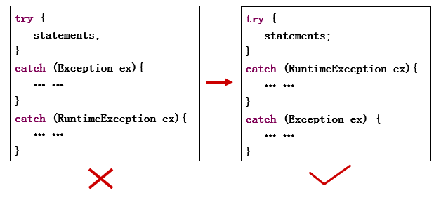
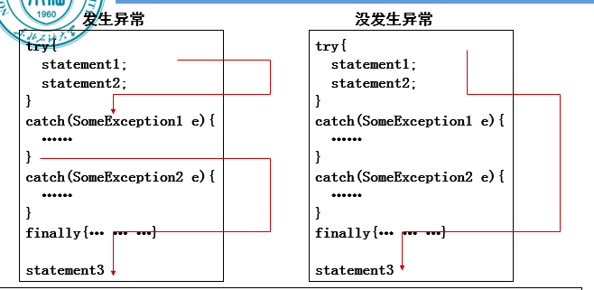

异常是程序运行时产生的，与编译无关
异常是中断了正常指令流的事件。

throw 在方法中手动抛出异常。（抛出异常）
throws 声明变量的方法可能抛出的异常。（转移异常）
try catch finally（捕获异常）

## 捕获异常
如果一个catch块以Exception类进行捕获异常，则它能捕获到所有Excepiton的子类的异常对象

如果父类的catch块出现在子类的catch块前面，就会导致编译出错

1.无论发生异常与否，finally块中的语句必须执行；
2.发生异常后，在try块中，发生异常的语句后面的语句都不再执行；
3.发生异常后，如果异常被捕获到，执行相应的catch块里的语句，然后执行finally块里的语句和finally块后的语句（statement3）；**如果没有捕获到，只执行finally块里的语句，而statement3将不能执行。**

## 抛出异常
程序检查到一个错误后，创建一个适当类型的异常的实例并抛出它，这就称为抛出异常

手动

    try {
    int m = 100, n=0;
    if (n==0) 
        throw new ArithmeticException();
    int a = m/n;
    } catch (ArithmeticException e) {
    System.out.println(“error");
    }

## 转移异常
public void m1() throws SomeException
public void m2() throws SomeException1,…,SomeException2

## 自定义异常
class 异常类名称 extends Exception{
    ……
}

    public class MyException extends Exception{
    
    }
    
    public class CustomExceptionExample {
    public static void main(String[] args) {
        try {
        throw new MyException();//手动抛出自定义异常
        } catch (MyException e) {//异常在catch块中被捕获
        System.out.println(e);//打印的是异常的名称
        System.out.println("It's caught!");
        }
        finally{
        System.out.println("It's finally!");
        }
    }
    }

自定义异常，并带有自定义的消息提示

    public class MyException extends Exception{
    public MyException(String message){
        super(message)
    }
    }
    public class CustomExceptionExample {
    public static void main(String[] args) {
        try {
        throw new MyException(“test“);
        } catch (MyException e) {
        System.out.println(e);//打印的是异常的名称和
        自定义的消息提示
        System.out.println("It's caught!");
        }finally{
        System.out.println("It's finally!");
        }
    }
    }