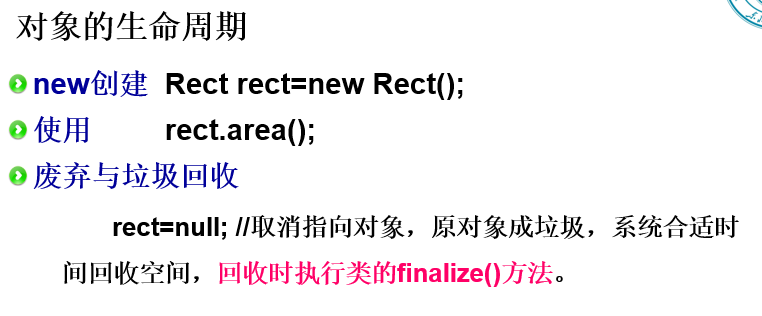
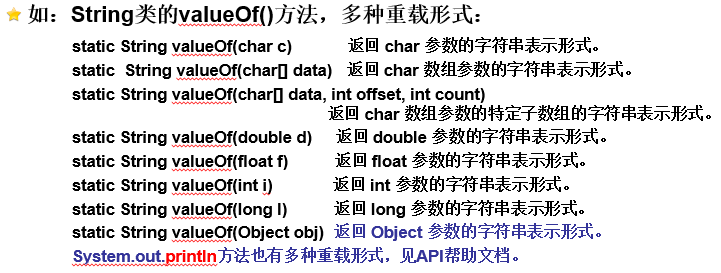
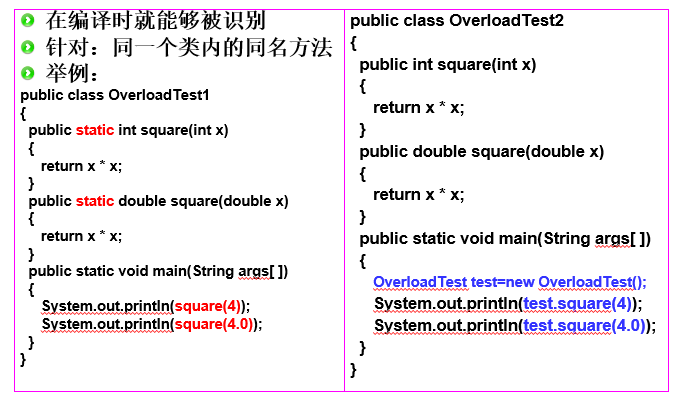
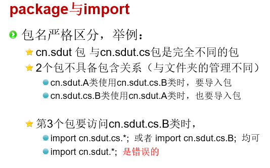
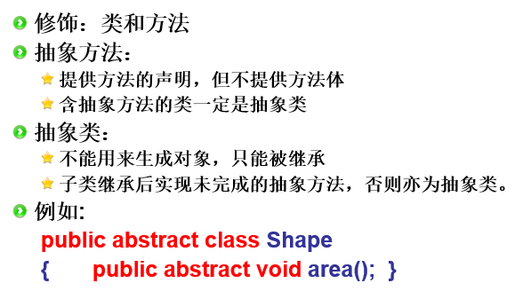
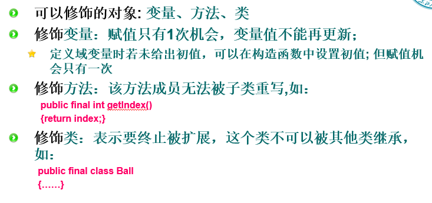

定义类的时候一般会包含三要素：**类名、属性、方法。**

垃圾回收时机：在**内存资源不足**或在**程序执行空闲**的时候

## 构造方法
需要注意的点：

（3）构造方法**不能**由编程人员显式地直接调用。
（4）构造方法总是和new运算符一起使用。
（5）在创建一个**类的新对象**的同时，系统会自动调用该类的构造方法为新对象初始化。
（7）构造方法可以带有参数，但没有返回类型。
（8）一个类可以有多个构造方法，但必须具有不同的参数列表。程序运行时,  根据分配对象时所指定的参数数据类型、参数个数，决定使用哪一个构造函数创建对象。

## 类的方法
**不定长参数：**
声明参数在类型关键词后加上…，如：
public int sum(int... nums)
{…… …… …… …… …… }
编译器会将参数行的sum(int... nums)解释为sum(int[] nums)。
声明的不定长参数必须在参数的**最后一个。**

**类方法：** 返回类型前面加上了static

**实例方法：** 无static

### static方法

static修饰的成员属于类所有，是每个实例（对象）所共享的成员。

静态方法能直接调用静态变量和其他静态方法。

静态方法不能直接使用非静态域变量和非静态方法，创建对象后，通过对象调用。

实例方法(非静态方法)可以直接调用:实例变量、其他实例方法、类变量（静态变量）和类方法（静态方法）

### 方法的重载
方法名称相同，参数个数及参数类型不同

举例：同一个类内的同名方法：

体现出有有static和无static的区别：主函数是静态方法，所以可以直接调用上面的静态方法，而如果上面的方法不是静态方法，就只能自己创建对象再通过对象调用

**几个关于static的题目：**

1、类中static修饰的变量或方法，可以使用类名或对象的引用变量直接访问。==**对**==

2、在类中利用关键字 **static** 修饰的成员变量可以被所有的实例对象共享

==static 修饰的成员变量称为类变量，它不属于某个具体的实例，而是属于类本身，所有实例共享同一个类变量。==

**3、下面哪些可以使用 static 关键字修饰?(多选)**

static 修饰的成员变量称为类变量，属于类本身，而不是类的实例。

A.成员变量  **对**

B.局部变量 

C.成员方法  **对** static 修饰的方法是静态方法，属于类本身，可以通过类名直接访问

D.成员内部类  **对**

成员内部类也可以被 static 修饰，称为静态内部类。静态内部类与外部类的实例对象无关，不能直接访问外部类的实例变量和方法，只能访问外部类的静态成员。

**方法内部类不能被static修饰**

==========================================================

### 访问修饰符 

类的访问权限关键字包括 **public、protected、private**和默认（default）4种

public：该类对所有其他类可见。

protected：该类对同一包内的类以及不同包子类可见。

private：该类只能在定义它的类内部访问。

default（默认）：包访问权限，可以在同一包内访问

## abstract

抽象类中可以有正常的方法
子类必须重写抽象类的抽象方法

### final
