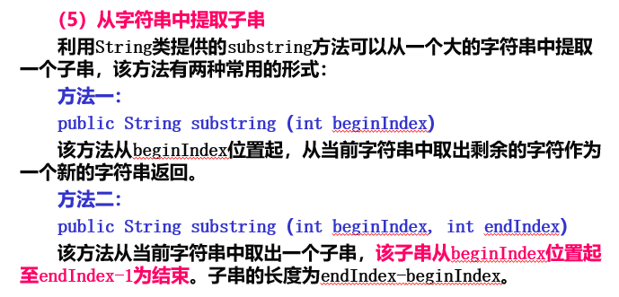
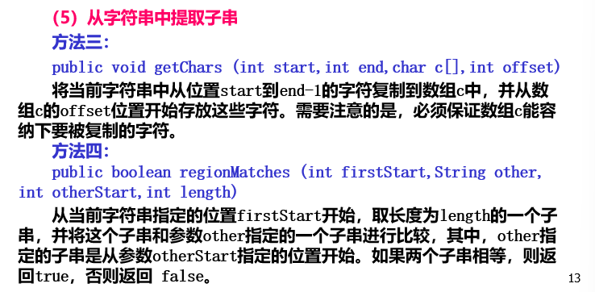
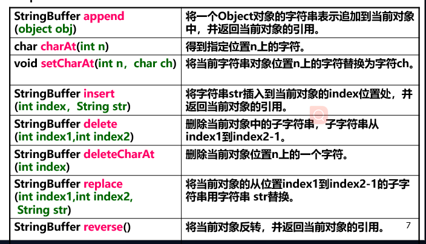
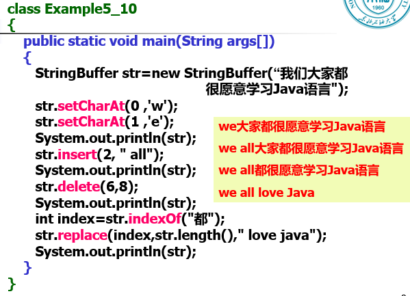

#### 在Java中，没有内置的字符串类型，字符串常量是作为String类的对象存在的。 String类的对象表示的是字符串常量，一个字符串常量创建以后就不能够被修改了。所以在创建String类对象时，通常需要向构造函数传递参数来指定创建的字符串的内容。

    String s = "Hello"

这里的s是一个String类的对象，在java中没有内置的字符串类型，字符串常量是作为String类型的对象存在的。

"Hello" 是一个字符串常量（字面量），它会自动存储在字符串池（String Pool）中。字符串池是Java中为了节省内存和提高效率而使用的一种机制，所有相同的字符串字面量都会引用池中的同一个实例，而不是每次都创建新的 String 对象。

但实际上我们并没有显式地调用构造函数来创建String类型的对象，而是通过字符串字面量（即 "Hello"）的方式，间接创建了一个 String 类型的对象。这里的关键点是 字符串字面量 的自动处理。Java 会在编译时自动将字符串字面量 "Hello" 转换成一个 String 类型的对象，并将其存储在 字符串池 中。

当写 String s = "Hello"; 时，Java 会把 s 这个变量指向字符串池中的 "Hello" 字符串对象。

    String s1 = "Hello";
    String s2 = "Hello";
    System.out.println(s1 == s2); // 输出 true，s1 和 s2 引用的是同一个对象
    
    String s3 = new String("Hello");
    System.out.println(s1 == s3); // 输出 false，s3 是通过构造函数创建的，引用的是不同的对象

### String类的构造方法

#### 1、public String() 

创建一个空白字符串对象，即字符串长度为0

    String str = new String();

#### 2.public String (String value)

根据已经存在的字符串常量来创建一个新的字符串对象，这个新对象的内容与传入的 value 字符串一致。

    String str = "Hello";
    String str1 = new String(str);

#### 3.public String (char[] value)

    char[] charArray = {'H', 'e', 'l', 'l', 'o'};
    String str = new String(charArray);// str 是 "Hello"

#### 4.public String (char a[], int startindex, int count)

    char[] charArray = {'H', 'e', 'l', 'l', 'o'};
    String str = new String(charArray, 1, 3);// str 是 "ell"

#### 5.public String (StringBuffer buffer)

    StringBuffer sb = new StringBuffer("Hello");
    String str = new String(sb);// str 是 "Hello"

### String类常用方法

#### concat(String str)因为字符串常量不可变，所以产生了一个新对象

#### 1.字符串的比较 考试考过

    public int compareTo(String anotherString)

两个字符串按Unicode中排列的顺序进行比较，如果两个字符串是完全相等的，返回0；如果发现了不同的地方，则比较过程会停下来，如果当前字符串在这个位置上的字符大于参数中这个字符，返回一个 “大于” 0的整数，否则返回一个小于0的整数。这个数是当前位置上所对应字符的Unicode代码的差值。

    public class DtoE {
        public static void main(String[] args){
            String s = "Hello";//e的Unicode是101
            String s1 = "Hallo";//a的Unicode是97
            Integer a = s.compareTo(s1);
            System.out.println(a);//返回4
    
        }
    
    }

其他方法：

    public boolean equals(Object anObject)

相等返回true，不相等返回false

    public boolean equalsIgnoreCase(String anotherString)

该方法与equals方法类似，不同的是，equalsIgnoreCase方法将忽略字母大小写的区别

#### 例子，曾经考过

    class Test{
    public static void main(String[] args){
        String s1,s2;
        s1 = new String("we are students");
        s2 = new String("we are students");
        System.out.println(s1.equals(s2));//true
        System.out.println(s1 == s2);//false  比较的是地址
    
        s1 = "how are you";
        s2 = "how are you";
        System.out.println(s1.equals(s2));//true
        System.out.println(s1 == s2);//true
    }
}

解释：

s1 = new String("we are students"); 是使用String类构造函数显式地创建一个新的String对象，字符串字面量 "we are students" 会被放入 字符串池（String Pool）中。然后，new String("we are students") 会在堆内存中创建一个新的 String 对象，并且该对象的内容和字符串池中的 "we are students" 相同，但它们是两个不同的对象。

因此，s1 引用的是一个新的 String 对象。那么，s2引用的也是一个新的String对象。

== 比的是地址 equals比的是内容。

s1 = "how are you";  s2 = "how are you";  s1和s2都指向同一个字符串池中的 "how are you" 对象，内存地址相同。

#### 从字符串中提取子串

#### 考点 

##### 将字符串逆序后输出

    public class Test{
        public static void main(String[] args){
            String s = "巴西足球队击败德国足球队";
            String ss = "";
            for (int i = s.length()-1; i>=0; i--){//8个字符，i就是从0到7
                ss = ss.concat(s.substring(i,i+1));
            }
            System.out.println(ss);
        }
    }

考这个：

    class Example5_6
    {  public static void main(String args[])
        { char c[],d[];
        String s="巴西足球队击败德国足球队";
        c=new char[2];
        s.getChars(5,7,c,0);
        System.out.println(c); // 击败
        d=new char[s.length()];
        s.getChars(7,12,d,0); // 德国
        s.getChars(5,7,d,5); 
        s.getChars(0,5,d,7);
        System.out.println(d); // 德国足球队击败巴西足球队
        }
    }

#### 单个字符查找

    String s1;
    s1 = new String("abcdef");
    System.out.println(s1.indexOf("d",2));//3

lastIndexOf()从字符串的末尾位置向前查找，返回的是字符ch在字符串中最后一次出现的位置。

    String s1;
    s1 = new String("abcdef");
    System.out.println(s1.lastIndexOf("d",5));//3

还是3

#### 去掉开头结尾的空格 trim()

#### 替换 replace(char oldChar, char newChar) 替换的是所有oldchar

    public static void main(String[] args) {
        String s1="abcdefg";
        String s2="hijklmn";
        String s3="abcdefghijklmn";
        String s4="abcdefg"+"hijklmn";
        System.out.println(s3==s4);
        System.out.println("加入Pool前:"); 
        String s5=null;
        s5=s1+s2;           //引用相加，不是常量相加
        System.out.println("s3=s5? "+(s3==s5));
        System.out.println("加入Pool后:");       
        String s6=s5.intern();
        System.out.println("s3=str6? "+(s3==s6));  
    }

由于 "abcdefg" 和 "hijklmn" 是编译时已知的常量字符串，"abcdefg" + "hijklmn" 会在编译阶段直接优化成 "abcdefghijklmn"，所以 s4 指向字符串常量池中的 "abcdefghijklmn"，和 s3 指向的是同一个对象。

s5 = s1 + s2;：
这里的 s1 和 s2 是引用变量，而不是常量字符串。
因此，s1 + s2 会在运行时动态地拼接两个字符串，这会创建一个新的 String 对象（存储在堆内存中），而不是存储在字符串常量池中。
结果：s5 指向堆中的一个新对象，该对象的值为 "abcdefghijklmn"

intern()方法的功能：如果String pool中包含内容相同的String对象，就从池中取出对象的引用返回；否则String对象会被加入池中，返回这个新对象的引用。

s5.intern()：
调用 intern() 方法时，会检查常量池中是否已存在与 s5 相等的字符串。
如果常量池中已经有了 "abcdefghijklmn"，intern() 会返回池中这个字符串的引用。
如果常量池中没有，则会将 s5 的值添加到常量池中，并返回该池中字符串的引用。
在本程序中，常量池中已经存在 "abcdefghijklmn"（即 s3 和 s4 指向的对象），所以 s6 会指向常量池中的 "abcdefghijklmn"。

