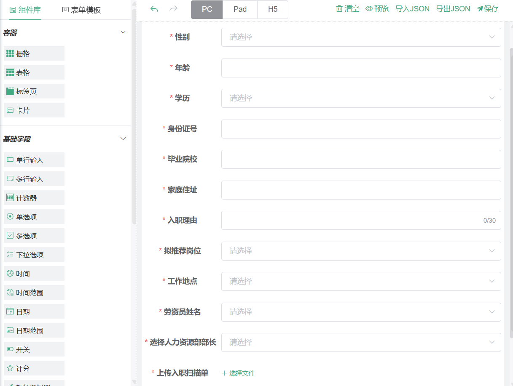
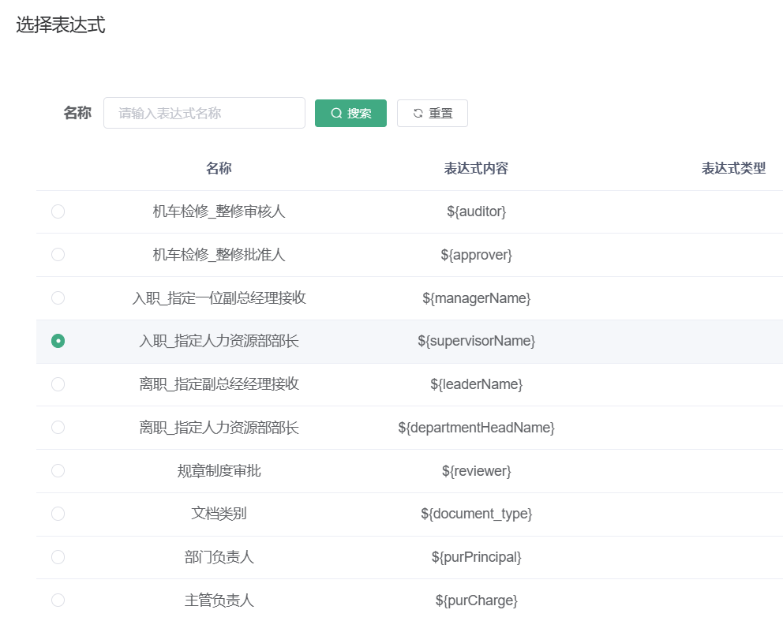
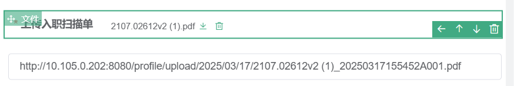

## 入职（离职）流程设计

**都是些个人方法，并不一定是最好的方法**



学历、拟推荐岗位、工作地点都需要绑定对应的字典，**表单中的东西没有对应的前端代码**，而是以下面这样的json代码，在数据库中存储。前端页面加载时，Vue会将这些 JSON 数据解析并渲染成表单。具体的步骤并不清楚。

```json
{
"type": "select",
"icon": "select-field",
"formItemFlag": **true**,
"options": **{**
"name": "recommendPosition",
"label": "拟推荐岗位",
"labelAlign": "label-center-align",
"defaultValue": "",
"placeholder": "",
"columnWidth": "200px",
"size": "",
"labelWidth": "145",
"labelHidden": **false**,
"disabled": **false**,
"hidden": **false**,
"clearable": **true**,
"filterable": **false**,
"allowCreate": **false**,
"remote": **false**,
"automaticDropdown": **false**,
"multiple": **false**,
"multipleLimit": **0**,
"optionItems": **[**
**{**
"label": "select 1",
"value": **1**
**}**,
**{**
"label": "select 2",
"value": **2**
**}**,
**{**
"label": "select 3",
"value": **3**
**}**
**]**,
"required": **true**,
"requiredHint": "请选择拟推荐岗位",
"validation": "",
"validationHint": "",
"customClass": **[****]**,
"labelIconClass": **null**,
"labelIconPosition": "rear",
"labelTooltip": **null**,
"onCreated": "",
"onMounted": "",
"onRemoteQuery": "",
"onChange": "",
"onFocus": "",
"onBlur": "",
"onValidate": ""
**}**,
"id": "select58020"
**}****,**
```

### 如何给这里的表单绑定字典：

json字符串从数据库中取出，由前端渲染。绑定字典的思路是在前端渲染时给它绑定一个字典，相当于这时候把字典中的内容塞给下拉框。

flowable审批流中，第一个节点的审批页面对应的是前端中的 **src-views-flowable-task-myProcess-send-index.vue**

而第二个审批节点对应的是 **src-views-flowable-task-todo-detail-index.vue**

在methods中写以下方法（以拟推荐岗位为例，其他下拉框只需要类似地添加if即可）：

```javascript
/** 流程表单数据 */
getFlowFormData(deployId) {
  const params = { deployId: deployId };//deployId是流程部署id，作为请求参数传递
  flowFormData(params).then(res => { //下面写了flowFormData方法
    if (res.data && res.data.widgetList) { //widgetList是组件列表
      const dictKeys = new Set(); //set是无重复值的集合，可以确保不重复添加相同的字典
      res.data.widgetList.forEach(widget => {
        if (widget.type === 'select') {
          // 入职——拟推荐岗位
          if (widget.id === 'select58020') {
            dictKeys.add("sys_position_title");
          }
        }
      });
      this.loadDictionaries(Array.from(dictKeys)).then(() => { //将set类型的dictKeys转换为数组类型，然后调用loadDictionaries方法
        this.updateFormOptions(res.data);
      });
    }
  }).catch(err => {
    console.error("加载表单数据失败:", err);
    this.goBack();
  });
}

// 批量加载字典数据
loadDictionaries(dictKeys) {
  const dictPromises = dictKeys.map(key => //map遍历数组
    this.getDicts(key).then(response => {
      this.$set(this.dict, key, response.data);
      //相当于this.dict["字典名"] = ["response.data的内容"]
    })
  );
	//dictPromises 是一个包含所有 getDicts(key) 调用的 Promise 数组。这个数组存放的是每次getDicts(key)返回的promise
  
    return Promise.all(dictPromises);//promise.all会并行执行所有 Promise，即同时请求所有字典数据，而不会等待一个请求完成后再进行下一个请求（提高性能）。只有在所有 Promise 都成功时才会返回，如果有一个 Promise 失败，则整个promise.all()失败。
}

updateFormOptions(formData) {
  this.$nextTick(() => { //$nextTick让Vue在DOM更新完成之后再执行内部的回调函数，在 Vue 中，数据的更改不会立即反映到 DOM，而是异步更新的。$nextTick 确保 formData 里的 widgetList 已经被 Vue 处理完毕，避免在 Vue 更新前操作数据导致的问题。
    formData.widgetList.forEach(widget => {
      if (widget.type === 'select') {
        // 入职——拟推荐岗位
        if (widget.id === 'select58020' && this.dict.sys_position_title) {
          const newOptions = this.dict.sys_position_title.map(item => ({
            label: item.dictLabel,
            value: item.dictValue
          }));
          this.$set(widget.options, 'optionItems', newOptions);
            //指定 select 组件使用 label 作为显示文本，value 作为实际值。
          widget.options.labelKey = 'label';
          widget.options.valueKey = 'value';
        }
      }
    });
    this.$refs.vFormRef.setFormJson(formData); //this.$refs.vFormRef 是表单组件的引用，这里调用 setFormJson(formData) 方法将更新后的表单数据渲染到页面。
    this.formJson = formData; //存储最新的 formData，可能用于后续操作（例如表单提交时使用）。
  });
}

```

追溯到服务层flowFormData方法：

```java
@Override
public AjaxResult flowFormData(String deployId) {
    // 第一次申请获取初始化表单
    if (StringUtils.isNotBlank(deployId)) {
        SysForm sysForm = sysInstanceFormService.selectSysDeployFormByDeployId(deployId);//根据deployId查找对应的表单配置
        if (Objects.isNull(sysForm)) {
            return AjaxResult.error("请先配置流程表单!");
        }
        return AjaxResult.success(JSONObject.parseObject(sysForm.getFormContent()));//将json转化为jsonObject对象，可以通过键访问值，方便前端进行处理
    } else {
        return AjaxResult.error("参数错误!");
    }
}
```

### 从数据库中筛选数据，填充到表单中的下拉框

以“选择人力资源部部长”为例，选择了人力资源部部长并点击提交之后，审批流程应该发给人力资源部部长，那么选项的value必须是人力资源部部长的user_id。

人员信息表和ruoyi自带的sys_user表并不是一个表。

Mapper.xml中写sql语句：

```xml
<!-- 根据 peo_duty = '人力资源部部长' 查询人员信息 -->
<select id="getHRManager" resultMap="PersonnelManagementPeopleResult">
    SELECT peo_job_number
    FROM personnel_management_people
    WHERE peo_duty = '人力资源部部长'
</select>
```

服务层：

```java
public List<PersonnelManagementPeople> getHRManager() {
    return personnelManagementPeopleMapper.getHRManager();
}
```

控制层：

```java
@Anonymous //标记允许匿名访问的方法
@GetMapping("/getHRManagerList")
public List<Map<String, String>> getHRManager() {
    // 调用服务层的方法来获取人员列表
    List<PersonnelManagementPeople> list = personnelManagementPeopleService.getHRManager();
    List<Map<String, String>> result = new ArrayList<>();
    list.forEach(item -> {
        Integer intPeoJobNumber = Integer.parseInt(item.getPeoJobNumber());
        //通过工号获取sys_user表里面的nick_name
        String peoName = sysUserService.getNickNameByJobNumber(intPeoJobNumber);
        //通过工号获取sys_user表里面的nick_name
        Integer userId = sysUserService.getUserIdByJobNumber(intPeoJobNumber);

        // 构建返回的 Map，label 为 peo_name，value 为 user_id
        Map<String, String> selectItem = new HashMap<>(16);
        selectItem.put("label", peoName);
        selectItem.put("value", String.valueOf(userId));
        result.add(selectItem);
    });
    return result;
}
```

在表单中，“选择人力资源部部长”组件的onMouted()方法中写：

```javascript
var addressAPI = '/dev-api/personnel_management_people/personnel_management_people/getHRManagerList'
var addressSelectR = this.getWidgetRef('supervisorName') //getWidgetRef用于获取表单控件（widget）的引用
axios.get(addressAPI).then(function(res){
  console.error(res)
  addressSelectR.loadOptions(res.data)//将 API 返回的选项数据加载到 select 组件
}).catch(function(error){
  console.error(error)
})
```

function(res) {...} 是 then() 的回调函数，当 axios.get() 请求成功后执行。

#### 如何确保是“人力资源部部长”一个人收到审批


选择表达式：




supervisorName是“选择人力资源部部长”组件的名字。

这样就能确保是“选择人力资源部部长”组件选择的那个人收到审批流程，而其他人收不到，即使这个人也是人力资源部部长。


### 文件上传组件如何实现查看上传的文件

文件上传组件是无法查看上传的文件的，到了下一个审批人时，下一个审批人更无法查看上传的文件，这是不合理的。


文本框设置为隐藏

在上传组件的 onUploadSuccess() 方法中写：

```javascript
onboardingDocuments.onUploadSuccess(result, file, fileList) {

  if (result.code == 200) {
      var blankInput = this.getWidgetRef('input47100');
      let fileUrl = file.response.url;
      // 获取当前页面的域名或IP，但不包括端口号
        const currentUrl = window.location.protocol + "//" + window.location.hostname;
      // // 替换 URL 中的 localhost
      fileUrl = fileUrl.replace('localhost', currentUrl.replace(/https?:\/\//, ''));
      blankInput.setValue(fileUrl);
}
}
```

意思是把上传的文件的名字存到下面的输入框中

这样上传之后，它可以获取到访问的端口号，而不是localhost，这样就适配于生产状况了：



按钮的onClick()方法：

```javascript
var inputRef = this.getWidgetRef('input47100'); // 获取 input 组件引用
  if (inputRef) {
    var fileUrl = inputRef.getValue(); // 调用 getValue() 获取输入框内容
    console.log("fileUrl:", fileUrl); // 打印 fileUrl 以检查值
    
    if (fileUrl) {
      window.open(fileUrl, "_blank"); // 在新标签页打开 URL
    } else {
      this.$message.warning("请输入或上传文件后再查看！");
    }
  } else {
    console.error("无法找到 input47100 组件");
  }
```

也就是文件上传成功后，将文件的存放路径放到输入框，然后onClick方法获取到存放路径。