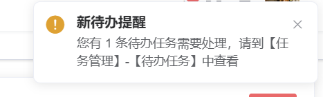

## 方法一、尝试当有待办任务时，在“任务管理”菜单右上角显示红点（失败，未采用）

### 后端：查询当前用户待办任务数量

需要在后端提供一个接口，用于返回当前用户的待办任务数量。

com/ruoyi/flowable/controller/FlowTaskController.class

```java
    @GetMapping("/todo/count")
    public AjaxResult getTodoTaskCount() {
        LoginUser loginUser = SecurityUtils.getLoginUser();
        String userId = loginUser.getUserId().toString();
        long count = flowTaskService.getTodoTaskCount(userId);
        return AjaxResult.success(count);
}

```

`flowableTaskService.getTodoTaskCount(userId)` 实现：

com/ruoyi/flowable/service/impl/FlowTaskServiceImpl.class

```java
    @Override
    public long getTodoTaskCount(String userId) {
        return taskService.createTaskQuery()
                .taskAssignee(userId)
                .active()
                .count();
    }
```


### 前端：在VUE菜单上显示角标红点

src/layout/components/Sidebar/Sidebarlterm.vue

全部代码放在这里：

```vue
<template>
  <div v-if="!item.hidden">
    <template
      v-if="hasOneShowingChild(item.children, item) && (!onlyOneChild.children || onlyOneChild.noShowingChildren) && !item.alwaysShow">
      <app-link v-if="onlyOneChild.meta" :to="resolvePath(onlyOneChild.path, onlyOneChild.query)">
        <el-menu-item :index="resolvePath(onlyOneChild.path)" :class="{ 'submenu-title-noDropdown': !isNest }">
          <el-tooltip class="item" effect="dark" :content="onlyOneChild.meta.title" placement="right-start">
            <span v-if="onlyOneChild.meta">
              <item :icon="onlyOneChild.meta.icon || (item.meta && item.meta.icon)" :title="onlyOneChild.meta.title" />
            </span>
          </el-tooltip>
          <!--<item :icon="onlyOneChild.meta.icon||(item.meta&&item.meta.icon)" :title="onlyOneChild.meta.title" />-->
        </el-menu-item>
      </app-link>
    </template>

    <el-submenu v-else ref="subMenu" :index="resolvePath(item.path)" popper-append-to-body class="submenu-wrapper">
      <template slot="title">
        <item v-if="item.meta" :icon="item.meta && item.meta.icon" :title="item.meta.title" />
        <el-badge v-if="showTodoDot(item)" is-dot class="submenu-badge" />
      </template>
      <sidebar-item v-for="(child, index) in item.children" :key="child.path + index" :is-nest="true" :item="child"
        :base-path="resolvePath(child.path)" class="nest-menu" />
    </el-submenu>
  </div>
</template>

<script>
import path from 'path'
import { isExternal } from '@/utils/validate'
import Item from './Item'
import AppLink from './Link'
import FixiOSBug from './FixiOSBug'

export default {
  name: 'SidebarItem',
  components: { Item, AppLink },
  mixins: [FixiOSBug],
  props: {
    // route object
    item: {
      type: Object,
      required: true
    },
    isNest: {
      type: Boolean,
      default: false
    },
    basePath: {
      type: String,
      default: ''
    }
  },
  data() {
    this.onlyOneChild = null
    return {
      todoCount: 0, // 存放待办任务数
    }
  },
  created() {
    this.getTodoCount();
  },
  methods: {

    async getTodoCount() {
      try {
        const res = await this.$axios.get('/flowable/task/todo/count');
        this.todoCount = res.data;
      } catch (e) {
        console.error('获取待办任务数量失败', e);
      }
    },
    // 判断是否需要显示红点
    showTodoDot(item) {
      // 替换成你路由中「待办任务」或「任务管理」的真实 name 或 path
      const todoPaths = ['/task/todo', '/task'];
      return this.todoCount > 0 && todoPaths.includes(item.path);
    },

    hasOneShowingChild(children = [], parent) {
      if (!children) {
        children = [];
      }
      const showingChildren = children.filter(item => {
        if (item.hidden) {
          return false
        } else {
          // Temp set(will be used if only has one showing child)
          this.onlyOneChild = item
          return true
        }
      })

      // When there is only one child router, the child router is displayed by default
      if (showingChildren.length === 1) {
        return true
      }

      // Show parent if there are no child router to display
      if (showingChildren.length === 0) {
        this.onlyOneChild = { ...parent, path: '', noShowingChildren: true }
        return true
      }

      return false
    },
    resolvePath(routePath, routeQuery) {
      if (isExternal(routePath)) {
        return routePath
      }
      if (isExternal(this.basePath)) {
        return this.basePath
      }
      if (routeQuery) {
        let query = JSON.parse(routeQuery);
        return { path: path.resolve(this.basePath, routePath), query: query }
      }
      return path.resolve(this.basePath, routePath)
    }
  }
}
</script>
<style scoped>
.menu-badge {
  margin-right: 8px;
}

.menu-badge :deep(.el-badge__content.is-dot) {
  right: 5px;
  top: 5px;
}

.submenu-wrapper {
  position: relative;
}

.submenu-badge {
  position: absolute;
  top: -10px;
  right: 20px;
  z-index: 2;
}

.submenu-badge :deep(.el-badge__content.is-dot) {
  width: 6px;
  height: 6px;
  border-radius: 50%;
}

</style>
```

主要改动是在元素内部加了el-badge元素，然后写了两个方法。

虽然的确显示了红点，但是造成了页面卡顿，而且即使把待办任务处理了，也还是会显示红点。

造成的问题：


因为每个 SidebarItem 组件实例都在独立发起请求，造成了大量的count请求，网页变卡。


## 方法二：当有待办任务时，页面的右上角部分显示出一个弹窗进行提醒

后端的方法仍然不变：

需要在后端提供一个接口，用于返回当前用户的待办任务数量。

com/ruoyi/flowable/controller/FlowTaskController.class

```java
    @GetMapping("/todo/count")
    public AjaxResult getTodoTaskCount() {
        LoginUser loginUser = SecurityUtils.getLoginUser();
        String userId = loginUser.getUserId().toString();
        long count = flowTaskService.getTodoTaskCount(userId);
        return AjaxResult.success(count);
}

```

`flowableTaskService.getTodoTaskCount(userId)` 实现：

com/ruoyi/flowable/service/impl/FlowTaskServiceImpl.class

```java
    @Override
    public long getTodoTaskCount(String userId) {
        return taskService.createTaskQuery()
                .taskAssignee(userId)
                .active()
                .count();
    }
```

前端：

在`src/store/modules`目录下创建`todo.js`

```js
import request from '@/utils/request'
import { Notification } from 'element-ui'

const state = {
  todoCount: 0,
  lastCount: 0 // 用于比较是否有新的待办
}

const mutations = {
  SET_TODO_COUNT: (state, count) => {
    state.lastCount = state.todoCount
    state.todoCount = count
  }
}

const actions = {
  getTodoCount({ commit, state }) {
    return request.get('/flowable/task/todo/count').then(res => {
      const count = parseInt(res.data) || 0
      commit('SET_TODO_COUNT', count)
      
      // 如果待办数量大于0，显示通知
      if (count > 0) {
        Notification({
          title: '新待办提醒',
          message: `您有 ${count} 条待办任务需要处理，请到【任务管理】-【待办任务】中查看`,
          type: 'warning',
          duration: 30000, //持续时间是30秒
          onClick: () => {
            window.location.href = '/#/task/todo' //点击通知弹窗跳转到待办任务页面
          }
        })
      }
    })
  }
}

export default {
  namespaced: true,
  state,
  mutations,
  actions
}
```

在App.vue中保持定时查询：

```vue
<template>
  <div id="app">
    <router-view />
    <theme-picker />
  </div>
</template>

<script>
import ThemePicker from "@/components/ThemePicker";

export default {
  name: "App",
  components: { ThemePicker },
  metaInfo() {
    return {
      title: this.$store.state.settings.dynamicTitle && this.$store.state.settings.title,
      titleTemplate: title => {
        return title ? `${title} - ${process.env.VUE_APP_TITLE}` : process.env.VUE_APP_TITLE
      }
    }
  },
    //以下内容是我新增
  data() {
    return {
      timer: null
    }
  },
  created() {
    this.startTodoTimer()
  },
  methods: {
    startTodoTimer() {
      // 首次加载立即获取
      this.$store.dispatch('todo/getTodoCount')
      // 每30秒获取一次
      this.timer = setInterval(() => {
        this.$store.dispatch('todo/getTodoCount')
      }, 60000)
    }
  },
  beforeDestroy() {
    if (this.timer) {
      clearInterval(this.timer)
      this.timer = null
    }
  }
};

</script>
<style scoped>
#app .theme-picker {
  display: none;
}
</style>

```

实现效果：

