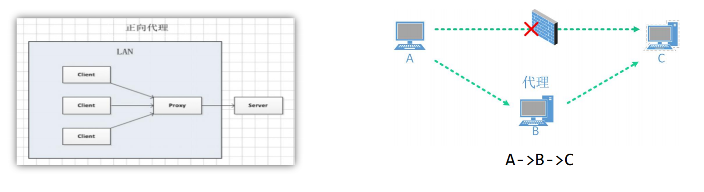
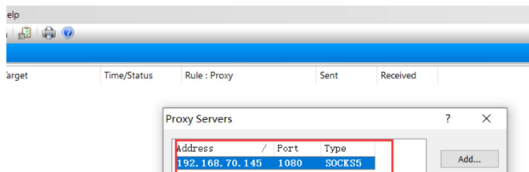
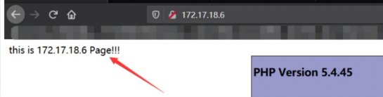
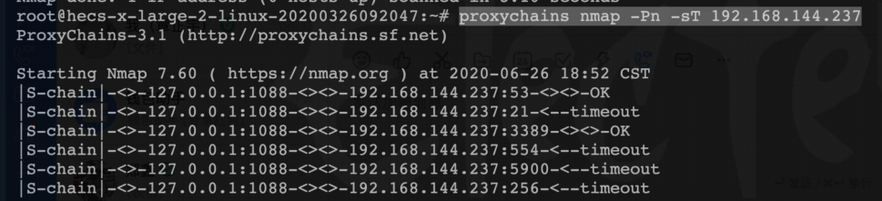

## 端口转发与代理介绍

在实际的网络中，通常会通过各种边界设备、软/硬件防火墙甚至入侵检测系统来检查对外连接情况如果发现异样，就会对通信进行阻断。那么什么是隧道呢？这里的隧道，就是一种绕过端口屏蔽的通信方式。防火墙两端的数据包通过防火墙所允许的数据包类型或端口进行封装，然后穿过防火墙，与对方进行通信。当封装的数据包到达目的地时，将数据包还原，并将还原后的数据包发送到相应服务器上。

常用的隧道技术有以下三种：

网络层：IPv6隧道、ICMP隧道

传输层：TCP隧道、UDP隧道、常规端口转发

应用层：SSH隧道、HTTP/S隧道、DNS隧道

当我们攻击入内网时，内网的某些端口（比如内网的0站点）是我们外网访问不到的，我们需要将这个端口转发到公网上某个特定的端口，这样我们访问公网上的这个端口就相当于访问内网的0站点一样。

### 正向代理

正向代理就像一个跳板，比如访问B访问C,接着把访问到的内容返回给A,这样就相当于A访问到了C。此时C只知道是B来请求，但是不知道A确切的IP。A能访问B,B能访问C,A不能访问C,那么，正向代理就是A去访问B,告诉B自己要访问C的什么内容，然后B去代替A来请求C。

优势：

- 1、能访问一些无法访问的资源，比如google或者vpn，连接内网。
-  2、对外隐藏用户信息。
-  3、对客户端访问授权，上网进行认证。

### 反向代理

反向代理是我们经常用到的一种代理方式，因为它可以有效的穿透防火墙，这也是很多网站保护集群的一种做法。

client想要访问一个X服务，但是这个X服务是开设在A服务器上的，此时A就跟B说我可以在你这边开设一个端口，访问到你这个端口，你就转发给我，让我处理这个请求。此时client只知道访问B能请求到X服务，但是不知道真实提供的服务是A。

以代理服务器来接受请求，然后将请求转发到内部网络上的服务器

优势：

- 1、保护代理服务器之后的内网内容 
- 2、实现负载均衡，比如nginx 
- 3、可以做到局域网之间的相互通信

## socks代理

代理客户端的作用就是配合代理服务端使用，服务端开启socks流量端口后使用客户端进行连接，达到内网穿透的效果。

proxifier中选择profile中的proxy servers,添加socks代理后在Proxification Rulest中启用规则即可生效

使用代理并配合代理服务端就可以达到穿透内网的效果

proxychains在kaliLinux中自动集成，在其他Linux系统中可以使用apt/yum命令安装。 

proxychains的配置文件默认在/etc/proxychains4.conf

需要修改该文件的最后一行，填入socks代理服务端的IP地址和端口后保存生效

配置完成后在输入脚本或指令之前加上proxychains即可让该条命令走代理流量

两个常用的代理工具：FRP和NPS